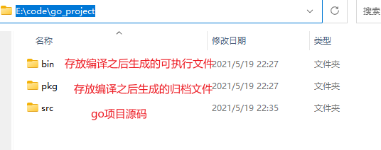
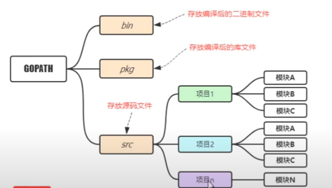
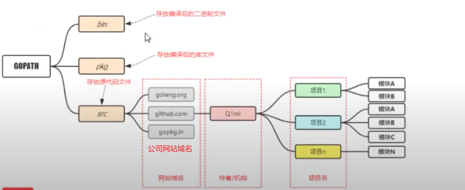
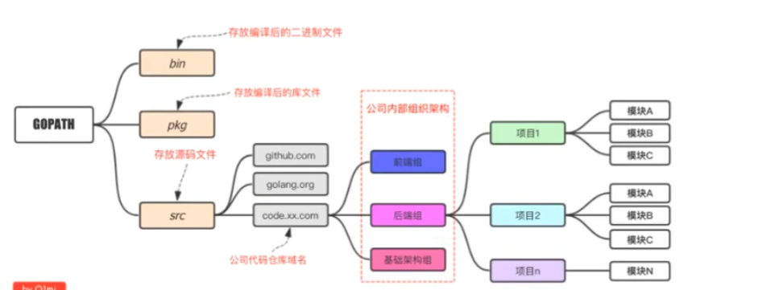
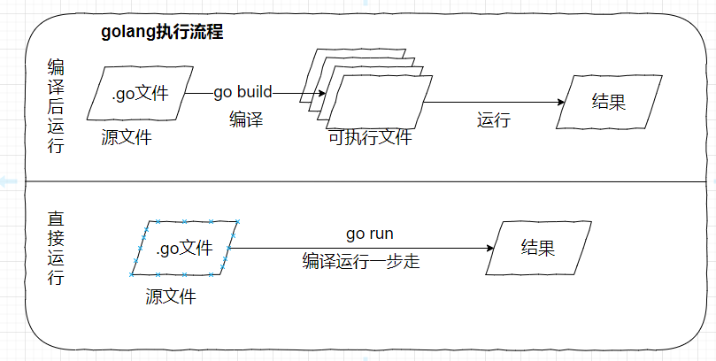

## 1. go概述

### 1.1 go为什么出现: 

1. 由于计算机硬件技术更新频繁,性能提高很快.目前主流的编程语言明显落后于硬件,不能合理的利用多核多线程cpu的又是提升软件系统性能.
2. 软件系统复杂度越来越高,维护成本越来越高,目前缺少一个足够简介高效的编程语言
3. 企业运行很多c/c++的项目,c/c++程序运行速度很快但是编译速度很慢,同时还存在内存泄漏的一系列的困扰需要解决.

### 1.2 go简史: 

1. 2007年,google工程师Rob pike,Ken Thompso和Robert Griesemer开始设计一门全新的语言,这是go语言最初的原型
2. 2009年,google开源go
3. 2015年,划时代的时间,Go 1.5版本发布, 本次更新 将最后残余的c代码剔除
4. 2017年,go 1.8发布
5. 2017年, go 1.9发布
6. 2019年,go 1.10发布

### 1.3 go语言特性:  

1. go语言保证了技能达到静态编译语言的安全和性能,又达到了动态语言开发维护的高效率,使用一个表达式来形容go语言: **GO = C+Python**, 说明 Go语言既有c静态语言程序的运行速度,又能达到Python动态语言的快速开发

   1. 从c语言中继承了很多理念,包括表达式语法,控制结构,基础数据类型,调用参数传值,指针等,也保留了和c语言一样的编译执行方式以及弱化的指针

   2. 引入包的概念用于组织程序结构,GO语言的`任何文件都要属于一个包`,而不能单独存在

   3. 垃圾回收机制,内存自动管理,不需要开发人员管理

   4. 天然并发:

      1. Go语言的并发是基于 `goroutine` 的，`goroutine` 类似于线程，但并非线程。可以将 `goroutine` 理解为一种虚拟线程。Go 语言运行时会参与调度 `goroutine`，并将 `goroutine` 合理地分配到每个 CPU 中，最大限度地使用CPU性能。开启一个`goroutine`的消耗非常小（大约2KB的内存），你可以轻松创建数百万个`goroutine`。  
         - `goroutine`的特点：
           1. `goroutine`具有可增长的分段堆栈。这意味着它们只在需要时才会使用更多内存。
           2. `goroutine`的启动时间比线程快。
           3. `goroutine`原生支持利用channel安全地进行通信。
           4. `goroutine`共享数据结构时无需使用互斥锁

      2. 从语言层面支持并发,实现简单

      3. 基于csp并发模型(Communicating Sequential Process)实现

   5. go吸收了管道机制,形成go语言特有的管道channel通过channel,可以实现不同的goroutine之间的通信

   6. 支持函数多个返回值

   7. 支持切片slice,延迟执行defer等,  `切片实际上就是java中的list.sublist(),defer多是用来回收资源的`


### 1.4 Go环境搭建:

1. 下载安装包:

   - 国内的Go官方镜像站: [Go官方镜像站](https://golang.google.cn/dl/)  

2. 版本选择:

   - 选最新的就行.`建议下载带源码的免安装版本,以windows为例:"`

3. 配置环境变量:  `linux环境下直接将各种路径写到/etc/profile`就行了

   - GOROOT: go的安装路径

   - Path: go SDK的/bin目录

   - GOPATH: 工作目录,`go项目的存放路径,最好只设置一个,将所有项目的代码都存放到该路径下的src文件夹中`,比如:

     - 

     - `Go1.14及以后版本中启用了Go Moudel模式之后,不一定非得将代码写到GOPATH 目录下面,使用默认的就行`,不喜欢把东西放在c盘,配置gopath上图
     - `GOPATH在不同环境有默认值`
       - 

     - 详细步骤: 
       - 
     
     > 设置GOPATH的时候可能会出现设置了GOPATH仍然是默认设置的情况.通过 `setx GOPATH 你的路径`命令,关闭cmd再次 `go env`就可以看到GOPATH变了

### 1.5 Go项目结构:   

#### 1.5.1 个人练习:  



#### 1.5.2 流行结构: 



#### 1.5.3 企业项目结构:  



### 1.6 Go执行流程:  



​    说明,两种执行流程的方式区别:   

- 先编译后运行的方式,可以将可执行文件放到没有go开发环境的机器上去执行

- 直接运行的方式,需要依赖go语言的环境,没有安装go语言环境无法执行

- 在编译的时候, 编译器会将程序运行依赖的库文件包含在可执行文件中,所以,可执行文件会变大很多

- 跨平台编译:

  - 默认我们`go build`的可执行文件都是当前操作系统可执行的文件，如果我想在windows下编译一个linux下可执行文件，那需要怎么做呢？

    只需要指定目标操作系统的平台和处理器架构即可，例如Windows平台cmd下按如下方式指定环境变量。

    ```bash
    SET CGO_ENABLED=0  // 禁用CGO
    SET GOOS=linux  // 目标平台是linux
    SET GOARCH=amd64  // 目标处理器架构是amd64
    ```

    注意：如果你使用的是PowerShell终端，那么设置环境变量的语法为`$ENV:CGO_ENABLED=0`。

    然后再执行`go build`命令，得到的就是能够在Linux平台运行的可执行文件了。

    Mac 下编译 Linux 和 Windows平台 64位 可执行程序：

    ```bash
    CGO_ENABLED=0 GOOS=linux GOARCH=amd64 go build
    CGO_ENABLED=0 GOOS=windows GOARCH=amd64 go build
    ```

    Linux 下编译 Mac 和 Windows 平台64位可执行程序：

    ```bash
    CGO_ENABLED=0 GOOS=darwin GOARCH=amd64 go build
    CGO_ENABLED=0 GOOS=windows GOARCH=amd64 go build
    ```

    Windows下编译Mac平台64位可执行程序：

    ```bash
    SET CGO_ENABLED=0
    SET GOOS=darwin
    SET GOARCH=amd64
    go build
    ```

### 1.7 Go依赖管理:   

依赖管理的作用:  最早的时候,go所依赖的所有第三方库都放在`GOPATH`这个目录下面.这就造成同一个库只能保存一个版本的代码.如果出现不同的项目依赖同一个第三方库的不同版本,就无法处理.

#### 1.7.1 `go dep`: 1.5之后的依赖管理

1. `vender模式`: 如果项目目录下面有`vendor目录`那么go工具链会优先使用 `vendor目录`内的包进行编译,测试等`

   1. `vender机制`: 主要是用于控制Go程序编译的时候依赖包搜索的路径.比如:  查找项目的某个依赖包,首先会在项目的根目录下面的`vender目录`中去寻找,如果没有找到需要的依赖包就会去`$GOPATH\src`目录下面找

2. `godep`:  是通过 `vendor模式`实现go语言第三方依赖管理的工具,类似的还有由社区维护的准官方包管理工具`dep`

3. `安装godep`:  `go get github.com\tools\godep`

4. `godep常用命令`: 

   ```go
   godep save     将依赖项输出并复制到Godeps.json文件中
   godep go       使用保存的依赖项运行go工具
   godep get      下载并安装具有指定依赖项的包
   godep path     打印依赖的GOPATH路径
   godep restore  在GOPATH中拉取依赖的版本
   godep update   更新选定的包或go版本
   godep diff     显示当前和以前保存的依赖项集之间的差异
   godep version  查看版本信息
   ```

   

5. 使用`godep`:    

   1. 在项目的根目录下面使用 `godep save`命令,会在当前项目中创建 `Godeps`和`vender`两个文件

      > 其中:  
      >
      > `Godeps`下有个`Godeps.json`文件,记录了该项目的所有依赖包信息
      >
      > `vender`下面就是项目依赖包的源码文件

6. `godep`开发流程:  

   1. 保证程序能够正常编译
   2. 执行`godep save`保存当前项目的所有第三方依赖版本信息和代码
   3. 提交`Godeps目录`和`vender`目录到代码库
   4. 如果需要更新依赖包的版本,可以直接修改`Godeps.json`中对应版本信息

#### 1.7.2 `go module`: 1.11之后Go语言默认的依赖管理

`go module`是`Go1.11`版本之后官方退出的版本管理工具,从`Go1.13`版本开始, `go module`成为默认的依赖管理工具.  

`go module`的作用相当于`maven对于java的作用`

只用`go module`管理依赖之后,会在`项目根目录`下生成两个文件 `go.mod`和`go.sum`

1. 开启`go module`: `设置GO111MODULE`

   1. 设置环境变量 `GO111MODULE`: 该环境变量的作用是`开启或者关闭模块支持`,共有三个可选值: `off`,`on`,`auto`;`auto`为默认值

      1. `GO111MODULE=off`禁用模块支持，编译时会从`GOPATH`和`vendor`文件夹中查找包。
      2. `GO111MODULE=on`启用模块支持，编译时会忽略`GOPATH`和`vendor`文件夹，只根据 `go.mod`下载依赖。
      3. `GO111MODULE=auto`，当项目在`$GOPATH/src`外且项目根目录有`go.mod`文件时，开启模块支持。

      > 1. 开启了`go module`后, 依赖文件是默认存放在 `$GOPATH/pkg/mod`目录里面的
      > 2. `GO111MODULE=on`就表示开启`go module`了,每次编译的时候都会根据`go.mod`文件去下载依赖
      > 3. `on` 和 `auto`是有区别的:  
      >     auto模式 当项目在`$GOPATH`里面去`$GOPATH/src`里面查找依赖, 但是当项目在`$GOPATH`之外, 就会使用`$GOPATH/pkg/mod`里面的依赖.  
      >     on模式, 则是无论项目路径在`$GOPATH`里面还是外面, 都是用`$GOPATH/pkg/mod`路径下的依赖

2. 设置依赖下载的地址: `设置环境变量GOPROXY`
   1. 由于墙的原因,默认的下载地址`heeps://proxy.golang.org`无法访问,需要修改环境变量`GOPROXY`
   2. 通过`export GOPROXY=https://goproxy.cn`或者`go env -w GOPROXY=https://goproxy.cn,direct`设置

3. `go mod`常用命令:  

   ```
   go mod download    下载依赖的module到本地cache（默认为$GOPATH/pkg/mod目录）
   go mod edit        编辑go.mod文件
   go mod graph       打印模块依赖图
   go mod init        初始化当前文件夹, 创建go.mod文件
   go mod tidy        增加缺少的module，删除无用的module
   go mod vendor      将依赖复制到vendor下
   go mod verify      校验依赖
   go mod why         解释为什么需要依赖
   ```

4. `go.mod`文件:  

   `go.mod`文件记录了项目所有的依赖信息, 比如: 

   ```go
   module github.com/pounds/studygo/blogger
   
   go 1.12
   
   require (
   	github.com/DeanThompson/ginpprof v0.0.0-20190408063150-3be636683586
   	github.com/gin-gonic/gin v1.4.0
   	github.com/go-sql-driver/mysql v1.4.1
   	github.com/jmoiron/sqlx v1.2.0
   	github.com/satori/go.uuid v1.2.0
   	google.golang.org/appengine v1.6.1 // indirect
   )
   /*
   module 用来定义包名
   require用来定义依赖包和版本
   indirect表示简介引用
   */
   ```

   **依赖的版本**

   go mod支持语义化版本号，比如`go get foo@v1.2.3`，也可以跟git的分支或tag，比如`go get foo@master`，当然也可以跟git提交哈希，比如`go get foo@e3702bed2`。关于依赖的版本支持以下几种格式：

   ```go
   gopkg.in/tomb.v1 v1.0.0-20141024135613-dd632973f1e7
   gopkg.in/vmihailenco/msgpack.v2 v2.9.1
   gopkg.in/yaml.v2 <=v2.2.1
   github.com/tatsushid/go-fastping v0.0.0-20160109021039-d7bb493dee3e
   latest
   ```

   **replace**

   国内不能访问`golang.org/x`,需要在`go.mod`中使用 `repalce`将其替换成`gihub`上对应的库

   ```go
   replace (
   	golang.org/x/crypto v0.0.0-20180820150726-614d502a4dac => github.com/golang/crypto v0.0.0-20180820150726-614d502a4dac
   	golang.org/x/net v0.0.0-20180821023952-922f4815f713 => github.com/golang/net v0.0.0-20180826012351-8a410e7b638d
   	golang.org/x/text v0.3.0 => github.com/golang/text v0.3.0
   )
   ```

5. `go get`下载依赖包:

   在下载单个依赖的时候可以使用`go get`命令,同时还可以指定版本号

   1. 运行`go get -u`将会升级到最新的次要版本或者修订版本(x.y.z, z是修订版本号， y是次要版本号)
   2. 运行`go get -u=patch`将会升级到最新的修订版本
   3. 运行`go get package@version`将会升级到指定的版本号version

   下载全部依赖直接使用`go mod download`就行

6. 在项目中删除依赖代码后,`go.mod`文件不会自动删除,需要使用`go mod tidy命令`更新`go.mod`中的依赖

7. 格式化`go.mod文件`: 

   1. `go mod edit -fmt`: 只格式化
   2. `go mod edit -require=golang.org/x/text`: 添加依赖
   3. `go mod edit -droprequire=golang.org/x/text` : 删除某个依赖
   4. `go help mod edit`: 查看`go mod edit`详细用法

8. 项目中使用`go module`的步骤: 

   1. 已有项目:  
      - 在项目目录下执行`go mod init`生成`go.mod`文件
      - 执行`go get`查找并记录当前项目的依赖,同时生成一个`go.sum`记录每个依赖库的版本和哈希值
   2. 新项目:  
      - 执行 `go mod init  项目名`命令,生成`go.mod`文件
      - 手动编辑 `go.mod`中的require依赖项目,只执行 `go get`自动发现,维护依赖.;

9. 使用`go module`导入本地包:  

   假设现在有`moduledemo`和`mypackage`两个包，其中`moduledemo`包中会导入`mypackage`包并使用它的`New`方法。

   ```go
   // mypackage/mypackage.go内容如下:  
   package mypackage
   
   import "fmt"
   
   func New(){
       fmt.Println("mypackage.New")
   }
   ```

   

   --------------------------------------------------

   **情况1 同一个项目下**: 

   - 目录结构:

     ```go
     moduledemo
     ├── go.mod
     ├── main.go
     └── mypackage
         └── mypackage.go
     ```

   - 导入包:

     需要在`moduledemo/go.mod`中按如下定义：

     ```go
     module moduledemo
     
     go 1.14
     ```

     然后在`moduledemo/main.go`中按如下方式导入`mypackage`:

     ```go
     package main
     
     import (
     	"fmt"
     	"moduledemo/mypackage"  // 导入同一项目下的mypackage包
     )
     func main() {
     	mypackage.New()
     	fmt.Println("main")
     }
     ```

     > 其实就是将项目根路径 通过`go.mod`中的module语句引入,然后再要使用被导入包的地方,用`import`从根路径下的第一级文件开始写路径直到要使用的.go文件所在的文件夹.

   再比如: 

   ​		举一反三，假设我们现在有文件目录结构如下：

   ```bash
   └── bubble
       ├── dao
       │   └── mysql.go
       ├── go.mod
       └── main.go
   ```

   其中`bubble/go.mod`内容如下：

   ```go
   module github.com/pounds/bubble
   
   go 1.14
   ```

   `bubble/dao/mysql.go`内容如下：

   ```go
   package dao
   
   import "fmt"
   
   func New(){
   	fmt.Println("mypackage.New")
   }
   ```

   `bubble/main.go`内容如下：

   ```go
   package main
   
   import (
   	"fmt"
   	"github.com/pounds/bubble/dao"
   )
   func main() {
   	dao.New()
   	fmt.Println("main")
   }
   ```

   ---------------

   **情况二 不同项目下**

   - 目录结构:  

     ```go
     ├── moduledemo
     │   ├── go.mod
     │   └── main.go
     └── mypackage
         ├── go.mod
         └── mypackage.go
     ```

   - 导入包:  

     `mypackage`也需要进行module初始化，即拥有一个属于自己的`go.mod`文件，内容如下：

     ```go
     module mypackage
     
     go 1.14
     ```

     在`moduledemo/main.go`中按如下方式导入：

     ```go
     package main
     
     import (
     	"fmt"
     	"mypackage"
     )
     func main() {
     	mypackage.New()
     	fmt.Println("main")
     }
     ```

     因为这两个包不在同一个项目路径下，你想要导入本地包，并且这些包也没有发布到远程的`github`或其他代码仓库地址。这个时候我们就需要在`go.mod`文件中使用`replace`指令。

     ```go
     module moduledemo
     
     go 1.14
     
     
     require "mypackage" v0.0.0
     replace "mypackage" => "../mypackage"
     ```

     > go.mod文件中记录的都是依赖所在的远程仓库地址,所以此时在远程仓库中并没有,需要替换成本地路径

   再比如:  

   我们现在有文件目录结构如下：

   ```bash
   ├── p1
   │   ├── go.mod
   │   └── main.go
   └── p2
       ├── go.mod
       └── p2.go
   ```

   `p1/main.go`中想要导入`p2.go`中定义的函数。

   `p2/go.mod`内容如下：

   ```go
   module pounds.com/pounds/p2
   
   go 1.14
   ```

   `p1/main.go`中按如下方式导入

   ```go
   import (
   	"fmt"
   	"pounds.com/pounds/p2"
   )
   func main() {
   	p2.New()
   	fmt.Println("main")
   }
   ```

   因为我并没有把`pounds.com/pounds/p2`这个包上传到`pounds.com`这个网站，我们只是想导入本地的包，这个时候就需要用到`replace`这个指令了。

   `p1/go.mod`内容如下：

   ```go
   module github.com/pounds/p1
   
   go 1.14
   
   
   require "pounds.com/pounds/p2" v0.0.0
   replace "pounds.com/pounds/p2" => "../p2"
   ```

   总结:  

   1. 不同项目下,要使用的两个项目都需要module初始化,而相同项目只需要初始化根项目就行了
   2. 不同项目下导入本地包,需要将本地包的下载路径使用`replace替换成本地相对路径`