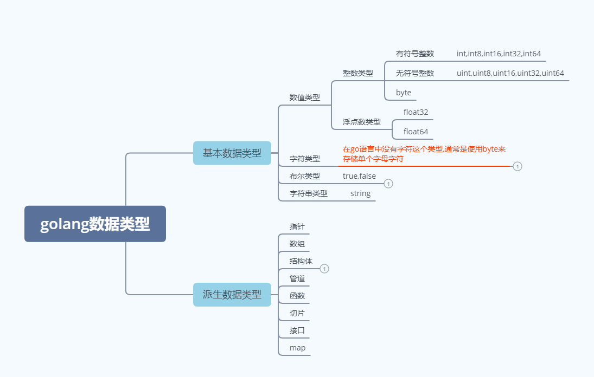

## 2.1 写代码之前: 

### 2.1.1 Go程序开发注意事项:

- go源文件以`.go`为扩展名
- go应用程序的执行是以 `main()`函数为入口
- go语言严格区分大小写
- Go方法由一条条语句构成, 语句后面不需要加`;`表示语句结束,因为`go语言会在每行后面自动加上分号`
- Go编译器是一行一行进行编译的,所以一行就写一条语句就行,`多条语句写在一起回报错`
- go语言`定义了的变量`,或者`导入了的包`没有使用到的话会报错.
- 大括号需要成对出现.

### 2.1.2 Go语言常用的转义字符:  

与其他语言一样:  反斜杠`\`表示转义

```go
\t 制表符
\n 换行符
\\ 将反斜杠转义成"\"字符
\" 将" " " 转义成 " " "字符
\r 将r字母转义成一个回车
```

### 2.1.3 Go语言的注释:  

```go
// 这是行注释
/* 这是块注释 */  
```

> 注释的使用习惯:  
>
> 块注释只是用来描述当前.go文件的作用
>
> 行注释通常是用来注释方法和语句(官方建议)

### 2.1.4 Go代码基本结构:   

```go
package main
/*
块注释写在这里,用来解释整个文件是做什么的:
go 文件结构演示 --- hello world
*/

// 导入外部包的语句
import "fmt"

// go程序入口函数
func main() {
	
	fmt.Println("hello world!")
}
```

### 2.1.5 Go语言中保留字 --- 关键字:  

**关键字**是预先约定好的具有特殊含义的标识符,通常不建议将 `关键字` 和`保留字`作其他用途.

- `关键字`: 

  ```go
      break        default      func         interface    select
      case         defer        go           map          struct
      chan         else         goto         package      switch
      const        fallthrough  if           range        type
      continue     for          import       return       var
  ```

- `保留字`:  

  ```go
      Constants:    true  false  iota  nil
  
          Types:    int  int8  int16  int32  int64  
                    uint  uint8  uint16  uint32  uint64  uintptr
                    float32  float64  complex128  complex64
                    bool  byte  rune  string  error
  
      Functions:   make  len  cap  new  append  copy  close  delete
                   complex  real  imag
                   panic  recover
  ```


-----------------------------


## 2.2 变量,常量:

注意事项: 

1. 无论是变量还是常量,在同一个作用域内名字都是不能重复的
2. 变量有数据类型的区别,同一个变量只能在该类型的取值范围中不断变化

### 2.2.1 变量 :  

1. `标识符`: 表示符表示具有特殊意义的词,比如变量名,常量名,函数名等等.

   go语言标识符规范:  由`字母`,`数字`,和`_` 组成,并且 <font color=red>只能由`字母`或者 `_`开头</font>

   几点注意事项:  

   1. 包名: 保持 package的名字和目录的名字一致,尽量采用简短有意义的名字,不要和`标准库`中的包名有冲突
   2. 变量,函数等: 采用驼峰命名法
   3. go严格区分大小写,并且通过大小写来判断 该标识符表示的内容,能否在包外访问.
      - `小写开头: 只能在包内访问`,等价于 `java`的`private`
      - `大写开头`: 可以在包外访问,等价于 `java`的`public`

3. 声明变量的几种方式：

   - 标准声明:  

     ```go
     var 变量名 数据类型
     ```

   - 声明变量并初始化:  

     <font color=red> 在声明变量并初始化的时候,go语言能够对变量的类型进行推导</font>

     - 初始化单个变量: 

     ```go
     var 变量名 数据类型 = 表达式
     var 变量名 = 表达式  // 类型推导
     ```

     - 多个变量同时初始化: 

     ```go
     var 变量1,变量2 = 表达式1,表达式2
     ```

   - 短变量声明: 使用 `:=`符号进行短变量声明,并初始化

     ```go
     变量名 := 表达式
     ```

     <font color=red><b>注意:</b>    如果不同时初始化变量是不能使用短变量声明的</font>

   - 匿名变量的声明:  使用 `_`表示一个匿名变量,并且`可以不使用`

     ```go
     _ := 表达式
     ```
     
   - 批量声明:  在声明的时候可以选择赋值与不赋值.
   
     ```go
     	// 批量声明 不赋值
     	var (
     		num int
     		age int
     		sex byte
     	)
     
     	// 批量声明 赋值
     	var (
     		nam int = 15
     		age1 int = 169
     		sex2 byte = 'g'
     	)
     ```
   
     <font color=red><b>问题:</b> 为什么byte存字符的时候,不赋值用%c输出会乱码</font>
   
     猜测:  byte的默认值超出了0-255.
   > 变量声明注意:
   > 1. 匿名变量不占用命名空间,`不会分配内存`,不存在匿名变量重复声明的问题
   > 2. 函数外的每个语句都必须以关键字开始,(`var`,`const`,`func`等)
   > 3. `:=`不能使用在函数之外
   > 4. `_`通常是用来占位置的,用来忽略某个值
   
3. 全局变量:   在`方法之外`通过下列语法声明的变量  

   ```go
   // 声明单个全局变量
   var 变量名 = 表达式  
   // 声明多个全局变量
   var (
   	变量名1 = 表达式1
       变量名2 = 表达式2
   )
   ```

   > 全局变量声明之后可以不使用.

4. 相关演示代码:  

   ```go
   package main
   
   import "fmt"
   // 声明一个全局变量, 必须赋值
   var globalVar = "全局变量"
   func main() {
   	varDeclaration()
   }
   var globalVarAfterFuncWasCalled = "在方法被调用之后声明的全局变量"
   // 变量常量的声明
   func varDeclaration(){
   	fmt.Printf("全局变量global var :  %s \n",globalVar)
   	fmt.Printf("能不能输出方法调用之后声明的变量: %s \n",globalVarAfterFuncWasCalled)
   	fmt.Printf("能不能输出方法定义之后声明的变量: %s \n",globalVarAfterFuncWasDecleared)
   	// 标准声明方式,如果不赋值就使用变量所属类型的默认值
   	var i int
   	fmt.Printf("变量 i 的值为 %d ,是否是int类型的默认值 0 : %t \n",i, i == 0)
   
   	// var i int = 10 错误的声明,变量i已经被声明过了
   	// 声明并复制:
   	var j int = 20
   	// 类型推导
   	var c = 20
   	fmt.Printf("变量 j 的值为 %d ,是否是int类型的默认值 0 : %t, 因为已经赋值了 \n",j, j == 0)
   	fmt.Printf("类型推导的c是一个 %T 类型,他的值为 %d  \n",c,c)
   
   	// 短变量声明: 实际上就是通过类型推导直接复制
   	a := "王二麻子"
   	fmt.Printf("a 是一个短变量声明出来的变量, 其类型为 %T , 值为 %s\n",a,a)
   
   	// 匿名变量的声明,匿名变量可以声明了不使用
   	var name,_ = "张三",anonymousVar()
   	fmt.Printf("通过匿名变量忽略了函数返回值,name的值为: %s \n",name)
   
   }
   
   var globalVarAfterFuncWasDecleared = "在方法定义之后声明的全局变量"
   
   func anonymousVar() string{
   	return "匿名变量"
   }
   /**
   输出结果: 
   -------------------------------------------------------------
   全局变量global var :  全局变量
   能不能输出方法调用之后声明的变量: 在方法被调用之后声明的全局变量
   能不能输出方法定义之后声明的变量: 在方法定义之后声明的全局变量
   变量 i 的值为 0 ,是否是int类型的默认值 0 : true
   变量 j 的值为 20 ,是否是int类型的默认值 0 : false, 因为已经赋值了
   类型推导的c是一个 int 类型,他的值为 20
   a 是一个短变量声明出来的变量, 其类型为 string , 值为 王二麻子
   通过匿名变量忽略了函数返回值,name的值为: 张三
   */
   ```

   **`fmt`包中`printf`函数的占位符**

   ```go
   /**
   
   printf格式化打印占位符：
               %v,原样输出
               %T，打印类型
               %t,bool类型
               %s，字符串
               %f，浮点
               %d，10进制的整数
               %b，2进制的整数
               %o，8进制
               %x，%X，16进制
                   %x：0-9，a-f
                   %X：0-9，A-F
               %c，打印字符
               %p，打印地址
    */	
   ```


### 2.2.2 常量:  

**Go常量**`const`是属于编译时期的常量，即在编译时期就可以完全确定取值的常量。<font color=red><b>只支持`数字`，`字符串`和`布尔值`，及`上述类型的表达式`</b> </font>。而切片，数组，正则表达式等等需要在运行时分配空间和执行若干运算才能赋值的变量则不能用作常量。

1. 常量声明:

   - 声明语法:  

     ```go
     const 变量名 = 表达式
     // 表达式说明： 
     // go语言中常量声明的时候的表达式，只支持数值，字符串，布尔值，以及以上类型组成的表达式
     // 常量声明时的表达式,表达式参与成员都必须要是常量 
     const (
     	firstTimeCall = getAndAddConstC() + 1 // 不支持函数作为常量表达式使用.
     )
     ```

   - 单个常量: 

     ```go
     	// 声明单个常量
     	const pi = 3.1415926
     ```

     

   - 多个常量: 

     ```go
     	// 如果某个常量在声明时赋值了,该常量之后没有声明的常量都是那一个表达式的结果.
     	const (
     		minutes = 12
     		hours
     		day
     		month = 01
     		year
     	)
     ```

     - <font color=red>注意:</font>

       多个常量声明的时候,如果某个常量(`比如:day`)没有进行赋值,那么该常量的值就是离他最近的赋了值的`常量表达式的结果`(`比如: day的值为12,year的值为1`)

       ```go
       	// 如果某个常量在声明时赋值了,该常量之后没有声明的常量都是那一个表达式的结果.
       	// 下面这个例子,由于c,e;d,f都没有赋值,所以分别对应使用iota+1,iota+2表达式,但是在常量声明中每新增一行声明就会让iota+1
       	const (
       		a, b = iota + 1, iota + 2 //a = 1, b = 2
       		c, d                      //2,3
       		e, f                      //3,4
       		g,h = 10, 20
       	)
       	fmt.Printf("a = %d ,b = %d\n",a,b)
       	fmt.Printf("c = %d ,d = %d\n",c,d)
       	fmt.Printf("e = %d ,f = %d\n",e,f)
       	fmt.Printf("g = %d ,h = %d\n",g,h)
       ```

       

2. **iota**: go语言中的常量计数器,只能在常量表达式中使用

   **iota**在`const`关键字出现时将被充值为0.`const`中`每新增一行常量声明`将会让`iota`+1.使用`iota`能够简化定义,在定义枚举的时候很有用.

   <font color=red>注意:<b>是每新增一行,会让iota+1</b></font>,而不是每增加一个常量就会让iota自增1.

   使用示例:  

   - 通常使用:  

     ```go
     	// iota使用示例
     	const (
     		n1 = iota // 0
     		n2		  // 1
     		n3        // 2
     		n4        // 3
     		n5        // 4
     	)
     ```

   - _ 跳过某些值:  

     ```go
     	// 用 _ 跳过不需要的值
     	const (
     		a1 = iota //0
     		a2        //1
     		_
     		a4        //3
     	)
     ```

   - 常量声明,iota中间插队

     ```go
     	// iota 中间插队,使iota增加
     	const (
     		c1 = iota //0
     		c2 = 100  //100
     		c3 = iota //2
     		c4        //3
     	)
     	const c5 = iota //0
     ```

   - 定义某个数量级

     ```go
     // 使用iota来定义某个数量级
     const (
        _  = iota                  // 0
        KB = 1 << (10 * iota)     // 1024
        MB = 1 << (10 * iota)
        GB = 1 << (10 * iota)
        TB = 1 << (10 * iota)
        PB = 1 << (10 * iota)
     )
     ```

   - 多个iota定义在同一行:  

     ```go
     // 多个iota定义在一行
     const (
        a, b = iota + 1, iota + 2 //a = 1, b = 2
        c, d                      //2,3
        e, f                      //3,4
     )
     ```

     <font color=red>注意:<b>是每新增一行,会让iota+1</b></font>,而不是每增加一个常量就会让iota自增1.

## 2.3 Go的数据类型



> 1. go语言是没有字符类型的,通过byte存储单个字符的ASC码值表示单个字符
> 2. go语言采用的是UTF-8的编码方式,汉字为3个字节,所以1byte无法存储一个汉字
> 3. bool类型只能使用`true`,`false`两个值,`不能像c语言那样非0即真`
> 4. 结构体类似于`c语言中的结构体`

> 默认初始值:  
>
> - 整型,浮点数                                        ===>  0
> - 字符串                                                 ===>   ""(空串)
> - 布尔类型                                             ===>        false
> - 切片,函数,指针等引用类型                ===>        nil(空指针)
>
> 可以使用`printf`函数,通过`%T`输出变量的数据类型

### 2.3.0 概述:  

**基本数据类型(值类型):**

值类型:变量直接存储值,通常在`栈中分配`


**派生数据类型(引用类型)**

引用数据类型: 变量存储的是一个地址,这个地址对应的空间才会真正的存储数据,通常在`堆上分配`,单没有任何变量引用这个地址表示的内存空间的时候, 该内存空间就是垃圾了,会被GC回收掉.


### 2.3.1 基本类型:

#### 1. 整数类型: 

go语言的整数类型分为`有符号`,`无符号`,`特殊整数类型`

- 无符号整数:

  |   类型   | 描述                                        | 占有字节数 |
  | :------: | :------------------------------------------ | ---------- |
  | `uint8`  | 无符号 8位整型 (0 到 255)                   | 1字节      |
  | `uint16` | 无符号 16位整型 (0 到 65535)                | 2字节      |
  | `uint32` | 无符号 32位整型 (0 到 4294967295)           | 4字节      |
  | `uint64` | 无符号 64位整型 (0 到 18446744073709551615) | 8字节      |

- 有符号整数:   

  |  类型   | 描述                                                         | 占有字节数 |
  | :-----: | :----------------------------------------------------------- | ---------- |
  | `int8`  | 有符号 8位整型 (-128 到 127)                                 | 1字节      |
  | `int16` | 有符号 16位整型 (-32768 到 32767)                            | 2字节      |
  | `int32` | 有符号 32位整型 (-2147483648 到 2147483647)                  | 4字节      |
  | `int64` | 有符号 64位整型 (-9223372036854775808 到 9223372036854775807) | 8字节      |

- 特殊整数类型

  |   类型    | 描述                                                   | 有无符号 | 占有字节数 |
  | :-------: | :----------------------------------------------------- | -------- | ---------- |
  |  `uint`   | 32位操作系统上就是`uint32`，64位操作系统上就是`uint64` | 无       |            |
  |   `int`   | 32位操作系统上就是`int32`，64位操作系统上就是`int64`   | 有       |            |
  | `uintptr` | 无符号整型，用于存放一个指针                           |          |            |
  |  `rune`   | 与`int32`等价,表示一个Unicode码                        | 有       | 4          |
  |  `byte`   | 与`uint8`等价                                          | 无       | 1字节      |

> 1. `uint8`对应`byte类型`
> 2. `int`和`uint`在使用的时候应该考虑到不同平台上可能产生的差异.
> 3. 在涉及到二进制传输、读写文件的结构描述时，为了保持文件的结构不会受到不同编译目标平台字节长度的影响，不要使用`int`和 `uint`。

**整数类型的使用示例:**

```go
//测试int类型的默认值
/**
测试结果:
有符号: int = 0,int8 = 0,int16 = 0,int32 = 0
无符号: uInt = 0,uInt8 = 0,uInt16 = 0,uInt32 = 0
rune default value = 0
byte default value = 0
*/
func testIntDefaultValue() {
   var (
      varInt   int
      varInt8  int8
      varInt16 int16
      varInt32 int32
   )
   fmt.Printf("有符号: int = %d,int8 = %d,int16 = %d,int32 = %d\n", varInt, varInt8, varInt16, varInt32)
   var (
      varuInt   uint
      varuInt8  uint8
      varuInt16 uint16
      varuInt32 uint32
   )
   fmt.Printf("无符号: uInt = %d,uInt8 = %d,uInt16 = %d,uInt32 = %d\n", varuInt, varuInt8, varuInt16, varuInt32)

   var varRune rune
   fmt.Printf("rune default value = %d\n", varRune)

   var varByte byte
   fmt.Printf("byte default value = %d\n", varByte)
}
```

**整型使用细节**

1. 默认情况下,整数赋值给变量默认是 `int`类型
2. `根据保小不保大的原则`,在定义变量的时候,保证逻辑不出现问题的情况下,尽量选择占用空间小的数据类型,比如: [年龄]

```go
// IntUseDetail 整数的使用细节:
/**
结果:
--------------------------------
n1的数据类型为 int, n1占用的字节数为: 8(默认是int ,int在64为系统中为8字节)
*/
func IntUseDetail() {
	// 查看变量的数据类型和占有的字节大小
	// 整数复制给变量默认是int类型
	n1 := 1999
	fmt.Printf("n1的数据类型为 %T, n1占用的字节数为: %d", n1, unsafe.Sizeof(n1))

	// golang有一个保小不保大的原则,就是说保证程序不出问题的情况下,尽量使用占用字节数少的数据类型
	// 举个例子: 年龄,一般就是0-150岁,这是最小的数据类型使用byte(0-255)就可以了
	var age byte = 200
	fmt.Printf("age : %d ", age)
}
```

**数字字面量语法**

Go1.13版本之后引入了数字字面量语法，便于用二进制，八进制，十六进制浮点数的格式定义数字  

例如：

`v := 0b00101101`， 代表二进制的 101101，相当于十进制的 45。 `v := 0o377`，代表八进制的 377，相当于十进制的 255。 `v := 0x1p-2`，代表十六进制的 1 除以 2²，也就是 0.25。  

此外：还可以在数字之间使用“_”来分隔数字,比如: `v := 123_456`表示v的值为123456

```go
// 演示数值字面量语法
func numericSyntax() {
	// 二进制 0b开头
	two := 0b00101101
	fmt.Printf("二进制数字为: %b\n", two)

	// 八进制 0开头
	eghit := 077
	fmt.Printf("八进制数字为: %o\n", eghit)

	// 十六进制 0x开头
	sixteen := 0xff
	fmt.Printf("十六进制为: %x\n", sixteen)

}
```


####　2. 浮点数类型:  

| 类型    | 占用空间 | 表数范围             |
| ------- | -------- | -------------------- |
| float32 | 4字节    | -3.403E38~3.403E38   |
| float64 | 8字节    | -1.798E308~1.798E308 |

说明:  

1. 浮点数在机器中存放形式为: 浮点数 = 符号位 + 指数位 + 尾数位,`在存储过程中,精度会有丢失`
2. 浮点数都是有符号的
3. 尾数部分可能丢失,造成精度损失, 在有精度要求的情况下,使用`decimal`包处理小数

**使用示例:**

```go
// 测试浮点数类型的默认值
/*
测试结果:
有符号: float32 = 0.000000,float64 = 0.000000
*/
func testFloatDefaultValue() {
	var (
		varfloat32 float32
		varfloat64 float64
	)
	fmt.Printf("有符号: float32 = %f,float64 = %f\n", varfloat32, varfloat64)
}
```

**使用细节:**

1. 浮点数有固定的范围和字段长度,不受操作系统的影响
2. golang浮点数默认为float64类型
3. 浮点数常量有两种表示形式:  
   - 十进制: `5.13` 或者  `.513 等价于 0.513`
   - 科学计数法: `5.134e2 = 5.13 * 10的2次方  ` 或者 `5.13e-2 = 5.13 / 10 的 2次方`
4. 精度要求不是特别高的情况下, 应该使用float64(精度高于float32)

#### 3. 字符类型: 

go语言中没有专门的字符类型,`如果存储单个字母的话,一般使用byte来存储,并且不要使用byte存储中文字符`.

字符串就是一串固定长度的字符连起来的字符序列.Go的字符串是由`单个字节连起来`的.

**使用示例:**

```go
// 字符演示
/*
结果:
------------------------------------
 字母c1为: a
存放中文的类型是: int32
直接输出: 33609
存放的中文是: 草
*/
func charUseDetail() {
	// 使用byte保存ASC码表里面的数字
	var c1 byte = 'a'
	fmt.Printf(" 字母c1为: %c\n", c1)

	// 但是不要使用byte来存储中文字符,直接编译错误
	//var c2 byte = '草'
	//fmt.Printf("中文字符: %c", c2)

	// 可以使用rune来存中文
	var test rune = '草'
	fmt.Printf("存放中文的类型是: %T\n", test)
	fmt.Println("直接输出:", test)
	fmt.Printf("存放的中文是: %c\n", test)
}
```

**使用细节:**

1. `byte`可以存储ASC码表里面的字符,超出ASC码表里面的字符可以考虑使用`int`保存
2. go语言默认使用`UTF-8`编码,`英文一个字节`,`汉字三个字节`.[查询UTF-8码值](http://www.mytju.com/classcode/tools/encode_utf8.asp)
3. go语言中所有的字符其实都是整数表示的,`%c`可以将其转换成对应的字符展示
4. go语言中汉字使用的是`int32`类型表示,同样可以使用`%c`转换成中文展示

**字符在go中的本质:**

1. 字符存储到计算机中,实际上是存储的是 字符对应码表中的码值 的二进制
   - 存储: 字符 ---->  对应码值  ---->   二进制   ----->   存储
   - 读取: 二进制  ----->  码值  -------> 字符  ------>   读取

#### 4. 布尔值:  

1. 布尔值(bool类型),只能是 `true` or `flase`
2. 布尔值占一个字节

#### 5. 字符串:  

**字符串就是一串固定长度的字符连接起来的字符序列**.go的字符串是由单个字节连接起来的.GO的字符串的字节使用`utf-8`编码标识Unicode文本

**使用示例  :   **

```go
// 使用示例
func stringUseDisplay() {
   var address string = "背景 长度  化   jifdsafdsafdsafdws"
   fmt.Printf("地址为: %s\n", address)
}
```

**使用细节:**

1. go语言同一使用`utf-8`编码表示`unicode文本`,不会有乱码

2. 字符串一旦赋值,该字符串表示的内容无法修改

   ```go
   	// go字符串一旦赋值了就不能更改了
   	//str := "a测试可不可以修改"
   	//str[0] = 'c' // cannot assign str[0]
   ```

   **如果实在要修改字符串的内容,必须将字符串强制转换成[]rune或者[]byte,修改完成之后转回string**

   ```go
   func changeString() {
   	s1 := "big"
   	// 强制类型转换
   	byteS1 := []byte(s1)
   	byteS1[0] = 'p'
   	fmt.Println(string(byteS1))
   
   	s2 := "白萝卜"
   	runeS2 := []rune(s2)
   	runeS2[0] = '红'
   	fmt.Println(string(runeS2))
   }
   ```

   

3. 字符串的两种表示方式:  

   - " 字符串内容 ",这种方式 `会识别转义字符`

   - ``反引号,以把字符串原样输出,包括换行和特殊字符,可以实现防止攻击,输出源代码的效果

     ```go
     s1 := `第一行
     第二行
     第三行
     `
     fmt.Println(s1)
     /*
     原样展示字符串:   第一行
     	第二行
     	第三行
     		
     	
     */
     ```

     

4. " + "加号可以实现字符串拼接

**string与其他类型的转换**

- 使用`strconv`包的函数,将string转换成其他类型

  

  > 将string转换成其他类型的时候,需要注意字符转必须要符合其他类型的格式,比如: 转换成`数值类型`的时候就只能是`数字字符串`

- 使用`strconv`包的函数,将其他类型转换成string

  

  ```go
  func stringToOtherType() {
  	// string 转换成bool
  	parseBool, err := strconv.ParseBool("true")
  	if err == nil {
  		fmt.Println(parseBool)
  	}
  }
  ```

#### 6. 类型转换: 

go语言中**不能**自动转换类型,任何的类型转换都需要手动转换.  

**1. 基本语法**

```go
T(v) // 表示将 值v 转换成 T类型
```

```go
// 类型转换
func typeRevert() {
	var i int32 = 100
	var n1 float32 = float32(i)
	fmt.Printf("转换之后是什么内容: %f", n1)

}
```

**2. 使用细节:**

1. 类型转换可以从 范围大  ---->  范围小(<font color=red>注意:<b>取值范围可能会溢出</b></font>), 也可以从  范围小  ----> 范围大.
2. 被转换的是变量值,变量本身的类型是没有变化的

### 2.3.2 派生数据类型:  

#### 1. 指针: 

**什么是指针:**指针的本质是 `存储数据的内存地址值`,通过`*`号来获取该地址上存储的数据.(`换句话说,指针就是一个道路指示牌,我们关心的不是指示牌,指示牌指向的地方才是我们想要去的地方`)

> 提到指针,就不能不提到`c语言的指针`,于c语言指针不同的是: <font color=red><b>go语言的指针是不能 `偏移和运算`的.</b></font>

**示例:**

```go
// 什么是指针
/**
a:10 ptr:0xc00000a0c0
b:0xc00000a0c0 type:*int
0xc000006030
 */
func whatIsPointer() {
	a := 10
	b := &a
	fmt.Printf("a:%d ptr:%p\n", a, &a) // a:10 ptr:0xc00001a078
	fmt.Printf("b:%p type:%T\n", b, b) // b:0xc00001a078 type:*int
	fmt.Println(&b)
}
```


**声明和使用:**  指针的类型为 `*数据类型`

1. 声明: 

   ```go
   var 指针名 *类型  // 不赋值
   var 指针名 = &变量  // 直接通过 & 符号获取变量的地址赋值给指针变量,此时指针的类型为 *变量的类型
   指针名 := &变量 // 意义与上面方式一样
   ```

2. 使用:  通过`*指针名`获取 `指针存放的地址上的内容`

   ```go
   *指针名 // 这就是在获取指针指向的数据了
   ```

   > `*指针`实际上是等价于 指针所指向的那个变量, 给 `*指针`赋值就等价于给 变量赋值了.

3. 示例:  

   ```go
   // 声明指针和使用指针
   /**
   指针的默认值为= 0x0
   0x0是不是等于nil= true
   c =  10
   p =  10
   */
   func declarationAndUse() {
      a := 10
      // 声明指针,不赋值声明,指针默认值就是nil
      var p *int
      println("指针的默认值为=", p)
      println("0x0是不是等于nil=", p == nil)
      // 声明指针2
      c := &a
      println("c = ", *c)
      // 使用指针
      p = &a
      println("p = ", *p)
   }
   ```


------------------------------------------


## 2.4 运算符:  

### 2.4.1 算数运算符: 


> 注意:
>
> 1. `++`和`--`,在go语言中<font color=red><b>必须写成单独的语句</b></font> ,是一类特殊的运算符,并且<font color=red><b>自增自减运算符只能写在变量的后面</b></font> 
> 2. `?　：`,go语言中并没有这种`三目运算符`,通过 `if ... else ...`语句来实现三目于运算
> 3. `/`go语言中 <font color=red><b>参与除法运算的两个数都是整数,那么结果也是整数</b></font>

### 2.4.2 关系运算符: 


### 2.4.3 逻辑运算符: 


> && || ,在go中也存在短路操作. 
>
> 1. &&: 只要前面的条件表达式`不成立`, 就不会去判断后面的表达式
> 2. ||:  只要前面的条件表达式`成立`,就不会去判断后面的表达式

### 2.4.4 赋值运算符: 


### 2.4.5 位运算符: 

| 运算符 | 描述                                                         | 助记             |
| :----: | :----------------------------------------------------------- | ---------------- |
|   &    | 参与运算的两数各对应的二进位相与。                           | 都真结果真       |
|   \|   | 参与运算的两数各对应的二进位相或。 （两位有一个为1就为1）    | 有真结果真       |
|   ^    | 参与运算的两数各对应的二进位相异或，当两对应的二进位相异时，结果为1。 （两位不一样则为1） | 不同为真相同为假 |
|   <<   | 左移n位就是乘以2的n次方。 “a<<b”是把a的各二进位全部左移b位，高位丢弃，低位补0。 |                  |
|   >>   | 右移n位就是除以2的n次方。 “a>>b”是把a的各二进位全部右移b位。 |                  |

> 助记的说明: 1为真,0为假 (从c语言中非零即真来的)


-------------------------------------


## 2.5 流程控制:  

Go语言中最常用的流程控制有`if`和`for`，而`switch`和`goto`主要是为了简化代码、降低重复代码而生的结构，属于扩展类的流程控制。

### 2.5.1 if ... else: 

```go
if 表达式1 {
    分支1
} else if 表达式2 {
    分支2
} else{
    分支3
}
```

**if 语句的特殊写法:**

```go
// if语句特殊写法测试
// 结果: 良好,成绩为: 80
func specialIf() {
	if score := 80; 80 < score && score <= 100 {
		println("优秀")
	} else if score > 60 && score <= 80 {
		println("良好,成绩为:", score)
	}
}
```

**注意事项**: 

1. go语言中 判断表达式不需要用括号括起来,但是 `{` 必须和 `if,else if,else` 关键字在一行. 
2. 特殊写法的if,实际上跟普通写法没有什么区别,只是 `if 声明的变量`只能在整个if语句块中使用

