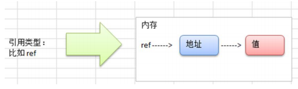
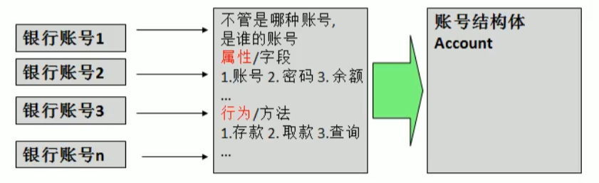

## 2.1 写代码之前: 

### 2.1.1 Go程序开发注意事项:

- go源文件以`.go`为扩展名
- go应用程序的执行是以 `main()`函数为入口
- go语言严格区分大小写
- Go方法由一条条语句构成, 语句后面不需要加`;`表示语句结束,因为`go语言会在每行后面自动加上分号`
- Go编译器是一行一行进行编译的,所以一行就写一条语句就行,`多条语句写在一起回报错`
- go语言`定义了的变量`,或者`导入了的包`没有使用到的话会报错.
- 大括号需要成对出现.

### 2.1.2 Go语言常用的转义字符:  

与其他语言一样:  反斜杠`\`表示转义

```go
\t 制表符
\n 换行符
\\ 将反斜杠转义成"\"字符
\" 将" " " 转义成 " " "字符
\r 将r字母转义成一个回车
```

### 2.1.3 Go语言的注释:  

```go
// 这是行注释
/* 这是块注释 */  
```

> 注释的使用习惯:  
>
> 块注释只是用来描述当前.go文件的作用
>
> 行注释通常是用来注释方法和语句(官方建议)

### 2.1.4 Go代码基本结构:   

```go
package main
/*
块注释写在这里,用来解释整个文件是做什么的:
go 文件结构演示 --- hello world
*/

// 导入外部包的语句
import "fmt"

// go程序入口函数
func main() {
	
	fmt.Println("hello world!")
}
```

### 2.1.5 Go语言中保留字 --- 关键字:  

**关键字**是预先约定好的具有特殊含义的标识符,通常不建议将 `关键字` 和`保留字`作其他用途.

- `关键字`: 

  ```go
      break        default      func         interface    select
      case         defer        go           map          struct
      chan         else         goto         package      switch
      const        fallthrough  if           range        type
      continue     for          import       return       var
  ```

- `保留字`:  

  ```go
      Constants:    true  false  iota  nil
  
          Types:    int  int8  int16  int32  int64  
                    uint  uint8  uint16  uint32  uint64  uintptr
                    float32  float64  complex128  complex64
                    bool  byte  rune  string  error
  
      Functions:   make  len  cap  new  append  copy  close  delete
                   complex  real  imag
                   panic  recover
  ```


-----------------------------


## 2.2 变量,常量:

注意事项: 

1. 无论是变量还是常量,在同一个作用域内名字都是不能重复的
2. 变量有数据类型的区别,同一个变量只能在该类型的取值范围中不断变化

### 2.2.1 变量 :  

#### 1.`标识符`: 

**标识符:**表示符表示具有特殊意义的词,比如变量名,常量名,函数名等等.

go语言标识符规范:  由`字母`,`数字`,和`_` 组成,并且 <font color=red>只能由`字母`或者 `_`开头</font>

几点注意事项:  

1. 包名: 保持 package的名字和目录的名字一致,尽量采用简短有意义的名字,不要和`标准库`中的包名有冲突
2. 变量,函数等: 采用驼峰命名法
3. go严格区分大小写,并且通过大小写来判断 该标识符表示的内容,能否在包外访问.
   - `小写开头: 只能在包内访问`,等价于 `java`的`private`
   - `大写开头`: 可以在包外访问,等价于 `java`的`public`

#### 2. 变量的作用域: 

1. `局部变量`: 函数内部声明的变量,叫做局部变量,其作用域就是整个函数中在它声明之后的代码都可以使用该变量,如果有`{}`则该变量的作用域限制在`{}`内部.
2. `全局变量`: 函数之外声明的变量,整个go文件任何地方都能使用
   - 全局变量如果名字以大写开头,那么在包外也可以使用(`先导包`)

**就近原则:** 同名变量在使用的时候,获取的是离使用地方最近的一个变量的值

#### 3. 变量的声明

- 标准声明:  

  ```go
  var 变量名 T
  ```

- 声明变量并初始化:  

  <font color=red> 在声明变量并初始化的时候,go语言能够对变量的类型进行推导</font>

  - 初始化单个变量: 

  ```go
  var 变量名 T = 表达式
  var 变量名 = 表达式  // 类型推导
  ```

  - 多个变量同时初始化: 

  ```go
  var 变量1,变量2 = 表达式1,表达式2
  ```

- 短变量声明: 使用 `:=`符号进行短变量声明,并初始化

  ```go
  变量名 := 表达式
  ```

  <font color=red><b>注意:</b>    如果不同时初始化变量是不能使用短变量声明的</font>

- 匿名变量的声明:  使用 `_`表示一个匿名变量,并且`可以不使用`

  ```go
  _ := 表达式
  ```
  
- 批量声明:  在声明的时候可以选择赋值与不赋值.

  ```go
  	// 批量声明 不赋值
  	var (
  		num int
  		age int
  		sex byte
  	)
  
  	// 批量声明 赋值
  	var (
  		nam int = 15
  		age1 int = 169
  		sex2 byte = 'g'
  	)
  ```

  <font color=red><b>问题:</b> 为什么byte存字符的时候,不赋值用%c输出会乱码</font>

  猜测:  byte的默认值超出了0-255.
> 变量声明注意:
> 1. 匿名变量不占用命名空间,`不会分配内存`,不存在匿名变量重复声明的问题
> 2. 函数外的每个语句都必须以关键字开始,(`var`,`const`,`func`等)
> 3. `:=`不能使用在函数之外
> 4. `_`通常是用来占位置的,用来忽略某个值

#### 4. 全局变量:   

在`方法之外`通过下列语法声明的变量  

```go
// 声明单个全局变量
var 变量名 = 表达式  
// 声明多个全局变量
var (
	变量名1 = 表达式1
    变量名2 = 表达式2
)
```

> 全局变量声明之后可以不使用.

1. 相关演示代码:  

   ```go
   package main
   
   import "fmt"
   // 声明一个全局变量, 必须赋值
   var globalVar = "全局变量"
   func main() {
   	varDeclaration()
   }
   var globalVarAfterFuncWasCalled = "在方法被调用之后声明的全局变量"
   // 变量常量的声明
   func varDeclaration(){
   	fmt.Printf("全局变量global var :  %s \n",globalVar)
   	fmt.Printf("能不能输出方法调用之后声明的变量: %s \n",globalVarAfterFuncWasCalled)
   	fmt.Printf("能不能输出方法定义之后声明的变量: %s \n",globalVarAfterFuncWasDecleared)
   	// 标准声明方式,如果不赋值就使用变量所属类型的默认值
   	var i int
   	fmt.Printf("变量 i 的值为 %d ,是否是int类型的默认值 0 : %t \n",i, i == 0)
   
   	// var i int = 10 错误的声明,变量i已经被声明过了
   	// 声明并复制:
   	var j int = 20
   	// 类型推导
   	var c = 20
   	fmt.Printf("变量 j 的值为 %d ,是否是int类型的默认值 0 : %t, 因为已经赋值了 \n",j, j == 0)
   	fmt.Printf("类型推导的c是一个 %T 类型,他的值为 %d  \n",c,c)
   
   	// 短变量声明: 实际上就是通过类型推导直接复制
   	a := "王二麻子"
   	fmt.Printf("a 是一个短变量声明出来的变量, 其类型为 %T , 值为 %s\n",a,a)
   
   	// 匿名变量的声明,匿名变量可以声明了不使用
   	var name,_ = "张三",anonymousVar()
   	fmt.Printf("通过匿名变量忽略了函数返回值,name的值为: %s \n",name)
   
   }
   
   var globalVarAfterFuncWasDecleared = "在方法定义之后声明的全局变量"
   
   func anonymousVar() string{
   	return "匿名变量"
   }
   /**
   输出结果: 
   -------------------------------------------------------------
   全局变量global var :  全局变量
   能不能输出方法调用之后声明的变量: 在方法被调用之后声明的全局变量
   能不能输出方法定义之后声明的变量: 在方法定义之后声明的全局变量
   变量 i 的值为 0 ,是否是int类型的默认值 0 : true
   变量 j 的值为 20 ,是否是int类型的默认值 0 : false, 因为已经赋值了
   类型推导的c是一个 int 类型,他的值为 20
   a 是一个短变量声明出来的变量, 其类型为 string , 值为 王二麻子
   通过匿名变量忽略了函数返回值,name的值为: 张三
   */
   ```

   **`fmt`包中`printf`函数的占位符**

   ```go
   /**
   
   printf格式化打印占位符：
               %v,原样输出
               %T，打印类型
               %t,bool类型
               %s，字符串
               %f，浮点
               %d，10进制的整数
               %b，2进制的整数
               %o，8进制
               %x，%X，16进制
                   %x：0-9，a-f
                   %X：0-9，A-F
               %c，打印字符
               %p，打印地址
               %#v,格式化打印数组
    */	
   ```

### 2.2.2 常量:  

**Go常量**`const`是属于编译时期的常量，即在编译时期就可以完全确定取值的常量。<font color=red><b>只支持`数字`，`字符串`和`布尔值`，及`上述类型的表达式`</b> </font>。而切片，数组，正则表达式等等需要在运行时分配空间和执行若干运算才能赋值的变量则不能用作常量。

#### 1. 常量声明:

- 声明语法:  

  ```go
  const 变量名 = 表达式
  // 表达式说明： 
  // go语言中常量声明的时候的表达式，只支持数值，字符串，布尔值，以及以上类型组成的表达式
  // 常量声明时的表达式,表达式参与成员都必须要是常量 
  const (
  	firstTimeCall = getAndAddConstC() + 1 // 不支持函数作为常量表达式使用.
  )
  ```

- 单个常量: 

  ```go
  	// 声明单个常量
  	const pi = 3.1415926
  ```

  

- 多个常量: 

  ```go
  	// 如果某个常量在声明时赋值了,该常量之后没有声明的常量都是那一个表达式的结果.
  	const (
  		minutes = 12
  		hours
  		day
  		month = 01
  		year
  	)
  ```

  - <font color=red>注意:</font>

    多个常量声明的时候,如果某个常量(`比如:day`)没有进行赋值,那么该常量的值就是离他最近的赋了值的`常量表达式的结果`(`比如: day的值为12,year的值为1`)

    ```go
    	// 如果某个常量在声明时赋值了,该常量之后没有声明的常量都是那一个表达式的结果.
    	// 下面这个例子,由于c,e;d,f都没有赋值,所以分别对应使用iota+1,iota+2表达式,但是在常量声明中每新增一行声明就会让iota+1
    	const (
    		a, b = iota + 1, iota + 2 //a = 1, b = 2
    		c, d                      //2,3
    		e, f                      //3,4
    		g,h = 10, 20
    	)
    	fmt.Printf("a = %d ,b = %d\n",a,b)
    	fmt.Printf("c = %d ,d = %d\n",c,d)
    	fmt.Printf("e = %d ,f = %d\n",e,f)
    	fmt.Printf("g = %d ,h = %d\n",g,h)
    ```

    

#### 2. iota: 

go语言中的常量计数器,只能在常量表达式中使用

**iota**在`const`关键字出现时将被充值为0.`const`中`每新增一行常量声明`将会让`iota`+1.使用`iota`能够简化定义,在定义枚举的时候很有用.

<font color=red>注意:<b>是每新增一行,会让iota+1</b></font>,而不是每增加一个常量就会让iota自增1.

使用示例:  

- 通常使用:  

  ```go
  	// iota使用示例
  	const (
  		n1 = iota // 0
  		n2		  // 1
  		n3        // 2
  		n4        // 3
  		n5        // 4
  	)
  ```

- _ 跳过某些值:  

  ```go
  	// 用 _ 跳过不需要的值
  	const (
  		a1 = iota //0
  		a2        //1
  		_
  		a4        //3
  	)
  ```

- 常量声明,iota中间插队

  ```go
  	// iota 中间插队,使iota增加
  	const (
  		c1 = iota //0
  		c2 = 100  //100
  		c3 = iota //2
  		c4        //3
  	)
  	const c5 = iota //0
  ```

- 定义某个数量级

  ```go
  // 使用iota来定义某个数量级
  const (
     _  = iota                  // 0
     KB = 1 << (10 * iota)     // 1024
     MB = 1 << (10 * iota)
     GB = 1 << (10 * iota)
     TB = 1 << (10 * iota)
     PB = 1 << (10 * iota)
  )
  ```

- 多个iota定义在同一行:  

  ```go
  // 多个iota定义在一行
  const (
     a, b = iota + 1, iota + 2 //a = 1, b = 2
     c, d                      //2,3
     e, f                      //3,4
  )
  ```

  <font color=red>注意:<b>是每新增一行,会让iota+1</b></font>,而不是每增加一个常量就会让iota自增1.

## 2.3 Go的数据类型


> 1. go语言是没有字符类型的,通过byte存储单个字符的ASC码值表示单个字符
> 2. go语言采用的是UTF-8的编码方式,汉字为3个字节,所以1byte无法存储一个汉字
> 3. bool类型只能使用`true`,`false`两个值,`不能像c语言那样非0即真`
> 4. 结构体类似于`c语言中的结构体`

> 默认初始值:  
>
> - 整型,浮点数                                        ===>  0
> - 字符串                                                 ===>   ""(空串)
> - 布尔类型                                             ===>        false
> - 切片,函数,指针等引用类型                ===>        nil(空指针)
>
> 可以使用`printf`函数,通过`%T`输出变量的数据类型

### 2.3.0 概述:  

**基本数据类型(值类型):**

值类型:变量直接存储值,通常在`栈中分配`


**派生数据类型(引用类型)**

引用数据类型: 变量存储的是一个地址,这个地址对应的空间才会真正的存储数据,通常在`堆上分配`,单没有任何变量引用这个地址表示的内存空间的时候, 该内存空间就是垃圾了,会被GC回收掉.



### 2.3.1 自定义数据类型和类型别名:

#### 1. 自定义类型

这种写法来源c语言的`typedef 自定义数据类型名字 数据类型`,想当于给 某个数据类型取了一个别名

拿自定义函数类型举例:

```go
type 变量名 数据类型
```

**示例:**

```go
/*
a 的类型为: main.sumFuncType,b的类型为: func(int, int) int
c的数据类型为: func(int, int) int,a和c数据类型相同吗: true
结果为: 109
*/
package main

import (
	"fmt"
	"reflect"
)

type sumFuncType func(int, int) int

func customType() {
	// 使用自定义数据类型
	var a sumFuncType
	var b func(int, int) int
	fmt.Printf("a 的类型为: %T,b的类型为: %T\n", a, b)

	// 函数赋值给变量,这里如果使用 c := sum 赋值出来的c的类型为 func(int, int) int
	c := sum
	fmt.Printf("c的数据类型为: %T,a和c数据类型相同吗: %t\n", c, reflect.TypeOf(c).Kind() == reflect.TypeOf(a).Kind())
	a = sum
	i := receiveCustomType(a, 90, 19)
	fmt.Printf("结果为: %d\n", i)
}

//作为参数传递自定义数据类型
func receiveCustomType(sumFunc sumFuncType, x, y int) int {
	return sumFunc(x, y)
}

func sum(x, y int) int {
	return x + y
}
```

#### 2. 类型别名:

**类型别名:** 实际上就是给某个类型取类一个别名,与该类型没有任何区别,并且在编译的时候也只会显示该类型.

声明:

```go
type alias = int
```

### 2.3.2 基本类型:

#### 1. 整数类型: 

go语言的整数类型分为`有符号`,`无符号`,`特殊整数类型`

- 无符号整数:

  |   类型   | 描述                                        | 占有字节数 |
  | :------: | :------------------------------------------ | ---------- |
  | `uint8`  | 无符号 8位整型 (0 到 255)                   | 1字节      |
  | `uint16` | 无符号 16位整型 (0 到 65535)                | 2字节      |
  | `uint32` | 无符号 32位整型 (0 到 4294967295)           | 4字节      |
  | `uint64` | 无符号 64位整型 (0 到 18446744073709551615) | 8字节      |

- 有符号整数:   

  |  类型   | 描述                                                         | 占有字节数 |
  | :-----: | :----------------------------------------------------------- | ---------- |
  | `int8`  | 有符号 8位整型 (-128 到 127)                                 | 1字节      |
  | `int16` | 有符号 16位整型 (-32768 到 32767)                            | 2字节      |
  | `int32` | 有符号 32位整型 (-2147483648 到 2147483647)                  | 4字节      |
  | `int64` | 有符号 64位整型 (-9223372036854775808 到 9223372036854775807) | 8字节      |

- 特殊整数类型

  |   类型    | 描述                                                   | 有无符号 | 占有字节数 |
  | :-------: | :----------------------------------------------------- | -------- | ---------- |
  |  `uint`   | 32位操作系统上就是`uint32`，64位操作系统上就是`uint64` | 无       |            |
  |   `int`   | 32位操作系统上就是`int32`，64位操作系统上就是`int64`   | 有       |            |
  | `uintptr` | 无符号整型，用于存放一个指针                           |          |            |
  |  `rune`   | 与`int32`等价,表示一个Unicode码                        | 有       | 4          |
  |  `byte`   | 与`uint8`等价                                          | 无       | 1字节      |

> 1. `uint8`对应`byte类型`
> 2. `int`和`uint`在使用的时候应该考虑到不同平台上可能产生的差异.
> 3. 在涉及到二进制传输、读写文件的结构描述时，为了保持文件的结构不会受到不同编译目标平台字节长度的影响，不要使用`int`和 `uint`。

**整数类型的使用示例:**

```go
//测试int类型的默认值
/**
测试结果:
有符号: int = 0,int8 = 0,int16 = 0,int32 = 0
无符号: uInt = 0,uInt8 = 0,uInt16 = 0,uInt32 = 0
rune default value = 0
byte default value = 0
*/
func testIntDefaultValue() {
   var (
      varInt   int
      varInt8  int8
      varInt16 int16
      varInt32 int32
   )
   fmt.Printf("有符号: int = %d,int8 = %d,int16 = %d,int32 = %d\n", varInt, varInt8, varInt16, varInt32)
   var (
      varuInt   uint
      varuInt8  uint8
      varuInt16 uint16
      varuInt32 uint32
   )
   fmt.Printf("无符号: uInt = %d,uInt8 = %d,uInt16 = %d,uInt32 = %d\n", varuInt, varuInt8, varuInt16, varuInt32)

   var varRune rune
   fmt.Printf("rune default value = %d\n", varRune)

   var varByte byte
   fmt.Printf("byte default value = %d\n", varByte)
}
```

**整型使用细节**

1. 默认情况下,整数赋值给变量默认是 `int`类型
2. `根据保小不保大的原则`,在定义变量的时候,保证逻辑不出现问题的情况下,尽量选择占用空间小的数据类型,比如: [年龄]

```go
// IntUseDetail 整数的使用细节:
/**
结果:
--------------------------------
n1的数据类型为 int, n1占用的字节数为: 8(默认是int ,int在64为系统中为8字节)
*/
func IntUseDetail() {
	// 查看变量的数据类型和占有的字节大小
	// 整数复制给变量默认是int类型
	n1 := 1999
	fmt.Printf("n1的数据类型为 %T, n1占用的字节数为: %d", n1, unsafe.Sizeof(n1))

	// golang有一个保小不保大的原则,就是说保证程序不出问题的情况下,尽量使用占用字节数少的数据类型
	// 举个例子: 年龄,一般就是0-150岁,这是最小的数据类型使用byte(0-255)就可以了
	var age byte = 200
	fmt.Printf("age : %d ", age)
}
```

**数字字面量语法**

Go1.13版本之后引入了数字字面量语法，便于用二进制，八进制，十六进制浮点数的格式定义数字  

例如：

`v := 0b00101101`， 代表二进制的 101101，相当于十进制的 45。 `v := 0o377`，代表八进制的 377，相当于十进制的 255。 `v := 0x1p-2`，代表十六进制的 1 除以 2²，也就是 0.25。  

此外：还可以在数字之间使用“_”来分隔数字,比如: `v := 123_456`表示v的值为123456

```go
// 演示数值字面量语法
func numericSyntax() {
	// 二进制 0b开头
	two := 0b00101101
	fmt.Printf("二进制数字为: %b\n", two)

	// 八进制 0开头
	eghit := 077
	fmt.Printf("八进制数字为: %o\n", eghit)

	// 十六进制 0x开头
	sixteen := 0xff
	fmt.Printf("十六进制为: %x\n", sixteen)

}
```


####　2. 浮点数类型:  

| 类型    | 占用空间 | 表数范围             |
| ------- | -------- | -------------------- |
| float32 | 4字节    | -3.403E38~3.403E38   |
| float64 | 8字节    | -1.798E308~1.798E308 |

说明:  

1. 浮点数在机器中存放形式为: 浮点数 = 符号位 + 指数位 + 尾数位,`在存储过程中,精度会有丢失`
2. 浮点数都是有符号的
3. 尾数部分可能丢失,造成精度损失, 在有精度要求的情况下,使用`decimal`包处理小数

**使用示例:**

```go
// 测试浮点数类型的默认值
/*
测试结果:
有符号: float32 = 0.000000,float64 = 0.000000
*/
func testFloatDefaultValue() {
	var (
		varfloat32 float32
		varfloat64 float64
	)
	fmt.Printf("有符号: float32 = %f,float64 = %f\n", varfloat32, varfloat64)
}
```

**使用细节:**

1. 浮点数有固定的范围和字段长度,不受操作系统的影响
2. golang浮点数默认为float64类型
3. 浮点数常量有两种表示形式:  
   - 十进制: `5.13` 或者  `.513 等价于 0.513`
   - 科学计数法: `5.134e2 = 5.13 * 10的2次方  ` 或者 `5.13e-2 = 5.13 / 10 的 2次方`
4. 精度要求不是特别高的情况下, 应该使用float64(精度高于float32)

#### 3. 字符类型: 

go语言中没有专门的字符类型,`如果存储单个字母的话,一般使用byte来存储,并且不要使用byte存储中文字符`.

字符串就是一串固定长度的字符连起来的字符序列.Go的字符串是由`单个字节连起来`的.

**使用示例:**

```go
// 字符演示
/*
结果:
------------------------------------
 字母c1为: a
存放中文的类型是: int32
直接输出: 33609
存放的中文是: 草
*/
func charUseDetail() {
	// 使用byte保存ASC码表里面的数字
	var c1 byte = 'a'
	fmt.Printf(" 字母c1为: %c\n", c1)

	// 但是不要使用byte来存储中文字符,直接编译错误
	//var c2 byte = '草'
	//fmt.Printf("中文字符: %c", c2)

	// 可以使用rune来存中文
	var test rune = '草'
	fmt.Printf("存放中文的类型是: %T\n", test)
	fmt.Println("直接输出:", test)
	fmt.Printf("存放的中文是: %c\n", test)
}
```

**使用细节:**

1. `byte`可以存储ASC码表里面的字符,超出ASC码表里面的字符可以考虑使用`int`保存
2. go语言默认使用`UTF-8`编码,`英文一个字节`,`汉字三个字节`.[查询UTF-8码值](http://www.mytju.com/classcode/tools/encode_utf8.asp)
3. go语言中所有的字符其实都是整数表示的,`%c`可以将其转换成对应的字符展示
4. go语言中汉字使用的是`int32`类型表示,同样可以使用`%c`转换成中文展示

**字符在go中的本质:**

1. 字符存储到计算机中,实际上是存储的是 字符对应码表中的码值 的二进制
   - 存储: 字符 ---->  对应码值  ---->   二进制   ----->   存储
   - 读取: 二进制  ----->  码值  -------> 字符  ------>   读取

#### 4. 布尔值:  

1. 布尔值(bool类型),只能是 `true` or `flase`
2. 布尔值占一个字节

#### 5. 字符串:  

**字符串就是一串固定长度的字符连接起来的字符序列**.go的字符串是由单个字节连接起来的.GO的字符串的字节使用`utf-8`编码标识Unicode文本

**使用示例  :   **

```go
// 使用示例
func stringUseDisplay() {
   var address string = "背景 长度  化   jifdsafdsafdsafdws"
   fmt.Printf("地址为: %s\n", address)
}
```

**使用细节:**

1. go语言同一使用`utf-8`编码表示`unicode文本`,不会有乱码

2. 字符串一旦赋值,该字符串表示的内容无法修改

   ```go
   	// go字符串一旦赋值了就不能更改了
   	//str := "a测试可不可以修改"
   	//str[0] = 'c' // cannot assign str[0]
   ```

   **如果实在要修改字符串的内容,必须将字符串强制转换成[]rune或者[]byte,修改完成之后转回string**

   ```go
   func changeString() {
   	s1 := "big"
   	// 强制类型转换
   	byteS1 := []byte(s1)
   	byteS1[0] = 'p'
   	fmt.Println(string(byteS1))
   
   	s2 := "白萝卜"
   	runeS2 := []rune(s2)
   	runeS2[0] = '红'
   	fmt.Println(string(runeS2))
   }
   ```

   

3. 字符串的两种表示方式:  

   - " 字符串内容 ",这种方式 `会识别转义字符`

   - ``反引号,以把字符串原样输出,包括换行和特殊字符,可以实现防止攻击,输出源代码的效果

     ```go
     s1 := `第一行
     第二行
     第三行
     `
     fmt.Println(s1)
     /*
     原样展示字符串:   第一行
     	第二行
     	第三行
     		
     	
     */
     ```

     

4. " + "加号可以实现字符串拼接

**string与其他类型的转换**

- 使用`strconv`包的函数,将string转换成其他类型

  

  > 将string转换成其他类型的时候,需要注意字符转必须要符合其他类型的格式,比如: 转换成`数值类型`的时候就只能是`数字字符串`

- 使用`strconv`包的函数,将其他类型转换成string

  

  ```go
  func stringToOtherType() {
  	// string 转换成bool
  	parseBool, err := strconv.ParseBool("true")
  	if err == nil {
  		fmt.Println(parseBool)
  	}
  }
  ```

#####  深入理解字符串:


#### 6. 类型转换: 

go语言中**不能**自动转换类型,任何的类型转换都需要手动转换.  

**1. 基本语法**

```go
T(v) // 表示将 值v 转换成 T类型
```

```go
// 类型转换
func typeRevert() {
	var i int32 = 100
	var n1 float32 = float32(i)
	fmt.Printf("转换之后是什么内容: %f", n1)

}
```

**2. 使用细节:**

1. 类型转换可以从 范围大  ---->  范围小(<font color=red>注意:<b>取值范围可能会溢出</b></font>), 也可以从  范围小  ----> 范围大.
2. 被转换的是变量值,变量本身的类型是没有变化的

### 2.3.3 派生数据类型:  

#### 1. 指针: *类型

**什么是指针:** 指针的本质是 `存储数据的内存地址值`,通过`*`号来获取该地址上存储的数据.(`换句话说,指针就是一个道路指示牌,我们关心的不是指示牌,指示牌指向的地方才是我们想要去的地方`)

> 提到指针,就不能不提到`c语言的指针`,于c语言指针不同的是: <font color=red><b>go语言的指针是不能 `偏移和运算`的.</b></font>

**示例:**

```go
// 什么是指针
/**
a:10 ptr:0xc00000a0c0
b:0xc00000a0c0 type:*int
0xc000006030
 */
func whatIsPointer() {
	a := 10
	b := &a
	fmt.Printf("a:%d ptr:%p\n", a, &a) // a:10 ptr:0xc00001a078
	fmt.Printf("b:%p type:%T\n", b, b) // b:0xc00001a078 type:*int
	fmt.Println(&b)
}
```


**声明和使用:**  指针的类型为 `*数据类型`

1. 声明: 

   ```go
   var 指针名 *类型  // 不赋值
   var 指针名 = &变量  // 直接通过 & 符号获取变量的地址赋值给指针变量,此时指针的类型为 *变量的类型
   指针名 := &变量 // 意义与上面方式一样
   ```

2. 使用:  通过`*指针名`获取 `指针存放的地址上的内容`

   ```go
   *指针名 // 这就是在获取指针指向的数据了
   ```

   > `*指针`实际上是等价于 指针所指向的那个变量, 给 `*指针`赋值就等价于给 变量赋值了.

3. 示例:  

   ```go
   // 声明指针和使用指针
   /**
   指针的默认值为= 0x0
   0x0是不是等于nil= true
   c =  10
   p =  10
   */
   func declarationAndUse() {
      a := 10
      // 声明指针,不赋值声明,指针默认值就是nil
      var p *int
      println("指针的默认值为=", p)
      println("0x0是不是等于nil=", p == nil)
      // 声明指针2
      c := &a
      println("c = ", *c)
      // 使用指针
      p = &a
      println("p = ", *p)
   }
   ```

#### 2. 数组:  [数组长度]数据类型

##### 1. 基本介绍: 

数组是同一种数据类型元素的集合。 在Go语言中，数组从声明时就确定，使用时可以修改数组成员，但是<font color=red><b>数组大小不可变化</b></font>。

 <font color=red><b>数组在go语言中是值类型,在参数传递的时候是将整个数组复制过去,所以如果数组比较大建议传递数组指针</b></font>

**注意事项:**

1. <font color=red><b> `[n]*T`表示指针数组，`*[n]T`表示数组指针 </b></font>。
2. 数组是同一种数据类型的集合, 一旦声明了 `长度固定,元素类型固定`
3. 数组中如果不初始化,其元素使用的是该数据类型的默认值
4. 使用的时候注意不要越界了
5. go中数组是值类型,要修改数组的值需要传递引用类型
6. [1]int和[3]int 并不是同一种类型,其他数据类型的数组也是一样的.与Java不太相同，在go语言中，相同类型但是数组容量不同，也被视为不同的数组类型，只有两个条件都相同才是同一类型。

##### 2. 基本语法:

1. 声明:

   ```go
   var 变量名 [元素个数]数据类型   //声明不复制
   var 变量名 [元素个数]数据类型 = [元素个数]数据类型{该类型的元素列表} // 静态初始化数组.也可以类型推导,短变量的方式声明
   var 变量名 = [元素个数]数据类型{元素列表}
   var 变量名 = [元素个数]数据类型{下标: 值,.....} // 以最大的下标为数组的长度
   ```

   ```go
   // 声明1: 不赋值后面赋值
   var arr1 [3]int
   for i := 0; i < 11; i++ {
      arr1[i] = i
      if i == 2 {
         break
      }
   }
   // 指定数组长度并赋值
   var arr2 [3]int = [3]int{1, 2, 3}
   fmt.Println(arr2)
   
   // 声明3: 不指定长度,让go去推断,必须赋值并且必须使用类型推导声明
   var arr3 = [...]int{1}
   fmt.Println(arr3)
   
   // 声明4: 通过下标指定具体元素是什么值
   var arr4 = [3]string{1: "jva"}//arr4 =  [ jva go lang]
   arr := []int{1: 2, 5: 6, 3: 4}// arr =  [0 2 0 4 0 6]
   ```
   
2. 使用: 通过下标来获取对应位置上的元素

   ```go
   变量名[0] // 表示获取数组元素中第一个元素
   ```

3. 数组的遍历:

   ```go
   func traverse() {
   	// 下标遍历
   	for i := 0; i < len(arr10086); i++ {
   		// 做些什么
   	}
   
   	// for-range遍历
   	for a, b := range arr10086 {
   		//
   		fmt.Printf("%d", a)
   		fmt.Printf("%s", b)
   	}
   }
   ```
   
4. 多维数组: 

   ```go
   	a := [3][2]string{
   		{"北京", "上海"},
   		{"广州", "深圳"},
   		{"成都", "重庆"},
   	}
   	fmt.Println(a)       //[[北京 上海] [广州 深圳] [成都 重庆]]
   	fmt.Println(a[2][1]) //支持索引取值:重庆
   
   	// 多维数组的遍历
   	for _, v1 := range a {
   		for _, v2 := range v1 {
   			fmt.Printf("%s\t", v2)
   		}
   		fmt.Println()
   	}
   ```

#### 3.切片: []数据类型

##### 1. 基本介绍: 

拥有相同类型元素的可变长度的序列.它是基于数组做的一层封装,`支持自动扩容`,是一个引用类型.

- 内部结构包含: `地址`,`长度`和`容量`.
- 切片一般用于快速的操作一块数据集合.

**数据结构:**

```go
type SliceHeader struct {
	Data uintptr    // 底层数组头指针
	Len  int        // 切片元素数量
	Cap  int        // 切片容量
}
```


##### 2. 基本语法:

1. 声明

   1. 通过已经创建好的数组去创建切片

      ```go
      var 切片名 = 数组名[low:high]
      ```

      ```go
      // 数组	
      var arr = [...]int{1, 2, 3, 5, 7, 65, 47, 56}
      // 切片	
      slice := arr[:]
      ```

      说明: 

      1. `[low:hign]` 是在确定切片从数组的哪个位置开始到哪个位置截止,范围为`[low,high)`. 

      2. `low和high`可以其中一个不写,或者两个不写.不写`low`默认从 数组第一个元素开始,不写`high`默认到数组最后一个元素截止
      3. 对于数组或字符串，如果`0 <= low <= high <= len(a)`，则索引合法，否则就会索引越界（out of range）。
      4. 这种方式声明就类似于 `java中ArrayList.subList`,不同的点就在于,slice的修改只有在数组长度范围内修改,才会对原数组进行修改.比如: 对slice进行append操作

   2. 通过`make函数`来创建

      ```go
      var 切片名 []数据类型 = make([]数据类型,len,cap)
      ```

      ```go
      	ints := make([]int, 0, 0)
      ```

   3. 定义切片的时候直接赋值

      ```go
      var 切片名 []数据类型 = []数据类型{....元素列表}
      ```

      ```go
      	strings := []string{"jva", "go", "ruby", "c", "python"}
      ```

2. 遍历: 

   ```go
   
   // 切片的遍历,看看遍历的过程中会不会出现fast fail的情况
   // 结论: 不会出现java中的fast fail情况,就是遍历的时候删除元素不会出现问题
   // 原因: 因为不是在原切片上进行删除,而是将原切片截断成新的切片赋值给原切片
   func traverseSlice(){
   	strings := []string{"jva", "go", "ruby", "c", "python"}
   	for i, s := range strings {
   		fmt.Printf("%d %s",i,s)
   		if i == 0 {
   			strings = append(strings[:1], strings[2:]...)
   		}
   	}
   }
   ```

3. 切片追加元素:

   对于切片,通过 slice[下标]的形式去赋值否个元素,如果下标超过切片的容量,会触发数组越界异常.

   如果需要对切片进行元素的追加,更好的办法是`append()`方法,append方法会对切片进行扩容,不会有数组越界异常

   ```go
   func append(slice []Type, elems ...Type) []Type
   // slice 表示要添加到的切片
   // elems 表示要添加的元素,可以是一个元素,可以是多个元素,也可以是一个切片(但是需要对切片后面加 ... )
   ```

   ```go
   // 切片的遍历,看看遍历的过程中会不会出现fast fail的情况
   /*
   append单个元素 ->  [jva go ruby c python c艹]
   append多个元素 ->  [jva go ruby c python c艹 c艹艹 vb erlang lua]
   append一个切片 --->  [jva go ruby c python c艹 c艹艹 vb erlang lua js vue rust and so on]
    */
   func traverseSlice(){
      strings := []string{"jva", "go", "ruby", "c", "python"}
      for i, s := range strings {
         fmt.Printf("%d %s\n",i,s)
         if i == 0 {
            strings = append(strings[:1], strings[2:]...)
         }
      }
   }
   
   // 切片追加元素
   func appendElems(){
      strings := []string{"jva", "go", "ruby", "c", "python"}
      // 追加一个元素
      strings = append(strings, "c艹")
      fmt.Println("append单个元素 -> ",strings)
   
      strings = append(strings,"c艹艹","vb","erlang","lua")
      fmt.Println("append多个元素 -> ",strings)
   
      strings2 := []string{"js", "vue", "rust", "and so on"}
      strings = append(strings,strings2...)
      fmt.Println("append一个切片 ---> ",strings)
   }
   ```

   **注意:**  

   <font color=red><b>扩容之后,会重新分配slice底层指向的数组,此时再对slice进行修改不会对原slice造成影响 </b></font>。

   ```go
   // 扩容之后底层的数组变了
   func appendTest() {
       array := [4]int{10, 20, 30, 40}
   	slice := array[0:2]
   	newSlice := append(append(append(slice, 50), 100), 150)
   	newSlice[1] += 1
   	fmt.Println(slice)
   	fmt.Printf("old slice指向的数组地址为 : %v ,new Slice的指向的数组地址为: %v\n", unsafe.Pointer(&slice[0]),unsafe.Pointer(&newSlice[0]))
    	// [10 20]
   	// old slice指向的数组地址为 : 0xc000010200 ,new Slice的指向的数组地址为: 0xc00000e380
   
   	array2 := [4]int{10, 20, 30, 40}
   	slice2 := array2[0:2]
   	newSlice2 := append(append(slice2, 50), 100)
   	newSlice2[1] += 1
   	fmt.Println(slice2)
   	fmt.Printf("old slice指向的数组地址为 : %v ,new Slice的指向的数组地址为: %v\n", unsafe.Pointer(&slice2[0]),unsafe.Pointer(&newSlice2[0]))
   	// [10 21]
   	// old slice指向的数组地址为 : 0xc0000041f8 ,new Slice的指向的数组地址为: 0xc000004210
   }
   ```

4. 切片的复制: 

   - 使用 `=` 对切片进行浅拷贝,仅复制切片的地址值

     ```go
     // 切片的复制:
     func sliceCopyTest() {
     	// = 号赋值是浅拷贝,只赋值了slice底层数组的地址值,对副本操作会影响原slice
     	/*
     		sliceReplication的地址为 : 0xc000098210,原slice的地址为: 0xc0000981f8
     		sliceReplication底层数组的地址为 : 0xc0000e60a0,原slice底层数组的地址为: 0xc0000e60a0
     		java
     		java
     	*/
     	strings := []string{"jva", "go", "ruby", "c", "python"}
     	var sliceReplication = strings
     	fmt.Printf("sliceReplication底层数组的地址为 : %v,原slice底层数组的地址为: %v\n", &sliceReplication[0], &strings[0])
     	sliceReplication[0] = "java"
     	fmt.Println(sliceReplication[0])
     	fmt.Println(strings[0])
     }
     ```

   - 使用 `copy()`对切片进行深拷贝, 将切片中的数据内容一同复制一份,存放于新的空间.

     ```go
     func copy(dst, src []Type) int
     // dst目标切片,src原切片
     ```

     注意: 

     1. <font color=red><b> 要求目标切片的len和原切片的len长度相同(或者比原切片大), </b></font>否则会报数组越界异常
     2. 只能在两个切片类型之间只用copy操作
     3. 如果目标切片的元素长度大于原slice的长度,那么大于原slice长度的元素保留目标slice中元素的值

     ```go
     // 切片的复制:
     func sliceCopyTest() {
     	// copy()函数对原slice所有的内容都复制,重新开辟一个空间来存放
     	/**
     	sliceR底层数组的地址为 : 0xc00004e140,原slice底层数组的地址为: 0xc00004e190
     	java
     	jva
     	*/
     	var sliceR = make([]string, 5, 5)
     	strings = []string{"jva", "go", "ruby", "c", "python"}
     	copy(sliceR, strings)
     	fmt.Printf("sliceR底层数组的地址为 : %v,原slice底层数组的地址为: %v\n", &sliceR[0], &strings[0])
     	sliceR[0] = "java"
     	fmt.Println(sliceR[0])
     	fmt.Println(strings[0])
     }
     ```

5. 删除元素: 

   slice中并没有直接的删除接口,一般就是使用append对slice进行截取操作.

   ```go
   // 删除元素
   // [jva go c python]
   func deleteElem(){
   	// 删除ruby
   	strings := []string{"jva", "go", "ruby", "c", "python"}
   	strings = append(strings[:2],strings[3:]...)
   	fmt.Println(strings)
   }
   ```

   

6. **切片扩容原理:**

   源码:

   ```go
   func growslice(et *_type, old slice, cap int) slice {
       // ... 省略部分代码
   
   	newcap := old.cap
   	doublecap := newcap + newcap
   	if cap > doublecap {
   		newcap = cap
   	} else {
   		if old.cap < 1024 {
   			newcap = doublecap
   		} else {
   			// Check 0 < newcap to detect overflow
   			// and prevent an infinite loop.
   			for 0 < newcap && newcap < cap {
   				newcap += newcap / 4
   			}
   			// Set newcap to the requested cap when
   			// the newcap calculation overflowed.
   			if newcap <= 0 {
   				newcap = cap
   			}
   		}
   	}
   	// ... 省略部分代码
   	
       // 定义slice底层指向数组的指针
       var p unsafe.Pointer
   	
       // ... 省略部分代码
       
       // 将原数组中的元素,复制到p指针所指向的数组中
       // 这就是扩容后新slice修改不会影响原slice的原因
   	memmove(p, old.array, lenmem)
   
   	return slice{p, old.len, newcap}
   }
   ```

   1. 判断 需要的新容量(cap),是不是比旧容量(old.cap)的两倍还大,如果大于旧容量的两倍,那么 新申请的容量(newcap)就 使用需要的新容量(cap)
   2. 如果没有大于旧容量的两倍,那么判断 旧容量是否大于 1024
      1. 如果旧容量小于1024,那么 将新申请的容量(newcap)设置为旧容量的两倍
      2. 如果旧容量大于1024,那么 将新申请的容量(newcap)扩大1.25倍
         1. 如果newcap在计算的时候溢出了,那么就将newcap置为cap(需要的容量)

#### 4. map: map[key类型]val类型

##### 1. 基本介绍:

**map**是go语言提供的一种映射关系的容器,其内部使用`散列表(hash)`实现

**map**是基于`key - value`的数据结构,go语言的**map**是 **引用数据类型**,必须初始化才能使用.

##### 2. 基本语法:

1. 声明:

   - 声明再make:

     ```go
     var 变量名 map[key数据类型]value数据类型
     ```

      <font color=red><b>这种方式map声明了是不会分配内存的,需要通过make初始化之后,才能使用</b></font>

     ```go
     // cap可选
     make(map[keytype]valuetype,[cap])
     ```

   - 直接make

     ```go
     var 变量名 = make(map[keytype]valuetype,[cap])
     ```

   - 声明时直接填充元素

     ```go
     变量名 := map[keytype]valuetype{
     	key: value,
     	.... ,
         // 注意即使是最后一个键值对也必须要加 ","号
     }
     ```

   说明: 

   1. **key**: 可以是很多种类型,比如: bool,数字,string,指针,channel,还可以是只包含前面几种类型的接口,数组,结构体, <font color=red><b>一般是使用int或者string作为key</b></font>

       <font color=red><b>不能是slice,map,function</b></font>,因为他们不能使用 `==`来比较

   2. **value**: value和key要求基本一样. <font color=red><b>一般是使用数字,string,map,struct作为value</b></font>

   **示例:**

   ```go
   	// 声明1,此时 a 还是一个空指针,并不能使用,需要make分配空间
   	var a map[string]string
   	fmt.Printf(" map声明之后是什么: %v\n",a)
   	// 如果不声明之后不给map分配空间,会报错,assignment to entry in nil map
   	//a["狗蛋"] = "宋江"
   
   	// 给map分配内存,10表示能够存10个键值对
   	a = make(map[string]string,10)
   	a["狗蛋"] = "宋江"
   
   	// 声明2 直接make
   	stringMapString := make(map[string]string, 10)
   	stringMapString["张三"] = "godaner"
   	fmt.Println("stringMapString = ",stringMapString)
   
   	// 声明3 直接填充元素
   	declaration3 := map[string]string{
   		"张三": "狗蛋儿",
   		"李四": "翠花儿",
   		"王五": "酸菜",
   	}
   	fmt.Println("declaration3 = ",declaration3)
   ```

##### 3. crud:

1. 增加和更新:

   ```
   map[key] = value
   ```

    <font color=red><b>如果key存在,更新value;如果key不存在,插入键值对</b></font>

2. 删除: 

   ```go
   delete(map名,key)
   ```

    <font color=red><b>delete是一个内置操作,如果key存在,就删除简直对;如果不存在,不进行任何操作,也不报错</b></font>

   如果要删除所有的键值对,没有现成的接口,只能遍历删除,或者重新make.

3. 查找:

   ```go
   value,ok := map名字[key]
   ```

    <font color=red><b>上面这个写法实际上就等同于 java中 get和contains的组合,上面这个写法会返回两个值,一个是value,一个是查找结果</b></font>

4. 示例: 

   ```go
   func mapCRUD(){
   	// 增加和替换
   	intMapString := make(map[int]string)
   	intMapString[1] = "张三"
   	fmt.Println("intMapString = ",intMapString)
   
   	// 删除
   	declaration3 := map[string]string{
   		"张三": "狗蛋儿",
   		"李四": "翠花儿",
   		"王五": "酸菜",
   	}
   	delete(declaration3,"张三")
   	fmt.Println("declaration3 = ",declaration3)
   	delete(declaration3,"王二麻子")
   	fmt.Println("declaration3 = ",declaration3)
   	// 查找
   	value,ok := declaration3["no1"]
   	if ok {
   		fmt.Println("value =",value)
   	}
   	
   	// 全部删除
   	declaration3 = make(map[string]string,0)
   	fmt.Println("declaration3 = ",declaration3)
   
   }
   ```

##### 4. 遍历

1. 只能使用for-range遍历

   ```go
   func mapTraverse(){
   	// map的遍历只能使用for-range
   	// 删除
   	declaration3 := map[string]string{
   		"张三": "狗蛋儿",
   		"李四": "翠花儿",
   		"王五": "酸菜",
   	}
   	for key, value := range declaration3 {
   		fmt.Printf("key = %s,vlaue = %s\t",key,value)
   	}
   	fmt.Println()
   
   	de3 := map[string]map[string]string{
   		"张三": {
   			"姓名": "张三",
   			"年龄": "12",
   			"职业": "码畜",
   		},
   		"王五": {
   			"姓名": "王王五",
   			"年龄": "12",
   			"职业": "汪汪队",
   		},
   	}
   	for name,info := range de3 {
   		for title, value := range info {
   			fmt.Printf("%s的信息如下: %s : %s\n",name,title,value)
   		}
   	}
   }
   ```

##### 5. 切片:

实际上就是把切片声明中的类型设置为map.让map的容量动态化,可以更方便使用.

```go
func sliceOfMap(){
   // 声明一个map切片,实际上就是java里面的List<Map<String,String>>
   var master []map[string]string
   // 初始化切片
   master = make([]map[string]string,2)
   if master[0] == nil {
      master[0] = make(map[string]string,2)
   }
}
```

##### 6. 排序 --- 遍历有序:

早期: go中没有对map中的entry顺序做具体的规定,既不是按照添加进map的顺序,也不是按照key的大小顺序排列,所以map中entry是无序的,每一次遍历都有可能

现在: 虽然map中元素存放是有序的了,但是遍历仍然是无序的

**实现遍历有序**,实际上就是通过`sort包下的函数`,将key有序的存入slice里面,然后遍历slice,再从map里面去entry.

```go
func orderOfMap(){
	strMapInt := map[string]int{
		"a": 1, "b": 1, "v": 1, "c": 1, "g": 1,
	}
	fmt.Println(strMapInt)

	// 遍历仍然是无序的
	for s := range strMapInt {
		fmt.Printf("%T,%v\n",s,s)
	}

	// 有序的输出map中的entry

	// 1. 将key存入切片
	var keys []string
	for key := range strMapInt{
		keys = append(keys,key)
	}
	// 将slice中的元素排好序
	sort.Strings(keys)
	fmt.Println(keys)

	for _,key := range keys {
		fmt.Printf("map[%s]=%d",key,strMapInt[key])
	}
}
```

##### 7. 使用细节:

1. map是一个应用类型,对形参修改会直接改变实参中的数据
2. map也是可以动态扩容的

#### 5. 结构体: struct

##### 1. struct概述

Go语言提供了一种自定义数据类型，可以封装多个基本数据类型，这种数据类型叫结构体，英文名称`struct`, 使用struct来充当传统OOP语言中class对某一事物属性的描述.

 <font color=red><b>结构体是一个值类型,</b></font>因为结构体变量的地址值是结构体中第一个属性的地址,因此结构体变量本身存储的是数据值而不是地址值

**定义`struct`:**  

 <font color=red><b>实际上是用结构体来自定义一个数据类型,这个数据类型可以描述某一个事物的基本属性</b></font>

```go
type 结构体名字 struct{
    属性名 数据类型
	属性名 数据类型
	属性名 数据类型
    ...
}
```

 <font color=red><b>注意事项:</b></font>

1. 如果结构体的属性需要被包外访问, <font color=red><b>结构体名字和属性名字都必须要是大写的</b></font>
2. **结构体中属性的类型** 可以是go语言中的任何数据类型
3. 结构体是个值类型,如果没有给属性赋值,那么属性将使用各个数据类型的默认值
4. 结构体实例化之后(声明), 各个结构体实例之间属性的值不会相互影响,<font color=red><b>也就是说一个实例的属性值变化,另外一个实例属性值不会改变</b></font>
5. 如果结构体中有引用类型的变量,因为其默认值为nil 无法直接使用,必须要对其进行初始化之后才能使用

```go
// struct定义,定义一个结构体表示人
type person struct{
	name string
	age int
	hobby string
}
```

##### 2. 声明结构体:

又叫结构体实例化,结构体变量又称为结构体实例

- 方式1: 

  ```go
  var 结构体实例名 结构体数据类型
  ```

- 方式2: 通过匿名结构体,声明时直接复制

  ```go
  var 结构体实例名 结构体数据类型 = 结构体数据类型{}
  ```

- 方式3: new 一个指向person结构体的指针

  ```go
  var 结构体实例名 结构体数据类型 = new(结构体数据类型)
  ```

- 方式4: `&`取一个匿名结构体的地址,获得一个指向结构体的指针

  ```go
  var 结构体实例名 结构体数据类型 = &结构体数据类型{}
  ```

- 示例: 

  ```go
  func firstView(){
  	// 结构体声明
  	var cater person
  	cater.name = "James"
  	cater.age = 12
  	cater.hobby = "打篮球"
  	fmt.Printf("james的地址为: %p\n",&cater)
  	fmt.Printf("james中name属性的地址为: %v,值为: %s\n",&cater.name, cater.name)
  	fmt.Printf("james中age属性的地址为: %v,值为: %d\n",&cater.age, cater.age)
  	fmt.Printf("james中hobby属性的地址为: %v,值为: %s\n",&cater.hobby, cater.hobby)
  
  	// 方式2: 通过匿名结构体,声明时直接复制
  	var kobe = person{
  		"kobe",
  		38,
  		"打篮球",
  	}
  	fmt.Println(kobe)
  
  	// new 一个指向person结构体的指针
  	var iverson *person = new(person)
  	// 调用某个属性,标准的写法(*iverson).属性名,但是go语言对其进行了优化,
  	// 在底层 将iverson.属性名 优化成了 (*iverson).属性名
  	iverson.name = "12"
  	fmt.Println(iverson)
  
  	// `&`取一个匿名结构体的地址,获得一个指向结构体的指针
  	var tracy *person = &person{}
  	fmt.Println(tracy)
  }
  ```

**匿名字段:**

结构体允许成员属性在声明的时候没有名字而只有类型,这种没有名字的字段就称为匿名字段.

<font color=red>匿名字段并不是没有名字,而是默认会采用类型名作为字段名，结构体要求字段名称必须唯一，因此一个结构体中同种类型的匿名字段只能有一个。</font>

```go
//Person 结构体Person类型
type Person struct {
	string
	int
}

func main() {
	p1 := Person{
		"小王子",
		18,
	}
	fmt.Printf("%#v\n", p1)        //main.Person{string:"北京", int:18}
	fmt.Println(p1.string, p1.int) //北京 18
}
```

**嵌套结构体:**

```go
//Address 地址结构体
type Address struct {
	Province string
	City     string
}

//User 用户结构体
type User struct {
	Name    string
	Gender  string
	Address //匿名字段
}

func main() {
	var user2 User
	user2.Name = "小王子"
	user2.Gender = "男"
	user2.Address.Province = "山东"    // 匿名字段默认使用类型名作为字段名
	user2.City = "威海"                // 匿名字段可以省略
	fmt.Printf("user2=%#v\n", user2) //user2=main.User{Name:"小王子", Gender:"男", Address:main.Address{Province:"山东", City:"威海"}}
}
```

##### 3. 结构体的内存布局:


##### 4. 内存对齐: 

由于cpu并不是单个字节单个字节的去访问内存,而是一块一块的去读取,块的大小可以是 2,4,6,8等字节大小.不同的平台其访问粒度(块)不同

内存对齐主要目的是:

- 平台移植性原因: 不是所有的硬件平台都能够访问任意地址上的任意数据.
- 性能原因: 如果访问未对齐的内存,将会造成cpu进行两次内存访问,并且要花费额外的时钟周期来处理对齐及运算.如果访问对齐的内存仅需要依次访问就完成读取动作

对齐系数:

不同的平台上编译器都有自己自己默认的`对齐系数`.通常:  32位  --->   4 , 64 位 ----> 8

```go
// 字节对齐
/**
bool align: 1
int32 align: 4
int8 align: 1
int64 align: 8
byte align: 1
string align: 8
map align: 8
slice align: 8
 */
func byteAlignment(){
	// 在 Go 中可以调用 unsafe.Alignof 来返回相应类型的对齐系数
	// 成员对齐,看看不同类型的成员对齐是怎么个样子的
	fmt.Printf("bool align: %d\n", unsafe.Alignof(bool(true)))
	fmt.Printf("int32 align: %d\n", unsafe.Alignof(int32(0)))
	fmt.Printf("int8 align: %d\n", unsafe.Alignof(int8(0)))
	fmt.Printf("int64 align: %d\n", unsafe.Alignof(int64(0)))
	fmt.Printf("byte align: %d\n", unsafe.Alignof(byte(0)))
	fmt.Printf("string align: %d\n", unsafe.Alignof("EDDYCJY"))
	fmt.Printf("map align: %d\n", unsafe.Alignof(map[string]string{}))
	fmt.Printf("slice align: %d\n", unsafe.Alignof([]int{}))
}
```

整体对齐: 

对于结构体,除了成员变量之间会存在内存对齐的情况,结构体整体也会进行内存对齐.

对齐规则:

- 结构体的成员变量: 第一个成员变量的偏移量为0.往后的每个成员变量的对齐值必须为 `编译器默认对齐长度(#pragma pack(n))`或者 `当前成员变量对应类型的长度`, 取两者之间的最小值最为该类型的对齐值.其偏移量必须为对齐值的整数倍

- 结构体本身: 对齐值必须是 `编译器默认对齐长度` 或者 `结构体的所有成员变量类型中最大长度`,取`二者之间最大值的最小整数倍`作为对齐值

- 偏移量是当某个元素要存入内存中,此时应该存入的位置相对于初始位置偏移的多少

  当`编译器默认对齐长度`超过结构体内不成员变量的类型最大长度时, `默认对齐长度没有什么意义`

举个例子: 结构体如下  

```go
type person struct{
    a bool
    b int32
    c int8
    d int64
    e byte
}
```

- 成员a: 

  - 类型为`bool`,自身长度一个字节
  - 取默认对齐长度与自身长度的最小值为对齐值,所以对齐值为1字节
  - 初始地址,偏移量为0,占用一个字节长度,此时内存中为  a

- 成员b:

  - 类型为`int32`,自身占用4字节
  - 取默认对齐长度与自身长度的最小值为对齐值,所以对齐值为4字节,
  - a存入后只占用了1个字节,相对于初始地址偏移量为1,且偏移量必须是对齐值的整数倍,故偏移量为4,将偏移量填充为4,此时内存中为 `axxx bbbb`

- 成员c:

  - 类型为`int8`,自身长度1字节
  - 取最小值作为对齐值,则对齐值为1,切偏移量应该为1的倍数,成员`b`存入内存中后使用字节数为8,即此时偏移量为8,满足规则1,无需填充
  - 直接将c存入,此时内存中 `axxx bbbb c`

- 成员d:

  - 类型为 `int64`,自身长度为8
  - 取默认对齐值与自身长度的最小值为对齐值,对齐值为8
  - c存入后使用了9个字节,相对于初始地址偏移了9个字节,不满足偏移量为对齐值的整数倍,所以应该填充7个字节,将偏移量置为16,然后放入d,此时内存中为 `axxx bbbb cxxx xxxx dddd dddd`

- 成员e:

  - 类型为byte,自身长度1
  - 对齐值为1
  - d存入后偏移量为24,满足规则1,不需要填充,直接存入,此时内存为 `axxx bbbb cxxx xxxx dddd dddd e`

- 结构体整体对齐:

  - 默认对齐长度为8,成员变量中自身最大长度也是8,成员变量对齐后整体占 25个字节,所以大于25且为8的最小整数倍,对齐值为32,`故整个结构体内存对齐后应该占的长度为32字节`

- | 成员变量   | 类型  | 偏移量 | 自身占用 |
  | ---------- | ----- | ------ | -------- |
  | a          | bool  | 0      | 1        |
  | 字节对齐   | 无    | 1      | 3(填充)  |
  | b          | int32 | 4      | 4        |
  | c          | int8  | 8      | 1        |
  | 字节对齐   | 无    | 9      | 7(填充)  |
  | d          | int64 | 16     | 8        |
  | e          | byte  | 24     | 1        |
  | 字节对齐   | 无    | 25     | 7(填充)  |
  | 总占用大小 | -     | -      | 32       |

- 验证:

  ```go
  var person person
  fmt.Printf("person所占字节长度: %d\n",unsafe.Sizeof(person))
  // 输出结果: person所占字节长度: 32
  
  	var person person1
  	fmt.Println("t占用的实际内存大小:", unsafe.Sizeof(person), "字节,结构体对齐保证:", unsafe.Alignof(person))
  	fmt.Println("a:", unsafe.Sizeof(person.a), "字节,字段对齐保证:", unsafe.Alignof(person.a), ",偏移地址:", unsafe.Offsetof(person.a))
  	fmt.Println("b:", unsafe.Sizeof(person.b), "字节,字段对齐保证:", unsafe.Alignof(person.b), ",偏移地址:", unsafe.Offsetof(person.b))
  	fmt.Println("c:", unsafe.Sizeof(person.c), "字节,字段对齐保证:", unsafe.Alignof(person.c), ",偏移地址:", unsafe.Offsetof(person.c))
  	fmt.Println("d:", unsafe.Sizeof(person.d), "字节,字段对齐保证:", unsafe.Alignof(person.d), ",偏移地址:", unsafe.Offsetof(person.d))
  	fmt.Println("e:", unsafe.Sizeof(person.e), "字节,字段对齐保证:", unsafe.Alignof(person.e), ",偏移地址:", unsafe.Offsetof(person.e))
  	fmt.Println(uintptr(unsafe.Pointer(&person)))
  	fmt.Printf("变量a的地址为: %v\n", &(person.a))
  	fmt.Printf("变量b的地址为: %v\n", &(person.b))
  	fmt.Printf("变量c的地址为: %v\n", &(person.c))
  	fmt.Printf("变量d的地址为: %v\n", &(person.d))
  	fmt.Printf("变量e的地址为: %v\n", &(person.e))
  	fmt.Printf("person所占字节长度: %d\n", unsafe.Sizeof(person))
  
  /**
  t占用的实际内存大小: 32 字节,结构体对齐保证: 8
  a: 1 字节,字段对齐保证: 1 ,偏移地址: 0
  b: 4 字节,字段对齐保证: 4 ,偏移地址: 4
  c: 1 字节,字段对齐保证: 1 ,偏移地址: 8
  d: 8 字节,字段对齐保证: 8 ,偏移地址: 16
  e: 1 字节,字段对齐保证: 1 ,偏移地址: 24
  824633786944
  变量a的地址为: 0xc000010240
  变量b的地址为: 0xc000010244
  变量c的地址为: 0xc000010248
  变量d的地址为: 0xc000010250
  变量e的地址为: 0xc000010258
  person所占字节长度: 32
  注意: 地址是16进制
  */
  ```

- 结论:

  > 在构造结构体时候,占用较大存储空间的字段后写比先写,占用的空间更小.

##### 5. 结构体使用注意事项: 

1. 结构体的基本数据类型变量在内存的分部是连续的,引用数据类型不一定是

2. 结构体只有在 字段数量,名字,类型完全相同的时候才能类型转换,<font color=red>但是不能相互赋值</font>

3. 结构体类型通过`type`再定义,相当于取别名,这种用法在go语言中被认为是新数据类型,但是可以相互类型转换

4. 结构体的每个字段,可以写上一个tag,该tag可以通过 `发射机制`获取,(适用场景就是:序列化和反序列化)

   ```go
   // tag的格式 key 比如: json, value 表示序列化的名字
   // tag的作用有些类似于java中 @JsonProperty,起到一个给属性重命名的作用
   `key:value`
   ```

   

   ```go
   // Monster 结构体的序列化
   type Monster struct{
   	Name string `json:"name"` // ``表示是个tag
   	Age int `json:"age"`
   	Skill string `json:"skill"`
   }
   ```

5. 空结构体是不占用空间的

   ```go
   var a struct{}
   fmt.Println("a的大小是: ",unsafe.Sizeof(a))
   // 结果: 0
   ```


#### 6. 方法: method

前面的`struct`是描述某个事物的属性,`method` 就是用来描述某个事物的行为的

go语言中的 `方法method`是一种作用于特定类型变量(`也就是和其他类型绑定`)的函数.这种特定类型变量叫`接受者reciver`.接受者的概念就等同于其他语言中的`this` 或 `self`.

> 特定类型:  只要是通过关键字  `type`定义的类型变量,都可以有方法

##### 1. 声明和调用: 

**声明:**

```go
func (接受者变量名 接受者类型) 方法名字(参数列表) (返回值列表) {
    函数体
}
```

**调用:**

```go
var 接受者名字 接受者类型
接受者名字.方法名
```

> 1. 方法的调用<font color=red>只能是通过接受者类型的变量来调用</font>,而不能通过方法名字来调用 

**示例:**

```go
// 方法的入门示例
// 自定义结构体,用来做方法的接受者
type animal struct {
	name string
}

// 定义方法
func (a *animal) bark(content string) {
	a.name = "张三"
	fmt.Printf("dog 的地址为: %p\n",a)
	fmt.Println(a.name + " 在疯狂的嚎叫 : " + content)
}
/*
结果:
dog 的地址为: 0xc00003ec60
张三 在疯狂的嚎叫 : 汪汪
dog 的地址为: 0xc00003ec60
dog的名字是 :  张三
 */
func methodTest(){
	var dog animal = animal{"李四"}
	dog.bark("汪汪")
	fmt.Printf("dog 的地址为: %p\n",&dog)
	fmt.Println("dog的名字是 : ",dog.name)
}
```

**特殊的:**

```go
// 方法
func (a animal) run(content string) {
	a.name = "张三"
	fmt.Printf("cat 的地址为: %p\n",&a)
	fmt.Println(a.name + " 在疯狂的奔跑 : " + content)
}
func methodTest(){
	// 如果接受者类型是值类型,就算使用地址调用方法,接受者仍然是实例的副本,而不是指向实例
	/**
	cat 的地址为: 0xc00003eca0
	张三 在疯狂的奔跑 : 嘿嘿嘿嘿
	cat 的地址为: 0xc00003ec90
	cat的名字是 :  tom cat
	 */
	var cat animal = animal{"tom cat"}
	(&cat).run("嘿嘿嘿嘿")
	fmt.Printf("cat 的地址为: %p\n",&cat)
	fmt.Println("cat的名字是 : ",cat.name)
}
```

 **强调:**

1. 接受者变量名建议: 官方建议使用接受者类型的首字母小写 作为接受者的名字.

2. 接受者类型: 跟参数类型没有什么区别,可以是指针类型或者非指针类型

3. 方法名,参数列表,返回值列表: 具体格式和函数类型相同

4. 接受者变量名: 跟函数传参是相同的,只不过实参是调用方法的实例.

5. 包外访问的规则: 大写允许包外访问,小写不允许

6. 在go语言中,如果接受者类型为值类型的话,使用地址取调用方法,该地址会被go语言优化成(*地址),底层还是通过结构体实例来调用的,再传递给接受者的时候,只是会复制一个副本,而不是接受者去指向结构体实例

   <font color=red>简单来讲: 编译器会将方法的调用者优化成 接受者表示的类型传参的意思 ---  值类型复制,引用类型指向调用者</font>

7. 什么时候使用引用类型的接受者: 

   - 需要对方法的调用者进行修改,该方法就应该使用引用类型的接受者
   - 方法的调用者是一个大对象,由于值类型接受者是复制一份开销很大,所以使用引用类型的接受者更合理
   - 保持一致性,如果某个方法使用了指针类型的接受者,其他方法也应该使用指针类型的接受者
   
8. 当结构体重存在引用类型属性的时候,修改他们应该通过make新的引用类型实例,然后拷贝

   ```go
   // SetDreams 这种修改方式的问题在于,结构体中的slice是指向data的,修改data的值会同时修改结构体中的slice
   func (p *Person) SetDreams(dreams []string) {
   	p.dreams = dreams
   }
   
   // SetDreams1 这种写法结构体指向的是make出来的slice,而不是指向data,修改data不影响结构体中的slice
   func (p *Person) SetDreams1(dreams []string) {
   	p.dreams = make([]string, len(dreams))
   	copy(p.dreams, dreams)
   }
   func change() {
   	p1 := Person{name: "小王子", age: 18}
   	data := []string{"吃饭", "睡觉", "打豆豆"}
   	p1.SetDreams(data)
   
   	// 你真的想要修改 p1.dreams 吗？
   	data[1] = "不睡觉"
   	fmt.Println(p1.dreams)  // [吃饭 不睡觉 打豆豆]
   
   	p1 = Person{name: "小王子", age: 18}
   	data = []string{"吃饭", "睡觉", "打豆豆"}
   	p1.SetDreams1(data)
   	data[1] = "a"
   	fmt.Println(p1.dreams)  // [吃饭 睡觉 打豆豆]
   }
   ```

   

#### 7. 接口:  interface

在Go语言中接口（interface）是一种类型，一种抽象的类型。

`interface`实际上是一组方法,接口是用来定义某个事物拥有的行为,<font color=red>且接口不能定义任何的属性</font>,而不关心具体事物是如何完成这些行为的.`比如: 签订协议, 协议只是列出了你要做什么,并不会规定你如何去做`

 ##### 1. 定义接口: 

```go
type 接口类型名 interface{
    方法名1( 参数列表1 ) 返回值列表1
    方法名2( 参数列表2 ) 返回值列表2
    …
}
```

- 接口名：使用`type`将接口定义为自定义的类型名。Go语言的接口在命名时，一般会在单词后面添加`er`，如有写操作的接口叫`Writer`，有字符串功能的接口叫`Stringer`等。接口名最好要能突出该接口的类型含义。
- 方法名：当方法名首字母是大写且这个接口类型名首字母也是大写时，这个方法可以被接口所在的包（package）之外的代码访问。
- 参数列表、返回值列表：参数列表和返回值列表中的参数变量名可以省略。

##### 2. 实现接口: 

在go语言中并不需要显示的指明某个结构体类型实现了什么接口,只要某个结构体类型实现了接口中所定义的 <font color=red>全部方法</font>就会被认为是实现了该接口.

```go
type 接口类型名 interface{
    方法名1( 参数列表1 ) 返回值列表1
    方法名2( 参数列表2 ) 返回值列表2
    …
}

// 实现接口
func (接受者名 接受者类型) 方法名1(形参列表1) 返回值列表1{
    
}
func (接受者名 接受者类型) 方法名2(形参列表2) 返回值列表2{
    
}
```

##### 3. 注意事项: 

1. 接口不能实例化变量,但是可以指向实现了该接口的自定义类型变量实例

2. 接口中的方法都是没有方法体的

3. 实现某个接口的要求必须是实现了该接口的所有方法

4. 实现了某个接口才能将 自定义变量实例赋值给 该接口类型变量

5. 只要是自定义类型就可以实现接口

6. 一个自定义类型可以实现多个接口

7. 接口中不能出现任何变量

8. 接口可以继承多个其他接口(就是内嵌多个接口),此时要实现a接口就必须将a接口内嵌的接口全部实现

9. 接口是一个引用类型,只要没有初始化就是默认值为nil

10. 空接口没有任何方法,所以所有类型都实现了空接口,任何变量都可以赋值给空接口

11. <font color=red>值类型实现的接口,可以指向 值类型实例或者指针类型实例,但是 指针类型实现的接口,只能指向指针类型实例</font>

    ```go
    // Mover 指针类型和值类型实现接口的区别
    /**
    结论:
    值类型实现接口:
    由于go底层的优化,会将 指针类型变量自动进行求值,所以在指针类型赋值给接口的时候,实际上是被转换成了值类型赋值过去
    指针类型实现接口:
    指针类型实现接口,在给接口赋值的时候,就只能将指针类型赋值给接口
     */
    type Mover interface { move() }
    type car struct{}
    type dog struct {}
    
    func (c car) move(){}
    func (d *dog) move(){}
    
    func itest(){
    	// 值类型两种都能赋值
    	var car1 Mover = car{}
    	var car2 Mover = &car{}
    	fmt.Println(car1 == car2)
    
    	// 指针类型只能指针类型赋值给接口
    	//var dog1 Mover = dog{} // move method has a pointer reciver
    	var dog2 Mover = &dog{}
    	fmt.Println(dog2)
    }
    ```

    

------------------------------------------


## 2.4 运算符:  

### 2.4.1 算数运算符: 


> 注意:
>
> 1. `++`和`--`,在go语言中<font color=red><b>必须写成单独的语句</b></font> ,是一类特殊的运算符,并且<font color=red><b>自增自减运算符只能写在变量的后面</b></font> 
> 2. `?　：`,go语言中并没有这种`三目运算符`,通过 `if ... else ...`语句来实现三目于运算
> 3. `/`go语言中 <font color=red><b>参与除法运算的两个数都是整数,那么结果也是整数</b></font>

### 2.4.2 关系运算符: 


### 2.4.3 逻辑运算符: 


> && || ,在go中也存在短路操作. 
>
> 1. &&: 只要前面的条件表达式`不成立`, 就不会去判断后面的表达式
> 2. ||:  只要前面的条件表达式`成立`,就不会去判断后面的表达式

### 2.4.4 赋值运算符: 


### 2.4.5 位运算符: 

| 运算符 | 描述                                                         | 助记             |
| :----: | :----------------------------------------------------------- | ---------------- |
|   &    | 参与运算的两数各对应的二进位相与。                           | 都真结果真       |
|   \|   | 参与运算的两数各对应的二进位相或。 （两位有一个为1就为1）    | 有真结果真       |
|   ^    | 参与运算的两数各对应的二进位相异或，当两对应的二进位相异时，结果为1。 （两位不一样则为1） | 不同为真相同为假 |
|   <<   | 左移n位就是乘以2的n次方。 “a<<b”是把a的各二进位全部左移b位，高位丢弃，低位补0。 |                  |
|   >>   | 右移n位就是除以2的n次方。 “a>>b”是把a的各二进位全部右移b位。 |                  |

> 助记的说明: 1为真,0为假 (从c语言中非零即真来的)


-------------------------------------


## 2.5 流程控制:  

Go语言中最常用的流程控制有`if`和`for`，而`switch`和`goto`主要是为了简化代码、降低重复代码而生的结构，属于扩展类的流程控制。

### 2.5.1 if ... else: 

```go
if 表达式1 {
    分支1
} else if 表达式2 {
    分支2
} else{
    分支3
}
```

**if 语句的特殊写法:**

```go
// if语句特殊写法测试
// 结果: 良好,成绩为: 80
func specialIf() {
	if score := 80; 80 < score && score <= 100 {
		println("优秀")
	} else if score > 60 && score <= 80 {
		println("良好,成绩为:", score)
	}
}
```

**注意事项**: 

1. go语言中 判断表达式不需要用括号括起来,但是 `{` 必须和 `if,else if,else` 关键字在一行. 
2. 特殊写法的if,实际上跟普通写法没有什么区别,只是 `if 声明的变量`只能在整个if语句块中使用

### 2.5.2 switch:  

switch匹配选择语句:

```go
// 输出 idea
func switchUse() {
   a := 10
   switch a {
   case 1:
      print("halo")
   case 2:
      print("hasagi")
   case 10:
      print("idea")
   default:
      print("aha")
   }
}
```

**switch的特殊用法:**

```go
// switch后面可以不写表达式,当做if...else来使用
// 输出: 测试对了
func switchWithNoStat() {
   a := 15
   switch {
   case a == 15:
      println("测试对了")
   case a == 20:
      println("测试错了")
   default:
      println("啥也不是")
   }
}
```

**fallthrough关键字实现击穿效果**

```go
func switchDemo5() {
	s := "a"
	switch {
	case s == "a":
		fmt.Println("a")
		fallthrough
	case s == "b":
		fmt.Println("b")
	case s == "c":
		fmt.Println("c")
	default:
		fmt.Println("...")
	}
}
```

**switch用作范围匹配:**

```go
// case后面可以跟随一组表达式,但是表达式的结果必须是switch后面的结果
func caseWithArray() {
   a := 12
   switch a {
   case 1, 32, 132, 12:
      println("配上了")
   default:
      println("没有,gun")
   }
}
```

**switch用作类型判断**

```go
// switch还可以用作类型判断,判断变量具体是什么类型
func typeCheck() {
   var x interface{}
   y := 10
   x = y
   switch i := x.(type) {
   case nil:
      fmt.Printf("i的类型为: %T\n", i)
   case int:
      fmt.Printf("i的类型为: %T\n", i)
   default:
      fmt.Println("都不是")
   }
}
```

> 注意: 
>
> 1. go中的switch没有击穿效应,所以不需要加`break`防止击穿分支
> 2. switch/case后面可以是一个表达式,也可以是一个函数,但是`表达式的结果的类型`必须和switch后面的表达式结果的类型相同
> 3. case后面的表达式可以有多个, 使用 `,`分隔,如果是常量表达式,则不能`重复`

### 2.5.3 for:  

在go语言中,for循环有三种形式

#### 1. 普通for:

```go
for 变量声明;表达式;步进{
    循环体;
}
```

```go
// 常规
for i := 0; i < 10; i++ {
   fmt.Printf("i = %d", i)
   if i == 9 {
      fmt.Printf("\n")
   }
}
```

#### 2. 类似于java while的for循环: 

```go
for 表达式 {
    循环体
}
```

```go
// while
i := 10
for i > 0 {
   fmt.Printf("i = %d", i)
   i--
   if i == 0 {
      fmt.Printf("\n")
   }
}
```

#### 3. for-range:

```go
for index,value := range 集合 {
    循环体
}
```

```go
	// for-range
	s := []int{1, 2, 3, 4, 45, 6}
	for index, value := range s {
		fmt.Printf("index = %d\t", index)
		fmt.Printf("value = %d\t", value)
		if index == len(s)-1 {
			fmt.Printf("\n")
		}
	}

	// for-range遍历中文字符串
	str := "犯我中华者,虽远必诛"
	for index, value := range str {
		fmt.Printf("index = %d\t", index)
		fmt.Printf("value = %c\t", value)
		if index == len(s)-1 {
			fmt.Printf("\n")
		}
	}
```


**注意:**

1. 集合可以是 数组,切片,字符串,map,通道
2. for-range循环,总是将集合拆分成类似于`键值对`的形式一起返回,不同的类型不同的含义:  
   - 数组,切片,字符串:  index 是索引,value是值
   - map: index是key ,value是值
   - 通道: 只返回value.
3. 字符串是被转换成字节在遍历, 所以如果是中文字符串一定要转换成`[]rune`数组来处理.

### 2.5.4 break,continue,goto:  

**break:**   如果没有使用标签指名退出的是那一层循环,那么退出的是当前循环

```go
// break的使用
// 结果:  i = 0j = 0j = 1j = 2跳出来了
func breakTest() {
	fmt.Printf("\n")
	// break通过标签控制跳出那一层循环
label1:
	for i := 0; i < 10; i++ {
		fmt.Printf("i = %d", i)
		for j := 0; j < 10; j++ {
			fmt.Printf("j = %d", j)
			if j == 2 {
				break label1
			}
		}
	}
	fmt.Printf("跳出来了\n")
}
```

**continue:**  跳过本次循环剩下的语句,直接进行下一次循环,同样也可以使用标签控制

**goto:**  跳到指定位置

注意: 

1. goto语句在go代码中是可以跳到任何指定的行(通过标签标记)
2. 通常是搭配条件判断进行代码执行顺序的调整
3. 虽然看起来很牛逼,但是在不能驾驭它的时候,<font color=red><b>不要使用goto,不要使用goto,不要使用goto.</b></font>

**可以忽略**

```go
func gotoDemo2() {
	for i := 0; i < 10; i++ {
		for j := 0; j < 10; j++ {
			if j == 2 {
				// 设置退出标签
				goto breakTag
			}
			fmt.Printf("%v-%v\n", i, j)
		}
	}
	return
	// 标签
breakTag:
	fmt.Println("结束for循环")
}
```

## 2.6 函数: 

Go语言中支持**函数**、**匿名函数**和**闭包**，并且函数在Go语言中属于“一等公民”。

### 2.6.1 基本语法: 

```go
func 函数名 (形参列表....) 返回值列表{
    函数体
    // return 有返回值就必须要
}
```

**说明:**

1. 函数名: 有字母,下划线,数字组成,但是不能由数字开头.`同一个包内不能重名`
2. 参数: 参数由变量名和参数类型,多个参数之间由`,`分隔
3. 返回值: go语言的函数支持多返回值,同样是由 变量名和类型构成,且 `多返回值`必须使用`()`包裹
4. 函数的参数是`值传递`,无论是传递的 变量值,还是变量地址值. 
5. 基本数据类型和数组都是值拷贝,引用数据类型是地址值传递, 如果要修改基本数据类型的实参,通过`&变量`传递地址值.
6. go语言的函数,不支持重载,`即函数不能同名`
7. 函数本身也是一个引用数据类型,可以赋值给变量,通过该变量就可以调用函数
8. 函数可以作为参数传递,然后再接收参数的函数中被调用
9. 函数可以给返回值命名,然后通过 return 返回指定参数

**简单示例:**

```go
package main

import "fmt"

func main() {
	res := test.Add(test.CanUseOut, test.CanUseOut)
	fmt.Println("res = ", res)

	// 函数赋值给变量
	a := sum
	fmt.Printf("函数sum的类型为: %T,变量a的类型为: %T\n", sum, a)

	// 通过变量调用函数
	sum := a(10, 20)
	fmt.Printf("通过变量a调用函数之后,返回值为: %d\n", sum)
    
    year, month := time()
	fmt.Printf("year = %d,month = %d\n",year,month)
}

// 函数本身也是一个数据类型,可以赋值给变量,然后通过变量调用函数
func sum(x, y int) int {
	return x + y
}

// 给返回值命名
func time() (year int, month int) {
	year = 12
	month = 13
	return
}
```

### 2.6.2 参数简写: 

#### 1. 函数传参的方式:  

函数参数传递的本质都是值传递

1. 值传递: 本质是传递变量值
2. 地址传递: 本质是传递地址值

#### 2. 如果参数类型相同,切数量较少: 

这种情况下,可以仅在最后一个参数后面写上数据类型,表示`类型前面的参数都是这个类型`

```go
// 相同类型的参数可以省略类型
func typeOmitted(x, y int) {
	fmt.Printf("入参x = %d，入参y=%d", x, y)
}
```

#### 3. 可变参数:

在go语言中,函数的参数可以是不固定的,换句话说`函数可以接受一组参数,参数具体的个数由调用者决定`

`...`标识参数可变,后面紧跟所有参数的类型.

**注意:**

1. 指定变量名的参数可以和可变形参搭配使用,但是 `...`需要放在指定变量名的后面.
2. 可变参数通常是写在函数形参的最后一位.
3. 可变参数第一个一定是名字.

**示例:**

```go
func main() {
    y := 13
    //传参
	params := []int{1, 2, 3, 5, 6}
	// params... 是将数组切片
    variableParameter(params...)
}

// 可变参数,与固定名称形参搭配,...需要放在固定形参后面
func variableParameter(y int,x ...int) {
	fmt.Printf("传入形参长度为: %d\n", x)
	fmt.Printf("传入的参数为: %v", x)
}
```

### 2.6.3 init()函数: 

每一个源文件都可以包含一个`init函数`,该函数会在 main函数执行之前,被 go运行框架调用,也就是说init会在main函数之前调用.

`通常用于初始化某些属性`

**go文件的加载顺序:**

1. 先按照 变量,init的顺序加载 被引入go文件中的数据

   

2. 再按照 变量,init,main的顺序加载 加载当前文件中的数据

   

**简单示例:**

initDemo.go文件

```go
package main

import "fmt"

var age = test1()

// init函数,通常用于初始化某些属性
func init() {
	age = 12
	fmt.Printf("age被初始化为: %d\n", age)
}

func test1() int {
	fmt.Printf("test1执行了\n")
	return 90
}
```

main.go文件

```go
func main() {
   test1()
}
```

输出结果:  

```go
test1执行了
age被初始化为: 12
test1执行了
```

### 2.6.4 匿名函数:

匿名函数就是没有名字的函数,定义格式如下:

1. 定义的时候就直接调用,这种方式定义的函数只能调用一次

   ```go
   func(形参列表) (返回值列表){
       函数体
   }(实参列表)
   
   	// 声明匿名函数,同时调用他
   	res := func(x, y int) int {
   		return x + y
   	}(1, 2)
   ```

2. 将匿名函数赋值给变量,后续通过变量多次调用匿名函数

   ```go
   变量名 := func(形参列表)(返回值列表){
       函数体
   }
   // 匿名函数的调用
   返回值接收列表 := a(形参)
   
   	//声明匿名函数的时候赋值给变量,后续多次调用
   	varFunc := func(x, y int) int {
   		return x + y
   	}
   	res = varFunc(3, 4)
   	fmt.Printf("声明匿名函数的时候赋值给变量,后续多次调用,获得结果res为: %d\n", res)
   ```

3. 全局的匿名函数:

   ```go
   var 变量名 = func(形参列表) (返回值列表){
       函数体
   }
   
   package main
   
   import "fmt"
   
   var Fun1 = func(x, y int) int {
   	return x + y
   }
   
   func main() {
   
   	res = Fun1(5, 6)
   	fmt.Printf("全局匿名函数,后续多次调用,获得结果res为: %d\n", res)
   
   }
   ```

### 2.6.5 闭包:  

**闭包** : 就是一个**函数**和**与其相关的引用环境**组合的一个整体(实体),`闭包=函数+引用环境`

**用`java`来说**: 一个类就是闭包. 

- `外部引用环境`: 就是类里面的私有静态属性,并且只会初始化依次
- `函数`:  就是类里面的方法
- `闭包`: 共有方法使用了类里面封闭的私有属性,形成一个封闭的包含关系. 
- `最外层的函数`: 就类似于构造函数,可以传参数也可以不传参数

```go
// 示例1: java中的无参构造函数初始化之后调用某个函数
func adder() func(int) int {
	var n = 10
	return func(x int) int {
		fmt.Println("闭包")
		n = n + x
		return n
	}
}

// 示例2: java中的有参构造函数初始化之后调用某个函数
func calc(base int) (func(int) int, func(int) int) {
	add := func(i int) int {
		base += i
		return base
	}

	sub := func(i int) int {
		base -= i
		return base
	}
	return add, sub
}

func testClosure() {
	a := adder()
	fmt.Println(a(10))
	fmt.Println(a(20))
	fmt.Println(a(30))
}
```

**说明:**

1. adder是一个返回函数的函数

2. 所谓的闭包就是下面画框的部分,匿名函数`func(x int) int`和 外部变量 n 形成了一个整体,构成`闭包`

   

#### 闭包使用示例: 

写一个程序完成以下要求:  

1. 编写一个函数makeSuffix(suffix string)可以接收一个文件后缀名(比如: .jpg),并返回一个闭包

2. 调用闭包,可以传入一个文件名,如果该文件名没有指定的后缀(比如.jpg),则返回 文件名.jpg,如果有就返回 文件名

3. 要求使用闭包完成

4. 辅助工具: strings.hasSuffix

   ```go
   func makeSuffix() func(string) string {
   	var suffix = ".jpg"
   	return func(fileName string) string {
   		if strings.HasSuffix(fileName, suffix) {
   			return strings.TrimSuffix(fileName, suffix)
   		} else {
   			return fileName + suffix
   		}
   	}
   }
   ```


### 2.6.6 defer延迟执行: 

#### 1. 什么是defer: 

当执行到defer关键字所在语句的时候,暂时不会执行defer后面的语句,会将defer关键字后面的语句压入`先入后出`的defer栈中,当defer语句所在的函数执行完毕之后,把defer栈中的函数弹出栈并执行


**说明:**

如果return 语句是一个表达式,那么 defer会在该表达式执行完毕,再return 表达式的结果.

```go

// defer执行顺序示例
/**
start
end
3
2
1
*/
func deferSequence() {
	fmt.Println("start")
	defer fmt.Println(1)
	defer fmt.Println(2)
	defer fmt.Println(3)
	fmt.Println("end")
}
```

<font color=red><b> `defer` 延迟调用语句的用处是在程序执行结束，甚至是崩溃后，仍然会被调用的语句，通常会用来执行一些告别操作，比如关闭连接，释放资源（类似于 `c++` 中的析构函数）等操作。</b></font>

- 并发时释放共享资源锁
- 延迟释放文件句柄
- 延迟关闭 `tcp` 连接
- 延迟关闭数据库连接

<font color=red><b>defer在讲函数入栈的同时会将该函数所涉及到的变量值也一起拷贝到栈中,换句话说,defer中的变量值在拷贝到栈中之后不会因为之后的改变而改变</b></font>

```go
// defer在函数入栈的同时也会将变量拷贝入栈
func varIsChangedAfterDefer() {
	n1, n2 := 10, 20
	defer fmt.Println("n1 = ", n1) // 输出10
	defer fmt.Println("n2 = ", n2) // 输出20

	n1++
	n2++
	res := n1 + n2
	fmt.Println("res = ", res) // 输出32
}
```

## 2.7 包:

`包(package)`是多个go代码的集合,是代码复用的一种方式,也是代码区分的一种方式,可以有效避免代码冲突.

### 1. 定义包:

一个包 简单的理解就是 存放实现某个功能需要使用的代码的文件夹.通过`package`来声明包的名字

```go
package 包名
```

注意事项:  

1. 一个文件夹下面的go文件只能属于相同的`package`，同样一个 `package`的文件不能放在多个文件下面
2. `package`可以和文件夹名字不同<font color=red><b>(个人建议放在同名文件内)</b></font>,`package`不能包含`-`减号
3.  <font color=red><b>package为main的包为应用程序的入口,这个包在编译后会形成一个可执行文件</b></font>,而编译不包含main包的源代码则不会得到可执行文件.

**对外可见:**

如果想在一个包中引用另外一个包里的标识符（如变量、常量、类型、函数等）时，该标识符必须是对外可见的（public）。在Go语言中只需要将标识符的<font color=red><b>首字母大写</b></font>就可以让标识符对外可见了。

```go
package test

import "fmt"

// 小写变量名,不可在包外使用
var cannotUseOut = 1

// CanUseOut 大写常量名,可以在包外使用
const CanUseOut = 13

// 小写,包外不可见
type person struct {
	name string
}

func Add(x, y int) int {
	age()
	return x + y
}

func age() {
	// 虽然大写了变量名字,但是在函数中包外仍然是不可见的
	var Age = 18
	fmt.Println(Age, cannotUseOut)
}
```

### 2. 导入包:  

#### 1. 单行导入: 

```go
import "包路径"
```

#### 2. 多行导入:

```go
import (
    "包路径1"
    "包路径2"
    别名 "包路径3"
    _ "包路径4" // 这个表示该包可以被忽略不使用也不会报错
)
```

**说明:**

1. `包的路径`: 包的路径都是从$GOPATH/src开始的,当需要导入包的时候,需要写全 `导入的包相对于$GOPAHT/src的路径`
2. `导入之后访问`: 如果没有给包设置别名,就是 `包名`.`调用的名字`; 如果使用了别名, 就需要使用 `别名`.`调用的名字`

## 2.8 内置函数: 

|    内置函数    | 介绍                                                         |
| :------------: | :----------------------------------------------------------- |
|     close      | 主要用来关闭channel                                          |
|      len       | 用来求长度，比如string、array、slice、map、channel           |
|      new       | 用来分配内存，主要用来分配值类型，比如int、struct。返回的是指针 |
|      make      | 用来分配内存，主要用来分配引用类型，比如chan、map、slice     |
|     append     | 用来追加元素到数组、slice中                                  |
| panic和recover | 用来做错误处理                                               |

## 2.9 错误处理: 

在 `go` 语言里是没有 `try catch` 的概念的，因为 `try catch` 会消耗更多资源，而且不管从 `try` 里面哪个地方跳出来，都是对代码正常结构的一种破坏。

而是通过 **defer,panic(),recover()来处理异常**, 或者**将异常作为返回值 主动抛出异常**

### 1. 捕获异常:

**panic()**

实际上就是`jvav`里面的`throw new RuntimeExcepton("xxxx")`的组合,也就是运行时异常,程序会在发生异常的地方停止.

**recover()**

实际上就是`java`里面的catch,只不过比较特殊,必须搭配defer关键字使用.

**defer,panic,recover处理异常的步骤:**

1. 通过panic()函数抛出异常
2. 通过defer 中使用 recover()来捕获异常,<font color=red><b>defer 一定要在可能引发panic的语句之前定义</b></font>

```go
// defer.panic,recover处理异常
func someMistakes(x, y int) int {
	defer func() {
		if err := recover(); err != nil {
			fmt.Printf("defer中捕获到了异常, %v\n", err)
		}
	}()
	return x / y
}
```


### 2. 自定义异常: 

`go` 语言的设计思想中主张

- 如果一个函数可能出现异常，那么应该把异常作为返回值，没有异常就返回 `nil`
- 每次调用可能出现异常的函数时，都应该主动进行检查，并做出反应，这种 `if` 语句术语叫**卫述语句**

所以异常应该总是掌握在我们的手上，保证每次操作产生的影响达到最小，保证程序即使部分地方出现问题，也不会影响整个程序的运行，及时的处理异常，这样就可以减轻上层处理异常的压力。

同时也不要让未知的异常使你的程序崩溃。

```go
// 将异常作为返回值抛出
func divideByZero(x, y int) (int, error) {
	if y == 0 {
		return -1, errors.New("除零异常")
	}
	return x / y, nil
}

// 调用函数之后,对异常进行处理
	res, err := divideByZero(10, 0)
	if err != nil {
		fmt.Printf("发生了异常 = %s\n", err.Error())
	}
	fmt.Printf("结果为: res = %d\n", res)
```

## 2.10 面向对象:

### 2.10.1 面向对象的说明: 

1.  go语言的面向对象不是纯粹的面向对象,与传统面向对象语言是有区别的.
2.  go没有class,go是使用结构体(`struct`)来充当其他语言中的class
3.  go面向对象编程非常简洁,去掉了传统OOP语言的继承,方法重载,构造函数,析构函数,this等
4.  go语言仍然具有面向对象编程的继承,封装,多态的特性,只是实现的方式和其他OOP语言不同,比如继承是通过匿名字段来实现的
5.  go语言的面向对象很优雅,OOP本身就是语言类型系统(type system)的一部分,通过接口关联,耦合性低,非常灵活.

### 2.10.2 对象: 

在go语言中,对象的描述大致分成了三部分:

- 对象属性的描述: 使用结构体来描述对象的属性
- 对象行为的描述: 使用方法来描述对象的行为
- 对象的构造函数: 使用put函数,将名字设置为newType来表示Type类型的构造函数

```go
// 对象属性的描述
type person struct {
	name string
}

// 对象行为的描述
func (p person) study(content string) {
	fmt.Println(p.name + "正在哈搓搓的学习 "+ content +" 着呢")
}

// 对象的构造函数
func newPerson(name string) *person{
	return &person{
		name,
	}
}

// 对象的getter
func (p person) getName() string{
	return p.name
}

// 对象的setter
func (p *person) setName(name string) {
	p.name = name
}

func desc(){
	// 测试一下创建出来的对象是不是一个对象
	zsp := newPerson("张三")
	lsp := newPerson("李四")
	zsp.setName("王二麻子")

	fmt.Printf("zsp的名字为  = %s, lsp的名字为 = %s \n",zsp.getName(),lsp.getName())
}
```

<font color=red>注意: go语言访问的权限范围是以包为界限,成员变量或者成员属性是以首字母大小写区分是否可以包外访问</font>

### 2.10.3 抽象: 

将一类具有相同属性,相类似行为的事物,抽取成一个模板. 这种研究问题的方法就成为是抽象.



### 2.10.4 封装:  

封装就是把 某些对象的属性私有化 ,通过允许被外界访问的方法来对私有化的属性进行操作.


**实现步骤:**

1. 将结构体及其属性的首字母小写
2. 在结构体所在包提供一个构造函数,让包外可以获取结构体实例
3. 给结构体属性提供访问属性的方法

### 2.10.5 继承:  

go语言是通过组合的方式实现的继承,即 在结构体中嵌套匿名结构体

```go
package main

import "fmt"

func inheritTest(){
	firstInheirt()
}

// 父类animal
type animal struct{
	name string
}

func (a animal) move()  {
	fmt.Println(a.name + "跑的飞起")
}

// 子类dog,通过内嵌结构体来继承父类的属性和方法
type dog struct{
	age int
	animal
}

func (d dog)bark(content string) {
	fmt.Println(d.name + "叫的飞起")
}

func firstInheirt(){
	d := &dog{
		age: 12,
		animal: animal{
			name: "张三",
		},
	}
	d.move()
	d.bark("")
}
```

**注意事项:**

1. 当某个结构体通过嵌套匿名内部类实现了继承之后,无论嵌套的结构体内部的属性和方法是大写的还是小写的都能使用(包外还是要看大小写的)
2. 结构体实现继承之后,可以直接通过属性名去访问 继承来的属性.(go的优化的原因,如果本结构体里面没有,就回去查找嵌入的机构体中是否有)
3. 如果结构体和继承的结构体中存在相同字段,根据就近原则,优先访问的是本结构体中的字段,如果希望访问匿名结构体中的字段需要用匿名结构体来区分.
4. 如果结构体中嵌入了多个结构体体,并且两个结构体中拥有相同的字段,此时就必须通过匿名结构体名字,明确是哪一个结构体的属性
5. 如果结构体嵌入的不是匿名结构体,那么这种方式叫组合,此时访问嵌入结构体中的属性也必须要指明嵌入结构体的名字

```go
import "FirstGo/chapter02_BasicSyntax/10_goOOP/test"

func inheritTest(){
	firstInheirt()
}

// 继承包外的结构体,仍然需要注意能不能访问的问题
type cat struct{
    // Name string 演示结构体中存在和匿名结构体中相同的字段应该怎么访问
	hobby string
	*test.Animal
}
func firstInheirt(){
	var c cat
	c.Animal.Name = "张三" // 区分匿名结构体中的属性
	c.Name = "网购" // 省略匿名结构体名字
}
```

### 2.10.6 多态:

多态的核心思想就是:  父类接口指向子类实例, 通过父类接口调用相同的方法, 实现不同的作用(因为最终的执行者是具体的子类实例)

```go
// Mover 接口
type Mover interface {
	move()
}
type dog struct {
	name string
}

type car struct {
	brand string
}

// dog类型实现Mover接口
func (d dog) move() {
	fmt.Printf("%s会跑\n", d.name)
}

// car类型实现Mover接口
func (c car) move() {
	fmt.Printf("%s速度70迈\n", c.brand)
}
func main() {
	var x Mover
	var a = dog{name: "旺财"}
	var b = car{brand: "保时捷"}
	x = a
	x.move()
	x = b
	x.move()
}
```

### 2.10.7 类型断言: 

一个接口的值（简称接口值）是由`一个具体类型`和`具体类型的值`两部分组成的。这两部分分别称为接口的`动态类型`和`动态值`。


**基本语法:**

```go
x.(T)
```

- x：表示类型为`interface{}`的变量
- T：表示断言`x`可能是的类型。

举个例子:

```go
func main() {
	var x interface{}
	x = "Hello 沙河"
	v, ok := x.(string)
	if ok {
		fmt.Println(v)
	} else {
		fmt.Println("类型断言失败")
	}
}

func justifyType(x interface{}) {
	switch v := x.(type) {
	case string:
		fmt.Printf("x is a string，value is %v\n", v)
	case int:
		fmt.Printf("x is a int is %v\n", v)
	case bool:
		fmt.Printf("x is a bool is %v\n", v)
	default:
		fmt.Println("unsupport type！")
	}
}
```

