## 3.1 文件操作:

### 1. 概述

文件在程序中是以流的形式来操作的:

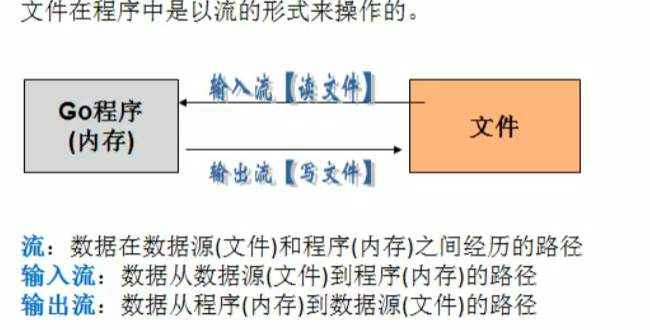

`os包`提供了操作系统函数的不依赖平台的接口。设计为Unix风格的，虽然错误处理是go风格的；失败的调用会返回错误值而非错误码。通常错误值里包含更多信息。例如，如果某个使用一个文件名的调用（如Open、Stat）失败了，打印错误时会包含该文件名，错误类型将为`*PathError`，其内部可以解包获得更多信息。

`os包`的接口规定为在所有操作系统中都是一致的。非公用的属性可以从操作系统特定的[`syscall](http://godoc.org/syscall)包获取。

`os包`中通过`File结构体`来描述文件相关信息

```go
type file struct {
	pfd        poll.FD
	name       string
	dirinfo    *dirInfo // nil unless directory being read
	appendMode bool     // whether file is opened for appending
}
```

常用的文件相关方法:  


### 2. 路径问题:

**相对路径:** 就是当前项目的根目录,比如当前项目 `test`全路径如图

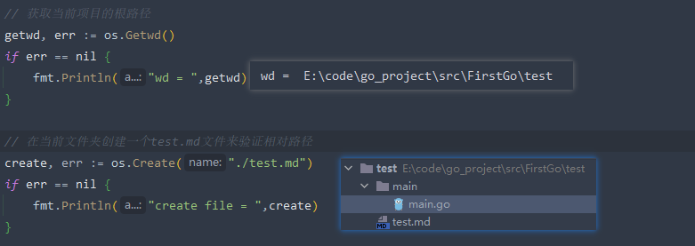

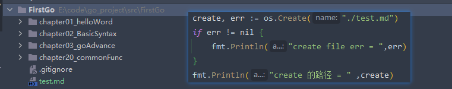

说明: 通过`os.Getwd()`获取到了项目的根据路径,上面两张图片,都希望在当前文件夹通过 `os.Create()`创建一个`test.md`文件,结果如图,说明 go项目的相对路径,是从项目的跟路径开始的.
> 在go语言中, `./` 表示的是当前项目的根路径, 而不是当前go文件所在的文件夹

如果要使用相对路径(`相对于当前go文件`)去加载文件,正确的做法是: 

```go
func create() {
	_, file, _, _ := runtime.Caller(0)
	fmt.Println("file = ",file)

	curFileDir := path.Dir(file)
	fmt.Println("path.Dir(file) = ",curFileDir)

	targetPath := path.Join(curFileDir, PATH)
	fmt.Println("join = ",targetPath)

	create, err := os.Create(targetPath)
	if err != nil {
		fmt.Println("create file err = ",err)
	}
}
```

1. 通过`runtime.Caller(0)拿到当前执行的栈帧信息,参数为向上回溯的栈帧数`获取当前正在运行的源文件的全路径
2. 通过`path.Join()`将 `当前运行源文件的全路径` 和 `相对于当前源文件的目标路径()`,拼接起来处理成 需要的全路径
3. 然后通过这个路径去做一些文件操作

如果通过项目根路径去操作,就直接把需要的路径补全就行.

```go
	// 打开文件
	file, err := os.Open("./chapter03_goAdvance/01_File/test/test.txt")
	if err != nil {
		fmt.Println("open file err = ",err)
	}
	// 看看file是什么类型的
	fmt.Printf("file = %v\n",file)

	if err = file.Close(); err != nil {
		fmt.Println("close file err = ",err)
	}
```


### 3. 文件的基本操作:  

#### 1. 开关文件:

**打开:**

```go
/* 
name string: 文件名
*File: 返回指向该文件的指针
error: 打开文件错误,类型为 *PathError
*/
func Open(name string) (*File, error)
```

**关闭:**

```go
/*
f *File: 要关闭的文件指针
error: 关闭时发生的错误
*/
func (f *File) Close() error 
```

```go
// 开关文件
func openClose() {
	// 打开文件
	file, err := os.Open("./chapter03_goAdvance/01_File/test/test.txt")
	if err != nil {
		fmt.Println("open file err = ",err)
	}
	// 看看file是什么类型的
	fmt.Printf("file = %v\n",file)

	if err = file.Close(); err != nil {
		fmt.Println("close file err = ",err)
	}
}
```

#### 2. 读写文件

**读取文件:**

```go
/*
以只读形式打开文件
name: 文件路径
*/
func Open(name string) (*File, error)
```

```go
// 将文件读取到缓冲区中,通过缓冲区读取文件
func operater() {
   open, err := os.Open("./chapter03_goAdvance/01_File/test/test.txt")
   if err != nil {
      return
   }
   defer func(open *os.File) {
      err := open.Close()
      if err != nil {
         fmt.Println("close file fialed = ", err)
      }
   }(open)

   // 创建一个带缓冲区的reader
   reader := bufio.NewReader(open)
   for {
      // 注意这里会将 换行符一起读取'\n'
      readString, err := reader.ReadString('\n')
      fmt.Print(readString)
      // 读取到文件末尾,退出循环
      if err == io.EOF {
         break
      }
   }

   fmt.Println("操作结束")
}
```

------------------

```go
/*
自选打开文件的模式
name: 文件路径
flag: 打开文件的模式(用 | 组合)
perm: 文件权限控制(主要是linux使用,win没有用)
*/
func OpenFile(name string, flag int, perm FileMode) (file *File, err error)
```

`flag`:

```go
const (
    O_RDONLY int = syscall.O_RDONLY // 只读模式打开文件
    O_WRONLY int = syscall.O_WRONLY // 只写模式打开文件
    O_RDWR   int = syscall.O_RDWR   // 读写模式打开文件
    O_APPEND int = syscall.O_APPEND // 写操作时将数据附加到文件尾部
    O_CREATE int = syscall.O_CREAT  // 如果不存在将创建一个新文件
    O_EXCL   int = syscall.O_EXCL   // 和O_CREATE配合使用，文件必须不存在
    O_SYNC   int = syscall.O_SYNC   // 打开文件用于同步I/O
    O_TRUNC  int = syscall.O_TRUNC  // 如果可能，打开时清空文件
)
```

`FileMode`: 

```go
const (
    // 单字符是被String方法用于格式化的属性缩写。
    ModeDir        FileMode = 1 << (32 - 1 - iota) // d: 目录
    ModeAppend                                     // a: 只能写入，且只能写入到末尾
    ModeExclusive                                  // l: 用于执行
    ModeTemporary                                  // T: 临时文件（非备份文件）
    ModeSymlink                                    // L: 符号链接（不是快捷方式文件）
    ModeDevice                                     // D: 设备
    ModeNamedPipe                                  // p: 命名管道（FIFO）
    ModeSocket                                     // S: Unix域socket
    ModeSetuid                                     // u: 表示文件具有其创建者用户id权限
    ModeSetgid                                     // g: 表示文件具有其创建者组id的权限
    ModeCharDevice                                 // c: 字符设备，需已设置ModeDevice
    ModeSticky                                     // t: 只有root/创建者能删除/移动文件
    // 覆盖所有类型位（用于通过&获取类型位），对普通文件，所有这些位都不应被设置
    ModeType = ModeDir | ModeSymlink | ModeNamedPipe | ModeSocket | ModeDevice
    ModePerm FileMode = 0777 // 覆盖所有Unix权限位（用于通过&获取类型位）
)
```

```go
// 创建并写入内容
func write(){
   str := "str et test\n"
   filePath := "./chapter03_goAdvance/01_File/file"

   // 这种方式不能直接创建的,因为没有上级目录
   //file, err := os.OpenFile(filePath, os.O_WRONLY|os.O_CREATE, 0666)
   err := os.MkdirAll(filePath,0666)
   if err != nil {
      fmt.Println("create dir failed : ",err)
   }
   file, err := os.OpenFile(filePath+"/file.md", os.O_WRONLY|os.O_CREATE, 0666)
   if err != nil {
      fmt.Println("create dir failed : ",err)
   }
   defer file.Close()

   writer := bufio.NewWriter(file)
   for i := 0; i < 5; i++ {
      _, err2 := writer.WriteString(str)
      if err2 != nil {
         fmt.Println("write file err = ",err)
      }
   }

   err = writer.Flush()
   if err != nil {
      fmt.Println("flush file err =",err)
   }
   fmt.Println("write success")
}
```

**写入文件:**

1. 清空源文件,然后写入文件. 即 以`os.TRUNC`打开文件
2. 在源文件后面追加内容, 即以 `os.APPEND`打开文件
3. 读取文件并追加内容, 即以 `os.RDWR | os.APPEND`打开文件

**判断文件是否存在:**

通过`os.Stat()`函数的返回值来判断文件是否存在

1. 返回的err = nil,表示文件存在
2. 返回的错误不为nil,则用`os.isNotExist(err)`判断,为`ture`说明文件不存在
3. 其他类型的err则 无法确定文件是否存在

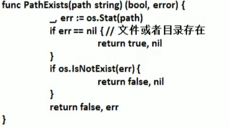

#### 3. 复制文件

**拷贝文件:**

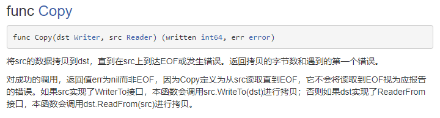

#### 4. 命令行传参:

1. 获取参数的方式1

在启动go程序的时候可以通过命令行来传参数,所有的参数都存放在 `os.Args`这个切片里面


2. 获取参数的方式2

   `flag包`实现了命令行参数的解析

   ```go
   func main() {
   	// 定义几个变量用来绑定参数值
   	var user,pwd,host string
   	var port int
   
   	/*
   	func StringVar(p *string, name string, value string, usage string)
   	参数解释:
   	p : 用来接受命令行中指定参数(name)的值,即 参数容器
   	name: 表示匹配命令行中的参数名字
   	value: 是命令行参数的默认值,即 不传就是用这个值
   	usage: 就是描述name参数的用途
   	*/
   	flag.StringVar(&user,"u","root","用户名,默认为default")
   	flag.StringVar(&pwd,"p","root","用户密码,默认为root")
   	flag.StringVar(&host,"h","127.0.0.1","ip,默认为127.0.0.1")
   	flag.IntVar(&port,"P",0,"端口号,默认为0")
   
   	// 这一步必须要有,就是从os.Args中读取出参数存入,否则上面的参数无法使用
   	flag.Parse()
   
   	// 传参的时候必须要用空格和参数标志分开 , 即-u test -p test -h 192.168.1.1 -P 33066
   	fmt.Printf("user = %v, pwd= %v,host = %v,port = %v\n",user,pwd,host,port)
   }
   ```

#### 5. 使用json存储文件:

`json`总是以 `key:value`的形式存储数据,易于机器解析和生成,并有效的提升网络传输效率,通常程序在网络传输的时候,会将数据对象序列化成json字符串,然后在接受方对json字符串进行解析,反序列化成原来的数据对象.


**序列化:**

```go
/*
v: 要序列化的对象,空接口可以传任意的类型
[]byte: 序列化完成之后返回的是一个byte数组
error: 可能的错误
*/
func Marshal(v interface{}) ([]byte, error) 
```

```go
// Animal 结构体的序列化
type Animal struct {
   Name string
   Age int
   Hobby string
}

func serializeTest(){
   // 序列化map
   mapA := make(map[string]interface{})
   mapA["name"] = "王二麻子"
   mapA["age"] = 30
   mapA["address"] = "花果山"

   jsonString := srializeFunc(mapA)
   fmt.Printf("mapA 转换成json之后的样子是: %v\n",jsonString)

   // 序列化struct,go官方说明序列化struct的时候只会序列化名字大写的属性
   a := &Animal{
      "张珊",
      255,
      "吃",
   }
   jsonString = srializeFunc(a)
   fmt.Printf("struct 转换成json之后的样子是: %v\n",jsonString)
   s := unserializeFunc(jsonString)
   fmt.Printf("struct 反序列化之后的样子是: %T,%s\n",s,s)

}

// 序列化函数
func srializeFunc(object interface{}) string {
	marshal, err := json.Marshal(object)
	if err != nil{
		return "serialize object failed"
	}
	return string(marshal)
}
```

<font color=red>注意:</font>

1. 由于go在转换的时候是需要将`struct对象`放到`json包`里面去使用,<font color=red>所以必须大写,小写字段在序列化的时候会被忽略</font>

2. 在序列化的时候,可以给字段设置是否序列化,序列化的名字,当序列化值为空的时候忽略该字段,<font color=red>但是使用了omitempty之后,各个类型的默认值也会被认为是空值,可以将希望默认值不被忽略的属性写成指针</font>, 但是指针类型的nil还是会被忽略

   ```go
   // User 序列化tag的使用
   type User struct {
   	Age       int    `json:"age,omitempty"` // 指定序列化key,如果值为null就忽略
   	FirstName string `json:"first_name,omitempty"`
   	Address   string `json:"address,omitempty"`
   	Account   string `json:"account,omitempty"`
   	Pwd       string `json:"-"` // -,序列化和反序列化都不会处理该字段
   }
   ```
   
3. 嵌套类型不想json字符串也是嵌套的, 可以使用`json:",inline"`

   ```go
   type JiraHttpReqField struct {
       Project     `json:"project"`   // `json:",inline"`
       Summary     string `json:"summary"`
       Description string `json:"description"`
   }
   
   14行为`json:"project"`时的输出结果：
   {"project":{"key":"name","value":"zhangsan"},"summary":"my summary","description":"my description"}
   
   14行为`json:",inline"`时的输出结果：
   {"key":"name","value":"zhangsan","summary":"my summary","description":"my description"}
   ```

4. 在json序列化的时候, 可以指定对应字段序列化或者反序列化成什么类型:

   ```go
   type Product struct {
       Name      string  `json:"name"`
       ProductID int64   `json:"product_id,string"`
       Number    int     `json:"number,string"`
       Price     float64 `json:"price,string"`
       IsOnSale  bool    `json:"is_on_sale,string"`
   }
   ```

**反序列化:**

```go
/*
data: 需要反序列化的字节数组
v: 接受反序列化的对象,必须与序列化的对象相同
error: 
*/
func Unmarshal(data []byte, v interface{}) error 
```

```go
// Animal 结构体的序列化
type Animal struct {
   Name string
   Age int
   Hobby string
}

func serializeTest(){

   // 序列化struct,go官方说明序列化struct的时候只会序列化名字大写的属性
   a := &Animal{
      "张珊",
      255,
      "吃",
   }
   jsonString = srializeFunc(a)
   fmt.Printf("struct 转换成json之后的样子是: %v\n",jsonString)
   s := unserializeFunc(jsonString)
   fmt.Printf("struct 反序列化之后的样子是: %T,%s\n",s,s)

}
func unserializeFunc(jsonString string) Animal {
	var animal Animal
	err2 := json.Unmarshal([]byte(jsonString), &animal)
	if nil != err2 {
		return Animal{}
	}
	return animal
}
```

错误的示例:

```go
// 反序列化,传入的是Animal类型的字符串,但是用了字符串指针来接收反序列化的结果
func unserializeFunc(jsonString string) string {
	bytes := make([]byte, len(jsonString))
	err := json.Unmarshal(bytes, &jsonString)
	if nil != err {
		return "unserialize failed"
	}
	return string(bytes)
}
```

## 3.2 单元测试: 

go语言自带一个轻量级的测试框架testing和自带的go test命令来实现单元测试和性能测试,testing框架和其他语言的测试框架类似,可以基于这个框架写针对响应函数的测试用例,也可以基于该框架写响应的压力测试用例.

go语言测试依赖 go test命令.编写测试代码和编写普通go代码差不多. 

go test命令是一个按照一定约定和组织的测试代码的驱动程序。在包目录内，所有以`_test.go`为后缀名的源代码文件都是`go test`测试的一部分，不会被`go build`编译到最终的可执行文件中。

在`*_test.go`文件中有三种类型的函数，单元测试函数、基准测试函数和示例函数。

|   类型   |         格式          |              作用              |
| :------: | :-------------------: | :----------------------------: |
| 测试函数 |   函数名前缀为Test    | 测试程序的一些逻辑行为是否正确 |
| 基准函数 | 函数名前缀为Benchmark |         测试函数的性能         |
| 示例函数 |  函数名前缀为Example  |       为文档提供示例文档       |

`go test`命令会遍历所有的`*_test.go`文件中符合上述命名规则的函数，然后生成一个临时的main包用于调用相应的测试函数，然后构建并运行、报告测试结果，最后清理测试中生成的临时文件。

单测目的:

1. 确保每个函数可运行且结果正确
2. 确保代码的性能
3. 单元测试可以及时发现程序设计或实现的逻辑问题.

### 1. 测试函数:

每个测试函数必须导入`testing`包，测试函数的基本格式（签名）如下：

```go
func TestName(t *testing.T){
    // ...
}
```

测试函数的名字必须以`Test`开头，可选的后缀名必须以大写字母开头，举几个例子：

```go
func TestAdd(t *testing.T){ ... }
func TestSum(t *testing.T){ ... }
func TestLog(t *testing.T){ ... }
```

其中参数`t`用于报告测试失败和附加的日志信息。 `testing.T`的拥有的方法如下：

```go
func (c *T) Error(args ...interface{})
func (c *T) Errorf(format string, args ...interface{})
func (c *T) Fail()
func (c *T) FailNow()
func (c *T) Failed() bool
func (c *T) Fatal(args ...interface{})
func (c *T) Fatalf(format string, args ...interface{})
func (c *T) Log(args ...interface{})
func (c *T) Logf(format string, args ...interface{})
func (c *T) Name() string
func (t *T) Parallel()
func (t *T) Run(name string, f func(t *T)) bool
func (c *T) Skip(args ...interface{})
func (c *T) SkipNow()
func (c *T) Skipf(format string, args ...interface{})
func (c *T) Skipped() bool
```

关于 `go test` 命令: 


**使用示例:** 在被测试go文件的同包下创建一个同名带后缀`_test`的go文件,然后在里面写测试方法

```go
package testcase

func Add(num int) (res int){
	for i := 0; i < num; i++ {
		res += i
	}
	return res
}

// 测试方法
package testcase

import "testing"

func TestCal(t *testing.T) {
	add := Add(10)
	if add == 45 {
		t.Logf("测试函数: Add(10) 成功,结果 %d 符合预期",add)
	}else {
		t.Errorf("测试结果错误: Add(10) 正确结果为45,实际结果为 %d",add)
	}
}
```

**注意事项:**

1. 单元测试源代码go文件,一定是以`_test`结尾的
2. 测试用例必须以`Test`开头,通常来说就是: `Test + 被测方法名字`
3. 测试函数的参数必须是 `*testing.T`类型
4. 当出现错误的时候,可以使用 `t.FataIf`来格式化输出错误信息,并退出程序
5. 如果要看执行过程信息: `t.Logf`来记录信息
6. 测试用例函数不需要放在main函数里面

### 2. 测试组:

除了测试一个用例之外,还可以测试一组用例

```go
func TestSplit(t *testing.T) { // 测试函数名必须以Test开头，必须接收一个*testing.T类型参数
   // 定义一个测试用例类型
   type test struct {
      input string// 测试内容
      sep   string// 分隔符
      want  []string// 期望的结果
   }
   tests := []test{
      {input: "a:b:c", sep: ":", want: []string{"a", "b", "c"}},
      {input: "a:b:c", sep: ",", want: []string{"a:b:c"}},
      {input: "abcd", sep: "bc", want: []string{"a", "d"}},
      {input: "沙河有沙又有河", sep: "沙", want: []string{"河有", "又有河"}},
   }
   for _,test := range tests {
      got := Split(test.input, ":")         // 程序输出的结果
      if !reflect.DeepEqual(got,test.want) { // 因为slice不能比较直接，借助反射包中的方法比较
         t.Errorf("excepted:%#v, got:%#v", test.want, got) // 测试失败输出错误提示
      }
   }
}
```

### 3. 覆盖率测试

测试覆盖率是你的代码被测试套件覆盖的百分比。通常我们使用的都是语句的覆盖率，也就是在测试中至少被运行一次的代码占总代码的比例。

```go
split $ go test -cover
PASS
coverage: 100.0% of statements
ok      github.com/Q1mi/studygo/code_demo/test_demo/split       0.005s
```

### 3. 基准测试:  

基准测试就是在一定的工作负载之下检测程序性能的一种方法

```go
// 性能测试命名方式
func BenchmarkName(b *testing.B){
    // ...
}
```

基准测试以`Benchmark`为前缀，需要一个`*testing.B`类型的参数b，基准测试必须要执行`b.N`次，这样的测试才有对照性，`b.N`的值是系统根据实际情况去调整的，从而保证测试的稳定性。 `testing.B`拥有的方法如下：

```go
func (c *B) Error(args ...interface{})
func (c *B) Errorf(format string, args ...interface{})
func (c *B) Fail()
func (c *B) FailNow()
func (c *B) Failed() bool
func (c *B) Fatal(args ...interface{})
func (c *B) Fatalf(format string, args ...interface{})
func (c *B) Log(args ...interface{})
func (c *B) Logf(format string, args ...interface{})
func (c *B) Name() string
func (b *B) ReportAllocs()
func (b *B) ResetTimer()
func (b *B) Run(name string, f func(b *B)) bool
func (b *B) RunParallel(body func(*PB))
func (b *B) SetBytes(n int64)
func (b *B) SetParallelism(p int)
func (c *B) Skip(args ...interface{})
func (c *B) SkipNow()
func (c *B) Skipf(format string, args ...interface{})
func (c *B) Skipped() bool
func (b *B) StartTimer()
func (b *B) StopTimer()
```

**示例:**

```go
func BenchmarkSplit(b *testing.B) {
	for i := 0; i < b.N; i++ {
		Split("沙河有沙又有河", "沙")
	}
}
```

基准测试并不会默认执行，需要增加`-bench`参数，所以我们通过执行`go test -bench=Split`命令执行基准测试，输出结果如下：

```bash
split $ go test -bench=Split
goos: darwin
goarch: amd64
pkg: github.com/Q1mi/studygo/code_demo/test_demo/split
BenchmarkSplit-8        10000000               203 ns/op
PASS
ok      github.com/Q1mi/studygo/code_demo/test_demo/split       2.255s
```

其中`BenchmarkSplit-8`表示对Split函数进行基准测试，数字`8`表示`GOMAXPROCS`的值，这个对于并发基准测试很重要。`10000000`和`203ns/op`表示每次调用`Split`函数耗时`203ns`，这个结果是`10000000`次调用的平均值。

我们还可以为基准测试添加`-benchmem`参数，来获得内存分配的统计数据。

```bash
split $ go test -bench=Split -benchmem
goos: darwin
goarch: amd64
pkg: github.com/Q1mi/studygo/code_demo/test_demo/split
BenchmarkSplit-8        10000000               215 ns/op             112 B/op          3 allocs/op
PASS
ok      github.com/Q1mi/studygo/code_demo/test_demo/split       2.394s
```

其中，`112 B/op`表示每次操作内存分配了112字节，`3 allocs/op`则表示每次操作进行了3次内存分配。 我们将我们的`Split`函数优化如下：

```go
func Split(s, sep string) (result []string) {
	result = make([]string, 0, strings.Count(s, sep)+1)
	i := strings.Index(s, sep)
	for i > -1 {
		result = append(result, s[:i])
		s = s[i+len(sep):] // 这里使用len(sep)获取sep的长度
		i = strings.Index(s, sep)
	}
	result = append(result, s)
	return
}
```

这一次我们提前使用make函数将result初始化为一个容量足够大的切片，而不再像之前一样通过调用append函数来追加。我们来看一下这个改进会带来多大的性能提升：

```bash
split $ go test -bench=Split -benchmem
goos: darwin
goarch: amd64
pkg: github.com/Q1mi/studygo/code_demo/test_demo/split
BenchmarkSplit-8        10000000               127 ns/op              48 B/op          1 allocs/op
PASS
ok      github.com/Q1mi/studygo/code_demo/test_demo/split       1.423s
```

这个使用make函数提前分配内存的改动，减少了2/3的内存分配次数，并且减少了一半的内存分配。

上面的基准测试只能得到给定操作的绝对耗时，但是在很多性能问题是发生在两个不同操作之间的相对耗时，比如同一个函数处理1000个元素的耗时与处理1万甚至100万个元素的耗时的差别是多少？再或者对于同一个任务究竟使用哪种算法性能最佳？我们通常需要对两个不同算法的实现使用相同的输入来进行基准比较测试。

### 4. 性能比较:

性能比较函数通常是一个带有参数的函数，被多个不同的Benchmark函数传入不同的值来调用。举个例子如下：

```go
func benchmark(b *testing.B, size int){/* ... */}
func Benchmark10(b *testing.B){ benchmark(b, 10) }
func Benchmark100(b *testing.B){ benchmark(b, 100) }
func Benchmark1000(b *testing.B){ benchmark(b, 1000) }
```

例如我们编写了一个计算斐波那契数列的函数如下：

```go
// fib.go

// Fib 是一个计算第n个斐波那契数的函数
func Fib(n int) int {
	if n < 2 {
		return n
	}
	return Fib(n-1) + Fib(n-2)
}
```

我们编写的性能比较函数如下：

```go
// fib_test.go

func benchmarkFib(b *testing.B, n int) {
	for i := 0; i < b.N; i++ {
		Fib(n)
	}
}

func BenchmarkFib1(b *testing.B)  { benchmarkFib(b, 1) }
func BenchmarkFib2(b *testing.B)  { benchmarkFib(b, 2) }
func BenchmarkFib3(b *testing.B)  { benchmarkFib(b, 3) }
func BenchmarkFib10(b *testing.B) { benchmarkFib(b, 10) }
func BenchmarkFib20(b *testing.B) { benchmarkFib(b, 20) }
func BenchmarkFib40(b *testing.B) { benchmarkFib(b, 40) }
```

运行基准测试：

```bash
split $ go test -bench=.
goos: darwin
goarch: amd64
pkg: github.com/Q1mi/studygo/code_demo/test_demo/fib
BenchmarkFib1-8         1000000000               2.03 ns/op
BenchmarkFib2-8         300000000                5.39 ns/op
BenchmarkFib3-8         200000000                9.71 ns/op
BenchmarkFib10-8         5000000               325 ns/op
BenchmarkFib20-8           30000             42460 ns/op
BenchmarkFib40-8               2         638524980 ns/op
PASS
ok      github.com/Q1mi/studygo/code_demo/test_demo/fib 12.944s
```

这里需要注意的是，默认情况下，每个基准测试至少运行1秒。如果在Benchmark函数返回时没有到1秒，则b.N的值会按1,2,5,10,20,50，…增加，并且函数再次运行。

最终的BenchmarkFib40只运行了两次，每次运行的平均值只有不到一秒。像这种情况下我们应该可以使用`-benchtime`标志增加最小基准时间，以产生更准确的结果。例如：

```bash
split $ go test -bench=Fib40 -benchtime=20s
goos: darwin
goarch: amd64
pkg: github.com/Q1mi/studygo/code_demo/test_demo/fib
BenchmarkFib40-8              50         663205114 ns/op
PASS
ok      github.com/Q1mi/studygo/code_demo/test_demo/fib 33.849s
```

这一次`BenchmarkFib40`函数运行了50次，结果就会更准确一些了。

使用性能比较函数做测试的时候一个容易犯的错误就是把`b.N`作为输入的大小，例如以下两个例子都是错误的示范：

```go
// 错误示范1
func BenchmarkFibWrong(b *testing.B) {
	for n := 0; n < b.N; n++ {
		Fib(n)
	}
}

// 错误示范2
func BenchmarkFibWrong2(b *testing.B) {
	Fib(b.N)
}
```

### 5. 重置时间

`b.ResetTimer`之前的处理不会放到执行时间里，也不会输出到报告中，所以可以在之前做一些不计划作为测试报告的操作。例如：

```go
func BenchmarkSplit(b *testing.B) {
	time.Sleep(5 * time.Second) // 假设需要做一些耗时的无关操作
	b.ResetTimer()              // 重置计时器
	for i := 0; i < b.N; i++ {
		Split("沙河有沙又有河", "沙")
	}
}
```

### 6. 并行测试

`func (b *B) RunParallel(body func(*PB))`会以并行的方式执行给定的基准测试。

`RunParallel`会创建出多个`goroutine`，并将`b.N`分配给这些`goroutine`执行， 其中`goroutine`数量的默认值为`GOMAXPROCS`。用户如果想要增加非CPU受限（non-CPU-bound）基准测试的并行性， 那么可以在`RunParallel`之前调用`SetParallelism` 。`RunParallel`通常会与`-cpu`标志一同使用。

```go
func BenchmarkSplitParallel(b *testing.B) {
	// b.SetParallelism(1) // 设置使用的CPU数
	b.RunParallel(func(pb *testing.PB) {
		for pb.Next() {
			Split("沙河有沙又有河", "沙")
		}
	})
}
```

执行一下基准测试：

```bash
split $ go test -bench=.
goos: darwin
goarch: amd64
pkg: github.com/Q1mi/studygo/code_demo/test_demo/split
BenchmarkSplit-8                10000000               131 ns/op
BenchmarkSplitParallel-8        50000000                36.1 ns/op
PASS
ok      github.com/Q1mi/studygo/code_demo/test_demo/split       3.308s
```

还可以通过在测试命令后添加`-cpu`参数如`go test -bench=. -cpu 1`来指定使用的CPU数量。

### 7. Setup与TearDown

测试程序有时需要在测试之前进行额外的设置（setup）或在测试之后进行拆卸（teardown）

#### 1. TestMain

通过在`*_test.go`文件中定义`TestMain`函数来可以在测试之前进行额外的设置（setup）或在测试之后进行拆卸（teardown）操作。

如果测试文件包含函数:`func TestMain(m *testing.M)`那么生成的测试会先调用 TestMain(m)，然后再运行具体测试。`TestMain`运行在主`goroutine`中, 可以在调用 `m.Run`前后做任何设置（setup）和拆卸（teardown）。退出测试的时候应该使用`m.Run`的返回值作为参数调用`os.Exit`。

一个使用`TestMain`来设置Setup和TearDown的示例如下：

```go
func TestMain(m *testing.M) {
	fmt.Println("write setup code here...") // 测试之前的做一些设置
	// 如果 TestMain 使用了 flags，这里应该加上flag.Parse()
	retCode := m.Run()                         // 执行测试
	fmt.Println("write teardown code here...") // 测试之后做一些拆卸工作
	os.Exit(retCode)                           // 退出测试
}
```

需要注意的是：在调用`TestMain`时, `flag.Parse`并没有被调用。所以如果`TestMain` 依赖于command-line标志 (包括 testing 包的标记), 则应该显示的调用`flag.Parse`。

#### 2. 子测试的Setup与Teardown

有时候我们可能需要为每个测试集设置Setup与Teardown，也有可能需要为每个子测试设置Setup与Teardown。下面我们定义两个函数工具函数如下：

```go
// 测试集的Setup与Teardown
func setupTestCase(t *testing.T) func(t *testing.T) {
	t.Log("如有需要在此执行:测试之前的setup")
	return func(t *testing.T) {
		t.Log("如有需要在此执行:测试之后的teardown")
	}
}

// 子测试的Setup与Teardown
func setupSubTest(t *testing.T) func(t *testing.T) {
	t.Log("如有需要在此执行:子测试之前的setup")
	return func(t *testing.T) {
		t.Log("如有需要在此执行:子测试之后的teardown")
	}
}
```

使用方式如下：

```go
func TestSplit(t *testing.T) {
	type test struct { // 定义test结构体
		input string
		sep   string
		want  []string
	}
	tests := map[string]test{ // 测试用例使用map存储
		"simple":      {input: "a:b:c", sep: ":", want: []string{"a", "b", "c"}},
		"wrong sep":   {input: "a:b:c", sep: ",", want: []string{"a:b:c"}},
		"more sep":    {input: "abcd", sep: "bc", want: []string{"a", "d"}},
		"leading sep": {input: "沙河有沙又有河", sep: "沙", want: []string{"", "河有", "又有河"}},
	}
	teardownTestCase := setupTestCase(t) // 测试之前执行setup操作
	defer teardownTestCase(t)            // 测试之后执行testdoen操作

	for name, tc := range tests {
		t.Run(name, func(t *testing.T) { // 使用t.Run()执行子测试
			teardownSubTest := setupSubTest(t) // 子测试之前执行setup操作
			defer teardownSubTest(t)           // 测试之后执行testdoen操作
			got := Split(tc.input, tc.sep)
			if !reflect.DeepEqual(got, tc.want) {
				t.Errorf("excepted:%#v, got:%#v", tc.want, got)
			}
		})
	}
}
```

测试结果如下：

```bash
split $ go test -v
=== RUN   TestSplit
=== RUN   TestSplit/simple
=== RUN   TestSplit/wrong_sep
=== RUN   TestSplit/more_sep
=== RUN   TestSplit/leading_sep
--- PASS: TestSplit (0.00s)
    split_test.go:71: 如有需要在此执行:测试之前的setup
    --- PASS: TestSplit/simple (0.00s)
        split_test.go:79: 如有需要在此执行:子测试之前的setup
        split_test.go:81: 如有需要在此执行:子测试之后的teardown
    --- PASS: TestSplit/wrong_sep (0.00s)
        split_test.go:79: 如有需要在此执行:子测试之前的setup
        split_test.go:81: 如有需要在此执行:子测试之后的teardown
    --- PASS: TestSplit/more_sep (0.00s)
        split_test.go:79: 如有需要在此执行:子测试之前的setup
        split_test.go:81: 如有需要在此执行:子测试之后的teardown
    --- PASS: TestSplit/leading_sep (0.00s)
        split_test.go:79: 如有需要在此执行:子测试之前的setup
        split_test.go:81: 如有需要在此执行:子测试之后的teardown
    split_test.go:73: 如有需要在此执行:测试之后的teardown
=== RUN   ExampleSplit
--- PASS: ExampleSplit (0.00s)
PASS
ok      github.com/Q1mi/studygo/code_demo/test_demo/split       0.006s
```

### 8. 示例函数

#### 1. 示例函数的格式

被`go test`特殊对待的第三种函数就是示例函数，它们的函数名以`Example`为前缀。它们既没有参数也没有返回值。标准格式如下：

```go
func ExampleName() {
    // ...
}
```

#### 2. 示例函数示例

下面的代码是我们为`Split`函数编写的一个示例函数：

```go
func ExampleSplit() {
	fmt.Println(split.Split("a:b:c", ":"))
	fmt.Println(split.Split("沙河有沙又有河", "沙"))
	// Output:
	// [a b c]
	// [ 河有 又有河]
}
```

为你的代码编写示例代码有如下三个用处：

1. 示例函数能够作为文档直接使用，例如基于web的godoc中能把示例函数与对应的函数或包相关联。

2. 示例函数只要包含了`// Output:`也是可以通过`go test`运行的可执行测试。

   ```bash
   split $ go test -run Example
   PASS
   ok      github.com/Q1mi/studygo/code_demo/test_demo/split       0.006s
   ```

3. 示例函数提供了可以直接运行的示例代码，可以直接在`golang.org`的`godoc`文档服务器上使用`Go Playground`运行示例代码。下图为`strings.ToUpper`函数在Playground的示例函数效果。


----------------------

## 3.3 并发编程:

Go语言的并发通过`goroutine`实现。`goroutine`类似于线程，属于用户态的线程，我们可以根据需要创建成千上万个`goroutine`并发工作。`goroutine`是由Go语言的运行时（runtime）调度完成，而线程是由操作系统调度完成。

Go语言还提供`channel`在多个`goroutine`间进行通信。`goroutine`和`channel`是 Go 语言秉承的 CSP（Communicating Sequential Process）并发模式的重要实现基础。

###　1. 线程,进程,协程: 

`进程`是操作系统进行资源分配的基本单位,进程可以创建销毁多个线程,一个程序至少有一个进程,一个进程至少有一个线程

`线程`是操作系统进行调度的基本单位,是程序执行的最小单位

`协程`是更轻量级的线程.

### 2. go协程和go主线程: 

**go主线程**: 一个go线程上,可以起多个协程

**go协程**: 协程是轻量级的线程[编译器做优化],有以下几个特点:

- 有独立的栈空间
- 共享程序堆空间
- 调度由用户控制,go的`runtime`调度和管理

### 3. 线程模型介绍:

通常在我们的操作系统中,线程被分为了两部分,用户线程和内核线程

**一对一模型:**java就是基于这种模型

一个用户线程对应一个内核线程.

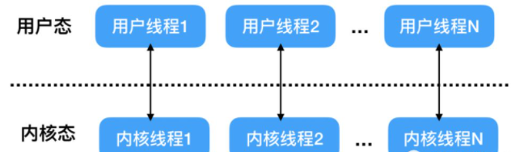

优点: 多处理器硬件下,内核空间线程支持了真正意义上的并行,当某个用户线程被阻塞之后,内核线程通过上下文切换可以去执行其他的用户线程,并发度高

缺点: 每个用户线程都要创建一个内核线程与其对应,创建线程的开销很大,影响程序的性能

**多对一模型:**

多个用户线程对应一个内核线程,同时同一个用户线程只能对应一个内核线程,此时同一个内核线程上的用户线程的上下文切换是由用户态的运行时线程库来的,不由操作系统调度

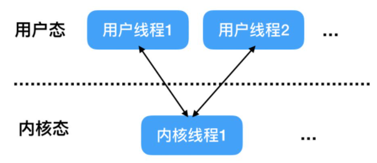

优点: 线程上线文切换是由用户运行时线程库处理,开销很小速度快;线程的数量只受到内存大小的限制

缺点: 由于多个线程绑定在一个内核线程上,一旦该内核线程应为某个用户线程而阻塞,那么该内核线程上的其他线程无法执行.并发度不高.

**多对多模型:** go --- 详细的后面了解

结合上面两个模型, 让大量的用户线程对应在少数几个内核线程上,换句话说: 一个用户线程可以选择性的在某个内核线程上执行.

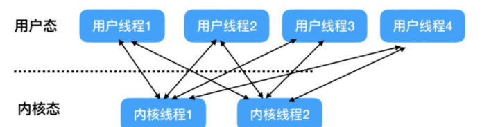

优点: 多个线程被绑定在了多个内核线程上,上线文切换发生在用户空间, 当某个用户线程阻塞从而阻塞内核线程的时候,该内核线程的其他用户线程可以由运行时线程库调度到其他内核线程上去执行

### 4. GMP模型:

[GMP模型](https://www.ituring.com.cn/book/tupubarticle/16048)

G(`goroutine`):一个G代表一个Go代码片段。前者是对后者的一种封装。里面除了存放本`goroutine`信息外 还有与所在P的绑定等信息。

M(`machine`):一个M代表一个内核线程，或者“工作线程”。在大多数情况下，创建一个新M的原因是没有足够的M来关联P并运行其中可运行的G。不过，在运行时系统执行系统监控或垃圾回收等任务的时候，也会导致新M的创建。M的部分结

P(`processor`): 一个P代表执行一个Go代码片段所必需的资源（或称“上下文环境”）。管理着一组`goroutine`队列，P里面会存储当前`goroutine`运行的上下文环境（函数指针，堆栈地址及地址边界），P会对自己管理的`goroutine`队列做一些调度（比如把占用CPU时间较长的`goroutine`暂停、运行后续的`goroutine`等等）当自己的队列消费完了就去全局队列里取，如果全局队列里也消费完了会去其他P的队列里抢任务。

简单来说，一个G的执行需要P和M的支持。一个M在与一个P关联之后，就形成了一个有效的G运行环境（内核线程+上下文环境）。每个P都会包含一个可运行的G的队列（`runq`）。该队列中的G会被依次传递给与本地P关联的M，并获得运行时机。

`GMP`与内核调度实体`KSE`之间的关系:

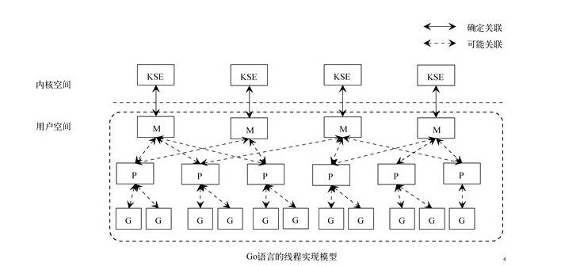

可以看到，M与`KSE`之间总是一对一的关系，一个M能且仅能代表一个内核线程。Go的运行时系统（runtime system）用M代表一个内核调度实体。M与`KSE`之间的关联非常稳固，一个M在其生命周期内，会且仅会与一个`KSE`产生关联。相比之下，M与P、P与G之间的关联都是易变的，它们之间的关系会在实际调度的过程中改变。此外，M与G之间也会建立关联，因为一个G终归会由一个M来负责运行；它们之间的关联会由P来牵线。注意，由于M、P和G之间的关系在实际调度过程中多变，图2-2中的可能关联仅能作为一般性的示意。

单从线程调度讲，Go语言相比起其他语言的优势在于OS线程是由OS内核来调度的，`goroutine`则是由Go运行时（runtime）自己的调度器调度的，这个调度器使用一个称为`m:n`调度的技术（复用/调度m个`goroutine`到n个OS线程）。 其一大特点是`goroutine`的调度是在用户态下完成的， 不涉及内核态与用户态之间的频繁切换，包括内存的分配与释放，都是在用户态维护着一块大的内存池， 不直接调用系统的`malloc`函数（除非内存池需要改变），成本比调度OS线程低很多。 另一方面充分利用了多核的硬件资源，近似的把若干`goroutine`均分在物理线程上， 再加上本身`goroutine`的超轻量，以上种种保证了go调度方面的性能。

### 5. 开启`goroutine`:

go将一个函数直接当作一个任务,通过关键字`go`直接提交给goroutine去执行

```go
// 这就表示开启了一个任务了
go funcName()
```


```go
func goroutineTest(){
	// 把一个函数当做是一个任务,然后调用的时候加上go关键字,就开启另外一个goroutine了
	go task()
	for i := 0; i < 10 ; i++ {
		fmt.Println("测试goroutine!!!!!!  main")
		time.Sleep(time.Second)
	}
}
func task(){
	for i := 0; i < 10 ; i++ {
		fmt.Println("测试goroutine!!!!!! task")
		time.Sleep(time.Second)
	}
}
```


go语言可以设置程序在运行的时候,程序所使用的`cpu`核心数,默认是当前环境`cpu`最大核心数.

Go运行时的调度器使用`GOMAXPROCS`参数来确定需要使用多少个OS线程来同时执行Go代码。默认值是机器上的CPU核心数。例如在一个8核心的机器上，调度器会把Go代码同时调度到8个OS线程上（`GOMAXPROCS`是`m:n`调度中的n）。

`Go1.5`版本之前，默认使用的是单核心执行。`Go1.5`版本之后，默认使用全部的CPU逻辑核心数。

```go
func setCPUSize(){
	// 获取当前系统cpu数量
	cpu := runtime.NumCPU()
	fmt.Println("cur cpu size = ",cpu)

	// 将go程序所用cpu数量设置为1
	runtime.GOMAXPROCS(1)
}
```

### 6. channel:

go为了避免发生竞态问题,避免保证数据正确交换从而必须加锁的问题,就没有采用 `共享内存通信`,而是采用`CSP`模型通过`通信来共享内存`.

如果说`goroutine`是Go程序并发的执行体，`channel`就是它们之间的连接。`channel`是可以让一个`goroutine`发送特定值到另一个`goroutine`的通信机制。

#### 1. 什么是channel

1. Go 语言中的通道（channel）是一种特殊的类型。
2. `channel`本质上就是存放`多个相同类型元素`的队列,元素总是遵循`先进先出`的规则进出`channel`
3. `channel`本身就是线程安全的,多个`goroutine`访问`channel`无需加锁也不会发生线程安全问题

#### 2. 声明channel

```go
var 变量 chan 数据类型
// 必须初始化之后才能使用
变量 := make(chan 数据类型, [缓冲大小])
```

说明:

1. `channel`是引用类型
2. `channel`必须要初始化后才能写入数据,
3. `channel`是由类型限制的,如同`ArrayList<Integer>`只能 存放Integer元素

#### 3. 操作channel:

通道有 `发送到ch(send)`,`从ch接收(recive)`,`关闭ch(close)`三个操作,其中发送接收都是 `<-`,指向`channel`表示写入channel,背离`chanel`表示接收

发送:

```go
ch <- 10 // 向channel中写入 10
```

接受

```go
x := <- ch // 从channel接收
<- ch // 从ch接收但是忽略掉
```

关闭

```go
close(ch)
```

关于关闭通道需要注意的事情是，只有在通知接收方`goroutine所有的数据都发送完毕`的时候才需要关闭通道。通道是可以被垃圾回收机制回收的，它和关闭文件是不一样的，在结束操作之后关闭文件是必须要做的，但关闭通道不是必须的。

对一个已经关闭的通道进行不同操作,可能产生以下情况:

1. 对关闭的channel继续发送会导致`panic`
2. 对关闭的channel继续接收会直接获取值到通道为空
3. 对关闭的channel且已经没有值得通道执行接收操作会的到对应类型的零值
4. 对关闭的通道执行关闭操作会造成`panic`
5. 如果没有使用`goroutine`的情况下,channel中的数据取完了,再取会造成死锁
6. 如果`channel`是无缓冲的 `make(chan int)`这种,在没有接收方的时候写入数据也会造成死锁
7. 管道只有读或者写,都会阻塞,从而造成dead lock

遍历: for-range

<font color=red>for-range在遍历 channel,遍历完所有的元素之后,如果channel没有关闭,还会去channel中获取一次.,但是也只是获取一次,获取完之后,在协程中会一直阻塞在那里,主线程中会直接报 `死锁` </font>

```go
func main() {
	ch1 := make(chan int, 100)
	// 写入
	for i := 0; i < 100; i++ {
		ch1 <- i*2
	}

	go func() {
		count := 0
		// 遍历取出
		for v := range ch1 {
			count++
			fmt.Printf("第 %d 次遍历,v = %d\n",count,v)
			if count == 100 {
				// 如果count == 100,ch1里面去写一个数
				go func() {
					ch1 <- 1
				}()
			}
			fmt.Println(" --- ")
		}
		fmt.Println("拿完了")
	}()
    ch1 <- 10086
	time.Sleep(10 * time.Second)
}
```

说明: 为了证明for在获取完chan里面数据后,还会去获取chan中的元素,遍历ch1的每一轮最后都会输出 ---,在第一百次也就是最后一次,又开启一个协程去给ch1添加了一个元素

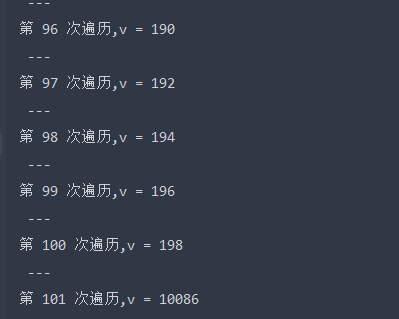

**无缓冲的通道**

无缓冲的通道又称为阻塞通道,下面的代码会造成死锁,因为没有接收方,代码会一直阻塞在 `ch <- 10`

```go
func main() {
	ch := make(chan int)
	ch <- 10
	fmt.Println("发送成功")
}
```

```go
// 解决无缓冲通道写入造成死锁
func recv(c chan int) {
	ret := <-c
	fmt.Println("接收成功", ret)
}
func main() {
	ch := make(chan int)
	go recv(ch) // 启用goroutine从通道接收值
	ch <- 10
	fmt.Println("发送成功")
}
```

无缓冲通道上的发送操作会阻塞，直到另一个`goroutine`在该通道上执行接收操作，这时值才能发送成功，两个`goroutine`将继续执行。相反，如果接收操作先执行，接收方的`goroutine`将阻塞，直到另一个`goroutine`在该通道上发送一个值。

使用无缓冲通道进行通信将导致发送和接收的`goroutine`同步化。因此，无缓冲通道也被称为`同步通道`。

**单向通道:**

通道可以在声明的时候指定其为只读或只写通道

```go
var 变量 chan<- int // 声明一个只写通道
var 变量 <-chan int // 声明一个只读通道
```

<font color=red>在函数传参及任何赋值操作中可以将双向通道转换为单向通道，但反过来是不可以的。</font>

#### 4. 总结:

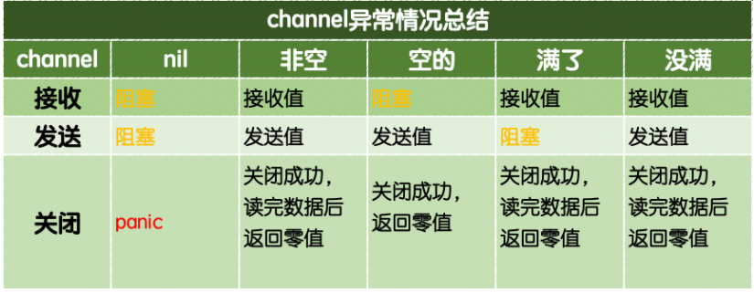

#### 5. select解决管道阻塞问题:

由于在开发中经常是希望从多个通道中读取数据,但是通道在接受数据的时候,如果没有数据可读就会发生阻塞,`go内置了select关键字来解决这个问题`

格式: `select`的写法类似于将`switch`当做`if...else`使用.也可以理解为这是一种 `IO多路复用`

```go
select{
	case 管道1的操作发生:
    	... // 业务逻辑
	case 管道2的操作发生:
    	... // 业务逻辑
	case 管道3的操作发生:
    	... // 业务逻辑
    default:
    	默认操作
}
```

#### 6. channel深入理解:

**`代码基于1.18`**

##### 1. 基础数据结构:

channel存储数据是基于一个环形数组来存储, 通过读写指针分别标识读/写操作应该操作的数组下标,从而实现读写操作.

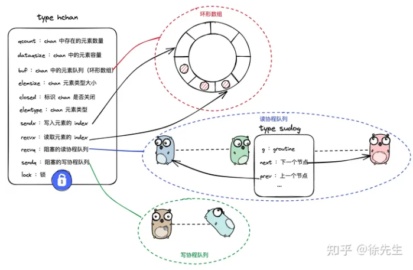

```go
type hchan struct {
    qcount   uint           // 现有元素对象
    dataqsiz uint           // 环形数组的元素容量
    buf      unsafe.Pointer // 环形数组
    elemsize uint16         // 单个元素的大小
    closed   uint32         // channel是否关闭
    elemtype *_type         // 元素类型
    sendx    uint           // 记录当前应该读的环形数组下标
    recvx    uint           // 记录当前应该写的环形数组下标
    recvq    waitq  		// 存放因接收而陷入阻塞的协程队列
    sendq    waitq          // 存放因写入而陷入阻塞的协程队列

    // lock protects all fields in hchan, as well as several
    // fields in sudogs blocked on this channel.
    //
    // Do not change another G's status while holding this lock
    // (in particular, do not ready a G), as this can deadlock
    // with stack shrinking.
    lock mutex
}

type waitq struct {
	first *sudog
	last  *sudog
}

// sudog 是协程在waitq中元素的封装, 例如用于在channel上等待接收/发送.
type sudog struct {
    // hchan的lock字段在sudog表示的协程被阻塞的时候回保护下面四个字段不发生并发安全问题
    g *g // 协程

	next *sudog
	prev *sudog
	elem unsafe.Pointer 读取/写入channel数据的容器
	
    // 下面的字段永远不会被并发访问
	acquiretime int64
	releasetime int64
	ticket      uint32

	// 表示channel是否参与select操作. 
	isSelect bool

	// 表示channel之间的通信是否成功. 
    // 一个协程因为将一个数据传送给channel被唤醒, success就是true.
    // 如果一个协程因为channel被关闭而唤醒, 那么success就是false
	success bool

	parent   *sudog // semaRoot binary tree
	waitlink *sudog // g.waiting list or semaRoot
	waittail *sudog // semaRoot
	c        *hchan // 与当前协程交互的channel
}
```

##### 2. 写流程:

```go
// block 是否阻塞协程
// callerpc调用协程
func chansend(c *hchan, ep unsafe.Pointer, block bool, callerpc uintptr) bool {
    // chan未初始化, 阻塞协程, 1.18默认传的true
    if c == nil {
       if !block {
          return false
       }
       gopark(nil, nil, waitReasonChanSendNilChan, traceBlockForever, 2)
       throw("unreachable")
    }

    if debugChan {
       print("chansend: chan=", c, "\n")
    }

    if raceenabled {
       racereadpc(c.raceaddr(), callerpc, abi.FuncPCABIInternal(chansend))
    }
    
	// 快速检查机制, 检查chan是否写满了, 写满了就不走下面的流程, 但是1.18好像这里没用, 因为block默认true
    if !block && c.closed == 0 && full(c) {
       return false
    }

    var t0 int64
    if blockprofilerate > 0 {
       t0 = cputicks()
    }

    lock(&c.lock)
	// 对于已经关闭的chan执行写操作, 报panic
    if c.closed != 0 {
       unlock(&c.lock)
       panic(plainError("send on closed channel"))
    }
    
	// 如果存在阻塞的读协程, 最终通过数组内存复制的机制将数据复制到目标chan的buffer里面去
    if sg := c.recvq.dequeue(); sg != nil {
       // Found a waiting receiver. We pass the value we want to send
       // directly to the receiver, bypassing the channel buffer (if any).
       send(c, sg, ep, func() { unlock(&c.lock) }, 3)
       return true
    }
	
    // chan没有写满
    if c.qcount < c.dataqsiz {
       // Space is available in the channel buffer. Enqueue the element to send.
       qp := chanbuf(c, c.sendx)
       if raceenabled {
          racenotify(c, c.sendx, nil)
       }
       typedmemmove(c.elemtype, qp, ep)
       c.sendx++
       if c.sendx == c.dataqsiz {
          c.sendx = 0
       }
       c.qcount++
       unlock(&c.lock)
       return true
    }

    if !block {
       unlock(&c.lock)
       return false
    }

    // Block on the channel. Some receiver will complete our operation for us.
    gp := getg()
    mysg := acquireSudog()
    mysg.releasetime = 0
    if t0 != 0 {
       mysg.releasetime = -1
    }
    // No stack splits between assigning elem and enqueuing mysg
    // on gp.waiting where copystack can find it.
    mysg.elem = ep
    mysg.waitlink = nil
    mysg.g = gp
    mysg.isSelect = false
    mysg.c = c
    gp.waiting = mysg
    gp.param = nil
    c.sendq.enqueue(mysg)
    // Signal to anyone trying to shrink our stack that we're about
    // to park on a channel. The window between when this G's status
    // changes and when we set gp.activeStackChans is not safe for
    // stack shrinking.
    gp.parkingOnChan.Store(true)
    gopark(chanparkcommit, unsafe.Pointer(&c.lock), waitReasonChanSend, traceBlockChanSend, 2)
    // Ensure the value being sent is kept alive until the
    // receiver copies it out. The sudog has a pointer to the
    // stack object, but sudogs aren't considered as roots of the
    // stack tracer.
    KeepAlive(ep)

    // someone woke us up.
    if mysg != gp.waiting {
       throw("G waiting list is corrupted")
    }
    gp.waiting = nil
    gp.activeStackChans = false
    closed := !mysg.success
    gp.param = nil
    if mysg.releasetime > 0 {
       blockevent(mysg.releasetime-t0, 2)
    }
    mysg.c = nil
    releaseSudog(mysg)
    if closed {
       if c.closed == 0 {
          throw("chansend: spurious wakeup")
       }
       panic(plainError("send on closed channel"))
    }
    return true
}
```

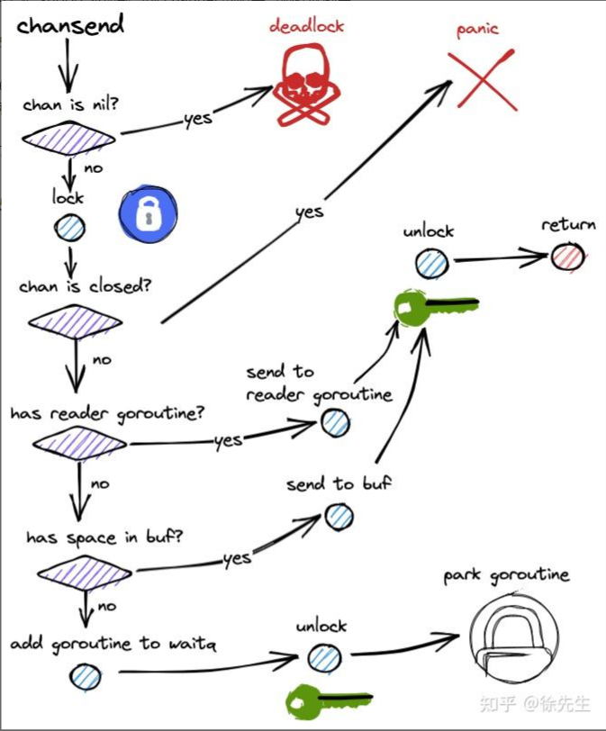

##### 3. 读流程:

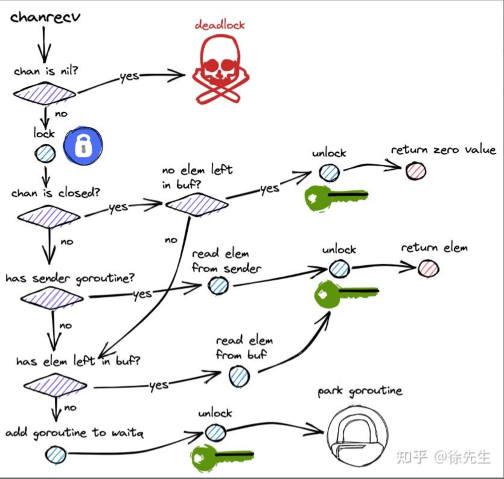

##### 4. 优雅关闭channel:

- `单sender`的情况下, 在sender端关闭channel.
- `多sender`的情况下, 增加一个传递`关闭信号`的channel, 专门用于关闭数据传输的channel.

> 核心原则: 不要再接收端关闭channel, 也不要在多个发送端的时候, 主动关闭channel.

### 7. 锁和共享控制:

#### 1. 互斥锁:

互斥锁是常见的解决线程安全的一个方式,互斥锁会保证只有一个线程能够拿到共享资源的访问权限,go语言使用`sync`包的`Mutex`类型来实现互斥锁

```go
var x int64
var wg sync.WaitGroup
var lock sync.Mutex

func add() {
	for i := 0; i < 5000; i++ {
		lock.Lock() // 加锁
		x = x + 1
		lock.Unlock() // 解锁
	}
	wg.Done()
}
func main() {
	wg.Add(2)
	go add()
	go add()
	wg.Wait()
	fmt.Println(x)
}
```

#### 2. 读写互斥锁:

某个场景下是读多写少的,当我们并发的去读取一个资源不涉及资源修改的时候是没有必要加锁的，这种场景下使用读写锁是更好的一种选择。读写锁在Go语言中使用`sync`包中的`RWMutex`类型。

**读锁:** 某个`goroutine`拿到读锁之后,其他`goroutine`拿到读锁的仍然可以访问共享资源,如果是拿到写锁的阻塞等待

**写锁:**某个`goroutine`拿到写锁后,其他`goroutine`无论是拿到读锁还是写锁都会阻塞等待

```go
var (
	x      int64
	wg     sync.WaitGroup
	lock   sync.Mutex
	rwlock sync.RWMutex
)

func write() {
	// lock.Lock()   // 加互斥锁
	rwlock.Lock() // 加写锁
	x = x + 1
	time.Sleep(10 * time.Millisecond) // 假设读操作耗时10毫秒
	rwlock.Unlock()                   // 解写锁
	// lock.Unlock()                     // 解互斥锁
	wg.Done()
}

func read() {
	// lock.Lock()                  // 加互斥锁
	rwlock.RLock()               // 加读锁
	time.Sleep(time.Millisecond) // 假设读操作耗时1毫秒
	rwlock.RUnlock()             // 解读锁
	// lock.Unlock()                // 解互斥锁
	wg.Done()
}

func main() {
	start := time.Now()
	for i := 0; i < 10; i++ {
		wg.Add(1)
		go write()
	}

	for i := 0; i < 1000; i++ {
		wg.Add(1)
		go read()
	}

	wg.Wait()
	end := time.Now()
	fmt.Println(end.Sub(start))
}
```

#### 3. sync.WaitGroup:

go语言中的`countDownLanch`.用来实现并发任务的同步。

|             方法名              |        功能         |
| :-----------------------------: | :-----------------: |
| (wg * WaitGroup) Add(delta int) |    计数器+delta     |
|     (wg *WaitGroup) Done()      |      计数器-1       |
|     (wg *WaitGroup) Wait()      | 阻塞直到计数器变为0 |

`sync.WaitGroup`内部维护着一个计数器，计数器的值可以增加和减少。例如当我们启动了N 个并发任务时，就将计数器值增加N。每个任务完成时通过调用Done()方法将计数器减1。通过调用Wait()来等待并发任务执行完，当计数器值为0时，表示所有并发任务已经完成。

<font color=red>需要注意`sync.WaitGroup`是一个结构体，传递的时候要传递指针。</font>

```go
var wg sync.WaitGroup

func hello() {
	defer wg.Done()
	fmt.Println("Hello Goroutine!")
}
func main() {
	wg.Add(1)
	go hello() // 启动另外一个goroutine去执行hello函数
	fmt.Println("main goroutine done!")
	wg.Wait()
}
```

#### 4. sync.Once:

在编程的很多场景下我们需要确保某些操作在高并发的场景下只执行一次，例如只加载一次配置文件、只关闭一次通道等。

Go语言中的`sync`包中提供了一个针对只执行一次场景的解决方案–`sync.Once`。

`sync.Once`只有一个`Do`方法，其签名如下：

```go
func (o *Once) Do(f func()) {}
```

备注：如果要执行的函数`f`需要传递参数就需要搭配闭包来使用。

**加载配置文件示例**

延迟一个开销很大的初始化操作到真正用到它的时候再执行是一个很好的实践。因为预先初始化一个变量（比如在init函数中完成初始化）会增加程序的启动耗时，而且有可能实际执行过程中这个变量没有用上，那么这个初始化操作就不是必须要做的。我们来看一个例子：

```go
var icons map[string]image.Image

func loadIcons() {
	icons = map[string]image.Image{
		"left":  loadIcon("left.png"),
		"up":    loadIcon("up.png"),
		"right": loadIcon("right.png"),
		"down":  loadIcon("down.png"),
	}
}

// Icon 被多个goroutine调用时不是并发安全的
func Icon(name string) image.Image {
	if icons == nil {
		loadIcons()
	}
	return icons[name]
}
```

多个`goroutine`并发调用Icon函数时不是并发安全的，现代的编译器和CPU可能会在保证每个`goroutine`都满足串行一致的基础上自由地重排访问内存的顺序。loadIcons函数可能会被重排为以下结果：

```go
func loadIcons() {
	icons = make(map[string]image.Image)
	icons["left"] = loadIcon("left.png")
	icons["up"] = loadIcon("up.png")
	icons["right"] = loadIcon("right.png")
	icons["down"] = loadIcon("down.png")
}
```

在这种情况下就会出现即使判断了`icons`不是nil也不意味着变量初始化完成了。考虑到这种情况，我们能想到的办法就是添加互斥锁，保证初始化`icons`的时候不会被其他的`goroutine`操作，但是这样做又会引发性能问题。

使用`sync.Once`改造的示例代码如下：

```go
var icons map[string]image.Image

var loadIconsOnce sync.Once

func loadIcons() {
	icons = map[string]image.Image{
		"left":  loadIcon("left.png"),
		"up":    loadIcon("up.png"),
		"right": loadIcon("right.png"),
		"down":  loadIcon("down.png"),
	}
}

// Icon 是并发安全的
func Icon(name string) image.Image {
	loadIconsOnce.Do(loadIcons)
	return icons[name]
}
```

**并发安全的单例模式**

下面是借助`sync.Once`实现的并发安全的单例模式：

```go
package singleton

import (
    "sync"
)

type singleton struct {}

var instance *singleton
var once sync.Once

func GetInstance() *singleton {
    once.Do(func() {
        instance = &singleton{}
    })
    return instance
}
```

`sync.Once`其实内部包含一个互斥锁和一个布尔值，互斥锁保证布尔值和数据的安全，而布尔值用来记录初始化是否完成。这样设计就能保证初始化操作的时候是并发安全的并且初始化操作也不会被执行多次。

### 8. sync.Map

像这种场景下就需要为map加锁来保证并发的安全性了，Go语言的`sync`包中提供了一个开箱即用的并发安全版map–`sync.Map`。开箱即用表示不用像内置的map一样使用make函数初始化就能直接使用。同时`sync.Map`内置了诸如`Store`、`Load`、`LoadOrStore`、`Delete`、`Range`等操作方法。

```go
var m = sync.Map{}

func main() {
	wg := sync.WaitGroup{}
	for i := 0; i < 20; i++ {
		wg.Add(1)
		go func(n int) {
			key := strconv.Itoa(n)
			m.Store(key, n)
			value, _ := m.Load(key)
			fmt.Printf("k=:%v,v:=%v\n", key, value)
			wg.Done()
		}(i)
	}
	wg.Wait()
}
```

### 9. 原子操作:

Go语言中原子操作由内置的标准库`sync/atomic`提供。

`atomic`包提供了底层的原子级内存操作，对于同步算法的实现很有用。这些函数必须谨慎地保证正确使用。除了某些特殊的底层应用，使用通道或者sync包的函数/类型实现同步更好。

| 方法                                                         | 解释         |
| :----------------------------------------------------------- | :----------- |
| func LoadInt32(addr *int32) (val int32)<br/>func LoadInt64(addr *int64) (val int64)<br/>func LoadUint32(addr *uint32) (val uint32)<br/>func LoadUint64(addr *uint64) (val uint64)<br/>func LoadUintptr(addr *uintptr) (val uintptr)<br/>func LoadPointer(addr *unsafe.Pointer) (val unsafe.Pointer) | 读取操作     |
| func StoreInt32(addr *int32, val int32)<br/>func StoreInt64(addr *int64, val int64)<br/>func StoreUint32(addr *uint32, val uint32)<br/>func StoreUint64(addr *uint64, val uint64)<br/>func StoreUintptr(addr *uintptr, val uintptr)<br/>func StorePointer(addr *unsafe.Pointer, val unsafe.Pointer) | 写入操作     |
| func AddInt32(addr *int32, delta int32) (new int32)<br/>func AddInt64(addr *int64, delta int64) (new int64)<br/>func AddUint32(addr *uint32, delta uint32) (new uint32)<br/>func AddUint64(addr *uint64, delta uint64) (new uint64)<br/>func AddUintptr(addr *uintptr, delta uintptr) (new uintptr) | 修改操作     |
| func SwapInt32(addr *int32, new int32) (old int32)<br/>func SwapInt64(addr *int64, new int64) (old int64)<br/>func SwapUint32(addr *uint32, new uint32) (old uint32)<br/>func SwapUint64(addr *uint64, new uint64) (old uint64)<br/>func SwapUintptr(addr *uintptr, new uintptr) (old uintptr)<br/>func SwapPointer(addr *unsafe.Pointer, new unsafe.Pointer) (old unsafe.Pointer) | 交换操作     |
| func CompareAndSwapInt32(addr *int32, old, new int32) (swapped bool)<br/>func CompareAndSwapInt64(addr *int64, old, new int64) (swapped bool)<br/>func CompareAndSwapUint32(addr *uint32, old, new uint32) (swapped bool)<br/>func CompareAndSwapUint64(addr *uint64, old, new uint64) (swapped bool)<br/>func CompareAndSwapUintptr(addr *uintptr, old, new uintptr) (swapped bool)<br/>func CompareAndSwapPointer(addr *unsafe.Pointer, old, new unsafe.Pointer) (swapped bool) | 比较并交换操 |

## 3.4 反射:

### 1. 基本介绍:

在Go语言的反射机制中，任何接口值都由是`一个具体类型`和`具体类型的值`两部分组成的. 在Go语言中反射的相关功能由内置的reflect包提供，任意接口值在反射中都可以理解为由`reflect.Type`和`reflect.Value`两部分组成，并且reflect包提供了`reflect.TypeOf`和`reflect.ValueOf`两个函数来获取任意对象的Value和Type。

**反射能做什么:**

1. 反射可以在运行时动态获取变量的各种信息,比如变量的类型(type),类别(kind)
2. 如果是结构体变量,还可以获取到结构体本身的信息(比如: 结构体的字段,方法)
3. 通过反射,可以修改变量的值,可以调用关联的方法

### 2. 类型: type ,kind

所有的对象的类型都分为两种,`type`和`kind`

- `type`: 指对象属于什么类型, 即`如果是自定义类型,只会显示是什么自定义类型`

- `kind`: 指对象的类型是由什么go语言内置类型定义的,即 `如果是自定义类型,会显示到自定义的什么类型`

  ```go
  type Kind uint
  const (
      Invalid Kind = iota  // 非法类型
      Bool                 // 布尔型
      Int                  // 有符号整型
      Int8                 // 有符号8位整型
      Int16                // 有符号16位整型
      Int32                // 有符号32位整型
      Int64                // 有符号64位整型
      Uint                 // 无符号整型
      Uint8                // 无符号8位整型
      Uint16               // 无符号16位整型
      Uint32               // 无符号32位整型
      Uint64               // 无符号64位整型
      Uintptr              // 指针
      Float32              // 单精度浮点数
      Float64              // 双精度浮点数
      Complex64            // 64位复数类型
      Complex128           // 128位复数类型
      Array                // 数组
      Chan                 // 通道
      Func                 // 函数
      Interface            // 接口
      Map                  // 映射
      Ptr                  // 指针
      Slice                // 切片
      String               // 字符串
      Struct               // 结构体
      UnsafePointer        // 底层指针
  )
  ```

- 举例:

  ```go
  // reflectType 反射的类型演示
  func main() {
     var a *float32 // 指针
     var b myInt    // 自定义类型
     var c rune     // 类型别名
     reflectType(a) // type: kind:ptr
     reflectType(b) // type:myInt kind:int64
     reflectType(c) // type:int32 kind:int32
  
     type person struct {
        name string
        age  int
  
     }
     type book struct{ title string }
     var d = person{
        name: "沙河小王子",
        age:  18,
     }
     var e = book{title: "《跟小王子学Go语言》"}
     reflectType(d) // type:person kind:struct
     reflectType(e) // type:book kind:struct
  }
  ```

### 3. 值:

`reflect.ValueOf()`返回的是`reflect.Value`类型，其中包含了原始值的值信息。`reflect.Value`与原始值之间可以互相转换。

`reflect.Value、interface{}、原始类型之间可以相互转换`

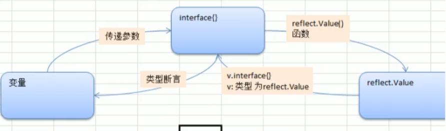

**通过反射获取值:**

`reflect.Value`类型提供的获取原始值的方法如下：

|           方法           | 说明                                                         |
| :----------------------: | :----------------------------------------------------------- |
| Interface() interface {} | 将值以 interface{} 类型返回，可以通过类型断言转换为指定类型  |
|       Int() int64        | 将值以 int 类型返回，所有有符号整型均可以此方式返回          |
|      Uint() uint64       | 将值以 uint 类型返回，所有无符号整型均可以此方式返回         |
|     Float() float64      | 将值以双精度（float64）类型返回，所有浮点数（float32、float64）均可以此方式返回 |
|       Bool() bool        | 将值以 bool 类型返回                                         |
|     Bytes() []bytes      | 将值以字节数组 []bytes 类型返回                              |
|     String() string      | 将值以字符串类型返回                                         |

```go
// reflect.Value, 原始类型, interface之间的转换
func convert(b interface{}){
   // 获取变量的类型
   reflectType := reflect.TypeOf(b)
   fmt.Println("reflect Type of b = ",reflectType)

   // 获取变量的值
   reflectValue := reflect.ValueOf(b)
   fmt.Println("reflect Value of b = ",reflectValue)

   // 将reflectValue转换成interface
   valInterface := reflectValue.Interface()
   // 将interface通过类型断言成需要的类型
   intType := valInterface.(int)
   fmt.Printf("valInterface 的接口是 %T,intType 被转换成了 %T类型\n",valInterface,intType)
}
```

**通过反射设置变量的值:**

想要在函数中通过反射修改变量的值，需要注意函数参数传递的是值拷贝，必须传递变量地址才能修改变量值。而`反射中使用专有的`Elem()`方法来获取指针对应的值`。

```go
func reflectSetValue1(x interface{}) {
   v := reflect.ValueOf(x)
   if v.Kind() == reflect.Int64 {
      v.SetInt(200) //修改的是副本，reflect包会引发panic
   }
}
func reflectSetValue2(x interface{}) {
   v := reflect.ValueOf(x)
   // 反射中使用 Elem()方法获取指针对应的值
   if v.Elem().Kind() == reflect.Int64 {
      v.Elem().SetInt(200)
   }
}
// setValue 通过反射设置变量的值
func setValue(){
	var a int64 = 100
	// reflectSetValue1(a) //panic: reflect: reflect.Value.SetInt using unaddressable value
	reflectSetValue2(&a)
	fmt.Println(a)
}
```

**特别的:**

`isNil()`

```go
func (v Value) IsNil() bool
```

`IsNil()`报告v持有的值是否为nil。v持有的值的分类必须是通道、函数、接口、映射、指针、切片之一；否则`IsNil`函数会导致panic。

`isValid()`

```go
func (v Value) IsValid() bool
```

`IsValid()`返回v是否持有一个值。如果v是指针类型,但是没有初始化的话`isValid()`就会返回false，此时v除了`IsValid`、`String`、`Kind`之外的方法都会导致panic。

### 4. 结构体反射:

任意值通过`reflect.TypeOf()`获得反射对象信息后，如果它的类型是结构体，可以通过反射值对象（`reflect.Type`）的`NumField()`和`Field()`方法获得结构体成员的详细信息。

`reflect.Type`中与获取结构体成员相关的的方法如下表所示。

| 方法                                                        | 说明                                                         |
| :---------------------------------------------------------- | :----------------------------------------------------------- |
| Field(i int) StructField                                    | 根据索引，返回索引对应的结构体字段的信息。                   |
| NumField() int                                              | 返回结构体成员字段数量。                                     |
| FieldByName(name string) (StructField, bool)                | 根据给定字符串返回字符串对应的结构体字段的信息。             |
| FieldByIndex(index []int) StructField                       | 多层成员访问时，根据 []int 提供的每个结构体的字段索引，返回字段的信息。 |
| FieldByNameFunc(match func(string) bool) (StructField,bool) | 根据传入的匹配函数匹配需要的字段。                           |
| NumMethod() int                                             | 返回该类型的方法集中方法的数目                               |
| Method(int) Method                                          | 返回该类型方法集中的第i个方法                                |
| MethodByName(string)(Method, bool)                          | 根据方法名返回该类型方法集中的方法                           |

**StructField:**

`StructField`类型用来描述结构体中的一个字段的信息。

`StructField`的定义如下：

```go
type StructField struct {
    // Name是字段的名字。PkgPath是非导出字段的包路径，对导出字段该字段为""。
    // 参见http://golang.org/ref/spec#Uniqueness_of_identifiers
    Name    string
    PkgPath string
    Type      Type      // 字段的类型
    Tag       StructTag // 字段的标签
    Offset    uintptr   // 字段在结构体中的字节偏移量
    Index     []int     // 用于Type.FieldByIndex时的索引切片
    Anonymous bool      // 是否匿名字段
}
```

```go
type student struct {
	Name  string `json:"name"`
	Score int    `json:"score"`
}

func main() {
	stu1 := student{
		Name:  "小王子",
		Score: 90,
	}

	t := reflect.TypeOf(stu1)
	fmt.Println(t.Name(), t.Kind()) // student struct
	// 通过for循环遍历结构体的所有字段信息
	for i := 0; i < t.NumField(); i++ {
		field := t.Field(i)
		fmt.Printf("name:%s index:%d type:%v json tag:%v\n", field.Name, field.Index, field.Type, field.Tag.Get("json"))
	}

	// 通过字段名获取指定结构体字段信息
	if scoreField, ok := t.FieldByName("Score"); ok {
		fmt.Printf("name:%s index:%d type:%v json tag:%v\n", scoreField.Name, scoreField.Index, scoreField.Type, scoreField.Tag.Get("json"))
	}
}
```

```go
// 给student添加两个方法 Study和Sleep(注意首字母大写)
func (s student) Study() string {
	msg := "好好学习，天天向上。"
	fmt.Println(msg)
	return msg
}

func (s student) Sleep() string {
	msg := "好好睡觉，快快长大。"
	fmt.Println(msg)
	return msg
}

func printMethod(x interface{}) {
	t := reflect.TypeOf(x)
	v := reflect.ValueOf(x)

	fmt.Println(t.NumMethod())
	for i := 0; i < v.NumMethod(); i++ {
		methodType := v.Method(i).Type()
		fmt.Printf("method name:%s\n", t.Method(i).Name)
		fmt.Printf("method:%s\n", methodType)
		// 通过反射调用方法传递的参数必须是 []reflect.Value 类型
		var args = []reflect.Value{}
		v.Method(i).Call(args)
	}
}
```

### 5. 谨慎使用反射:

1. 基于反射的代码是极其脆弱的，反射中的类型错误会在真正运行的时候才会引发panic，那很可能是在代码写完的很长时间之后。
2. 大量使用反射的代码通常难以理解。
3. 反射的性能低下，基于反射实现的代码通常比正常代码运行速度慢一到两个数量级。

## 3.5 网络编程:

### 1. tcp通信:

**服务端:**

一个TCP服务端可以同时连接很多个客户端，例如世界各地的用户使用自己电脑上的浏览器访问淘宝网。因为Go语言中创建多个`goroutine`实现并发非常方便和高效，所以我们可以每建立一次链接就创建一个`goroutine`去处理。

TCP服务端程序的处理流程：

1. 监听端口
2. 接收客户端请求建立链接
3. 创建`goroutine`处理链接。

```go
package main

import (
   "bufio"
   "fmt"
   "net"
)

func process(conn net.Conn){
   defer func(conn net.Conn) {
      err := conn.Close()
      if err != nil {
         fmt.Println("关闭连接时出错,",err)
      }
   }(conn)
   // 循环监听
   for  {
      reader := bufio.NewReader(conn)
      var buf = make([]byte,1024)
      n, err := reader.Read(buf[:])
      if err != nil {
         fmt.Println("read from client failed, err:",err)
         break
      }
      // 将实际接收到数量的字符转换成字符串
      recvStr := string(buf[:n])
      fmt.Println("receive message from client : ",recvStr)
      n, err = conn.Write([]byte(recvStr))
      if err != nil {
         return
      }

   }
}
func main() {
   // 关键语句,监听端口
   listener, err := net.Listen("tcp", "127.0.0.1:10086")
   if err != nil {
      fmt.Println("listen to port(10086) err",err)
      return
   }

   fmt.Printf("listen to port(10086) success,listener type : %T,%v\n",listener,listener)

   // 资源关闭
   defer func(listener net.Listener) {
      err := listener.Close()
      if err != nil {
         fmt.Println("close listener err:",err)
      }
   }(listener)
   // 循环等待客户端连接
   for  {
      conn, err := listener.Accept()
      if err != nil {
         fmt.Println("accept client connect err:",err)
         return
      }
      fmt.Printf("accept client connect success, conn : %T.%v,客户端ip: %s\n",conn,conn,conn.RemoteAddr().String())
      go process(conn)
   }
}
```

**客户端:**

一个TCP客户端进行TCP通信的流程如下：

1. 建立与服务端的链接
2. 进行数据收发
3. 关闭链接

```go
package main

import (
   "bufio"
   "fmt"
   "net"
   "os"
   "strings"
)

func main() {
   dial, err := net.Dial("tcp", "127.0.0.1:10086")
   if err != nil {
      fmt.Printf("connect to host[%s] err:%v\n",dial.RemoteAddr().String(),err)
   }

   // 从终端获取输入
   reader := bufio.NewReader(os.Stdin)
   inStr := ""
   for {
      str, err := reader.ReadString('\n')
      if err != nil{
         fmt.Println("read input string error: ",err)
      }
      if strings.EqualFold(str,"exit\n") {
         break
      }
      inStr += str
   }
   n, err := dial.Write([]byte(inStr))
   if err != nil {
      fmt.Println("write inStr to server error : ",err)
   }
   fmt.Printf("client send %d to server\n",n)

}
```

### 2. tcp粘包:

服务端代码如下：

```go
// socket_stick/server/main.go

func process(conn net.Conn) {
	defer conn.Close()
	reader := bufio.NewReader(conn)
	var buf [1024]byte
	for {
		n, err := reader.Read(buf[:])
		if err == io.EOF {
			break
		}
		if err != nil {
			fmt.Println("read from client failed, err:", err)
			break
		}
		recvStr := string(buf[:n])
		fmt.Println("收到client发来的数据：", recvStr)
	}
}

func main() {

	listen, err := net.Listen("tcp", "127.0.0.1:30000")
	if err != nil {
		fmt.Println("listen failed, err:", err)
		return
	}
	defer listen.Close()
	for {
		conn, err := listen.Accept()
		if err != nil {
			fmt.Println("accept failed, err:", err)
			continue
		}
		go process(conn)
	}
}
```

客户端代码如下：

```go
// socket_stick/client/main.go

func main() {
	conn, err := net.Dial("tcp", "127.0.0.1:30000")
	if err != nil {
		fmt.Println("dial failed, err", err)
		return
	}
	defer conn.Close()
	for i := 0; i < 20; i++ {
		msg := `Hello, Hello. How are you?`
		conn.Write([]byte(msg))
	}
}
```

将上面的代码保存后，分别编译。先启动服务端再启动客户端，可以看到服务端输出结果如下：

```bash
收到client发来的数据： Hello, Hello. How are you?Hello, Hello. How are you?Hello, Hello. How are you?Hello, Hello. How are you?Hello, Hello. How are you?
收到client发来的数据： Hello, Hello. How are you?Hello, Hello. How are you?Hello, Hello. How are you?Hello, Hello. How are you?Hello, Hello. How are you?Hello, Hello. How are you?Hello, Hello. How are you?Hello, Hello. How are you?
收到client发来的数据： Hello, Hello. How are you?Hello, Hello. How are you?
收到client发来的数据： Hello, Hello. How are you?Hello, Hello. How are you?Hello, Hello. How are you?
收到client发来的数据： Hello, Hello. How are you?Hello, Hello. How are you?
```

客户端分10次发送的数据，在服务端并没有成功的输出10次，而是多条数据“粘”到了一起。

**粘包的原因:**

主要原因就是tcp数据传递模式是流模式，在保持长连接的时候可以进行多次的收和发。

“粘包”可发生在发送端也可发生在接收端：

1. 由`Nagle`算法造成的发送端的粘包：`Nagle`算法是一种改善网络传输效率的算法。简单来说就是当我们提交一段数据给TCP发送时，TCP并不立刻发送此段数据，而是等待一小段时间看看在等待期间是否还有要发送的数据，若有则会一次把这两段数据发送出去。
2. 接收端接收不及时造成的接收端粘包：TCP会把接收到的数据存在自己的缓冲区中，然后通知应用层取数据。当应用层由于某些原因不能及时的把TCP的数据取出来，就会造成TCP缓冲区中存放了几段数据。

**解决办法:** 自定义数据长度,在解码的时候使用相同的解码方式

出现”粘包”的关键在于接收方不确定将要传输的数据包的大小，因此我们可以对数据包进行封包和拆包的操作。

封包：封包就是给一段数据加上包头，这样一来数据包就分为包头和包体两部分内容了(过滤非法包时封包会加入”包尾”内容)。包头部分的长度是固定的，并且它存储了包体的长度，根据包头长度固定以及包头中含有包体长度的变量就能正确的拆分出一个完整的数据包。

我们可以自己定义一个协议，比如数据包的前4个字节为包头，里面存储的是发送的数据的长度。

```go
// socket_stick/proto/proto.go
package proto

import (
	"bufio"
	"bytes"
	"encoding/binary"
)

// Encode 将消息编码
func Encode(message string) ([]byte, error) {
	// 读取消息的长度，转换成int32类型（占4个字节）
	var length = int32(len(message))
	var pkg = new(bytes.Buffer)
	// 写入消息头
	err := binary.Write(pkg, binary.LittleEndian, length)
	if err != nil {
		return nil, err
	}
	// 写入消息实体
	err = binary.Write(pkg, binary.LittleEndian, []byte(message))
	if err != nil {
		return nil, err
	}
	return pkg.Bytes(), nil
}

// Decode 解码消息
func Decode(reader *bufio.Reader) (string, error) {
	// 读取消息的长度
	lengthByte, _ := reader.Peek(4) // 读取前4个字节的数据
	lengthBuff := bytes.NewBuffer(lengthByte)
	var length int32
	err := binary.Read(lengthBuff, binary.LittleEndian, &length)
	if err != nil {
		return "", err
	}
	// Buffered返回缓冲中现有的可读取的字节数。
	if int32(reader.Buffered()) < length+4 {
		return "", err
	}

	// 读取真正的消息数据
	pack := make([]byte, int(4+length))
	_, err = reader.Read(pack)
	if err != nil {
		return "", err
	}
	return string(pack[4:]), nil
}
```

接下来在服务端和客户端分别使用上面定义的`proto`包的`Decode`和`Encode`函数处理数据。

服务端代码如下：

```go
// socket_stick/server2/main.go

func process(conn net.Conn) {
	defer conn.Close()
	reader := bufio.NewReader(conn)
	for {
		msg, err := proto.Decode(reader)
		if err == io.EOF {
			return
		}
		if err != nil {
			fmt.Println("decode msg failed, err:", err)
			return
		}
		fmt.Println("收到client发来的数据：", msg)
	}
}

func main() {

	listen, err := net.Listen("tcp", "127.0.0.1:30000")
	if err != nil {
		fmt.Println("listen failed, err:", err)
		return
	}
	defer listen.Close()
	for {
		conn, err := listen.Accept()
		if err != nil {
			fmt.Println("accept failed, err:", err)
			continue
		}
		go process(conn)
	}
}
```

客户端代码如下：

```go
// socket_stick/client2/main.go

func main() {
	conn, err := net.Dial("tcp", "127.0.0.1:30000")
	if err != nil {
		fmt.Println("dial failed, err", err)
		return
	}
	defer conn.Close()
	for i := 0; i < 20; i++ {
		msg := `Hello, Hello. How are you?`
		data, err := proto.Encode(msg)
		if err != nil {
			fmt.Println("encode msg failed, err:", err)
			return
		}
		conn.Write(data)
	}
}
```

### 3. udp通信:

`UDP协议`（User Datagram Protocol）中文名称是用户数据报协议，是`OSI`（Open System Interconnection，开放式系统互联）参考模型中一种**无连接**的传输层协议，不需要建立连接就能直接进行数据发送和接收，属于不可靠的、没有时序的通信，但是`UDP`协议的实时性比较好，通常用于视频直播相关领域。

**UDP服务端:**

```go
// UDP/server/main.go

// UDP server端
func main() {
	listen, err := net.ListenUDP("udp", &net.UDPAddr{
		IP:   net.IPv4(0, 0, 0, 0),
		Port: 30000,
	})
	if err != nil {
		fmt.Println("listen failed, err:", err)
		return
	}
	defer listen.Close()
	for {
		var data [1024]byte
		n, addr, err := listen.ReadFromUDP(data[:]) // 接收数据
		if err != nil {
			fmt.Println("read udp failed, err:", err)
			continue
		}
		fmt.Printf("data:%v addr:%v count:%v\n", string(data[:n]), addr, n)
		_, err = listen.WriteToUDP(data[:n], addr) // 发送数据
		if err != nil {
			fmt.Println("write to udp failed, err:", err)
			continue
		}
	}
}
```

**UDP客户端:**

使用Go语言的`net`包实现的UDP客户端代码如下：

```go
// UDP 客户端
func main() {
	socket, err := net.DialUDP("udp", nil, &net.UDPAddr{
		IP:   net.IPv4(0, 0, 0, 0),
		Port: 30000,
	})
	if err != nil {
		fmt.Println("连接服务端失败，err:", err)
		return
	}
	defer socket.Close()
	sendData := []byte("Hello server")
	_, err = socket.Write(sendData) // 发送数据
	if err != nil {
		fmt.Println("发送数据失败，err:", err)
		return
	}
	data := make([]byte, 4096)
	n, remoteAddr, err := socket.ReadFromUDP(data) // 接收数据
	if err != nil {
		fmt.Println("接收数据失败，err:", err)
		return
	}
	fmt.Printf("recv:%v addr:%v count:%v\n", string(data[:n]), remoteAddr, n)
}
```

## 3.6 无处不在的context

### 1. 核心数据结构:

#### 1. 接口:

##### 1.1 Context:

```go
type Context interface {
    
	Deadline() (deadline time.Time, ok bool)

	Done() <-chan struct{}

	Err() error

	Value(key any) any
}
```

- Deadline(): 返回context的截止时间, 如果没有设置截止时间的话, ok为false, 连续调用此方法返回结果是一样的.

- Done(): 返回context的channel, 如果context永远不可取消的话, 返回值为nil.

  `WithCancel()`: 这个反方创建出来的context, 在调用cancel()后 Done返回的channel被关闭.

  `WithDeadline()`: 这个方法创建出来的context, 在context过期时间达到后, Done返回的channel被关闭.

  `WithTimeout()`: 这个方法创建出来的context, 在context设置的有效时间达到后, Done返回的channel被关闭.

- Err(): 如果Done返回的channel未被关闭, Err返回nil; 如果Done返回的chanel关闭了, Err()返回一个非空错误信息,

  `Canceled错误`: 表示context取消了

  `DeadlineExceeded错误`: 表示context截止时间达到了.

- Value(): 返回context中存储的信息.

##### 1.2 canceler:

```go
type canceler interface {
	cancel(removeFromParent bool, err, cause error)
	Done() <-chan struct{}
}
```

cancelCtx和timerCtx实现了这个接口.

##### 1.3 stringer:

```go
type stringer interface {
	String() string
}
```

##### 1.4 afterFuncer:

```go
type afterFuncer interface {
    AfterFunc(func()) func() bool
}
```

#### 2. 错误:

```go
var Canceled = errors.New("context canceled")

var DeadlineExceeded error = deadlineExceededError{}

type deadlineExceededError struct{}

func (deadlineExceededError) Error() string   { return "context deadline exceeded" }
func (deadlineExceededError) Timeout() bool   { return true }
func (deadlineExceededError) Temporary() bool { return true }
```

### 2. 实现:

#### 1. emptyCtx:

emptyCtx是一个永不过期, 永远不会被取消且不带任何值得context. backgroundCtx, todoCtx继承了emptyCtx.

```go
type emptyCtx struct{}

func (emptyCtx) Deadline() (deadline time.Time, ok bool) {
    return
}

func (emptyCtx) Done() <-chan struct{} {
    return nil
}

func (emptyCtx) Err() error {
    return nil
}

func (emptyCtx) Value(key any) any {
    return nil
}
```

- Deadline: 返回值 deadline为公元元年, ok 为 false.
- Done: 返回值 nil, 往nil中写入或者读取都会被阻塞.
- Err: 返回值 nil
- Value: 返回值 nil


本月用度:

5184.8

娱乐: 535.69

借出: 20

请客: 270

烟: 120.8

日用品: 366.47

交通: 91.552

三餐: 614.39

周末买菜: 268.8

零食: 205.84

医疗: 2192.8

投资理财: 44

花呗: 333.72


