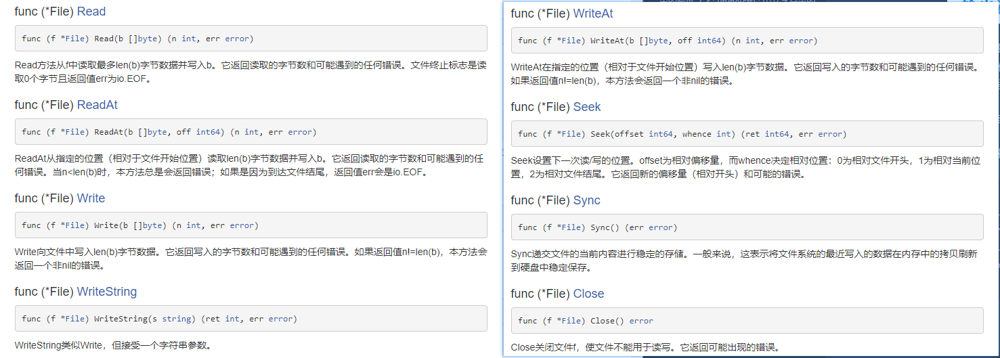

## 3.1 文件操作:

### 1. 概述

文件在程序中是以流的形式来操作的:


`os包`提供了操作系统函数的不依赖平台的接口。设计为Unix风格的，虽然错误处理是go风格的；失败的调用会返回错误值而非错误码。通常错误值里包含更多信息。例如，如果某个使用一个文件名的调用（如Open、Stat）失败了，打印错误时会包含该文件名，错误类型将为`*PathError`，其内部可以解包获得更多信息。

`os包`的接口规定为在所有操作系统中都是一致的。非公用的属性可以从操作系统特定的[`syscall](http://godoc.org/syscall)包获取。

`os包`中通过`File结构体`来描述文件相关信息

```go
type file struct {
	pfd        poll.FD
	name       string
	dirinfo    *dirInfo // nil unless directory being read
	appendMode bool     // whether file is opened for appending
}
```

常用的文件相关方法:  


### 2. 路径问题:

**相对路径:** 就是当前项目的根目录,比如当前项目 `test`全路径如图


说明: 通过`os.Getwd()`获取到了项目的根据路径,上面两张图片,都希望在当前文件夹(`./`表示当前文件夹)通过 `os.Create()`创建一个`test.md`文件,结果如图,说明 go项目的相对路径,是从项目的跟路径开始的.

如果要使用相对路径(`相对于当前go文件`)去加载文件,正确的做法是: 

```go
func create() {
	_, file, _, _ := runtime.Caller(0)
	fmt.Println("file = ",file)

	curFileDir := path.Dir(file)
	fmt.Println("path.Dir(file) = ",curFileDir)

	targetPath := path.Join(curFileDir, PATH)
	fmt.Println("join = ",targetPath)

	create, err := os.Create(targetPath)
	if err != nil {
		fmt.Println("create file err = ",err)
	}
}
```

1. 通过`runtime.Caller(0)拿到当前执行的栈帧信息,参数为向上回溯的栈帧数`获取当前正在运行的源文件的全路径
2. 通过`path.Join()`将 `当前运行源文件的全路径` 和 `相对于当前源文件的目标路径()`,拼接起来处理成 需要的全路径
3. 然后通过这个路径去做一些文件操作

如果通过项目根路径去操作,就直接把需要的路径补全就行.

```go
	// 打开文件
	file, err := os.Open("./chapter03_goAdvance/01_File/test/test.txt")
	if err != nil {
		fmt.Println("open file err = ",err)
	}
	// 看看file是什么类型的
	fmt.Printf("file = %v\n",file)

	if err = file.Close(); err != nil {
		fmt.Println("close file err = ",err)
	}
```


### 3. 文件的基本操作:  

#### 1. 开关文件:

**打开:**

```go
/* 
name string: 文件名
*File: 返回指向该文件的指针
error: 打开文件错误,类型为 *PathError
*/
func Open(name string) (*File, error)
```

**关闭:**

```go
/*
f *File: 要关闭的文件指针
error: 关闭时发生的错误
*/
func (f *File) Close() error 
```

```go
// 开关文件
func openClose() {
	// 打开文件
	file, err := os.Open("./chapter03_goAdvance/01_File/test/test.txt")
	if err != nil {
		fmt.Println("open file err = ",err)
	}
	// 看看file是什么类型的
	fmt.Printf("file = %v\n",file)

	if err = file.Close(); err != nil {
		fmt.Println("close file err = ",err)
	}
}
```

