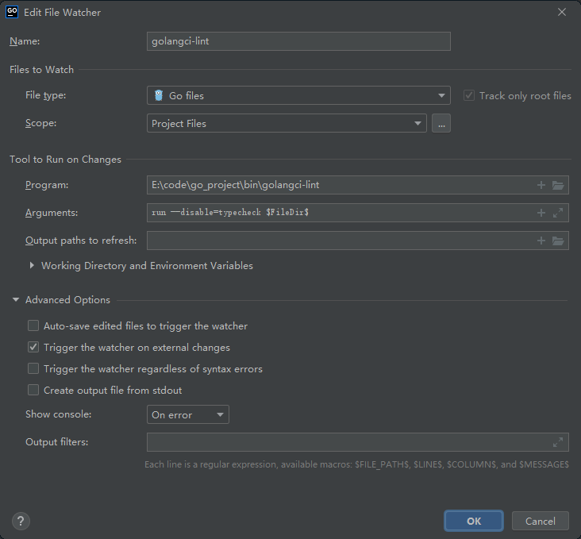

## 1.1 Golint

### 1.1.1 Golint介绍

  Golint 是一个源码检测工具用于检测代码规范
  Golint 不同于gofmt, Gofmt用于代码格式化

Golint会对代码做以下几个方面检查

  package注释 必须按照 “Package xxx 开头”
  package命名 不能有大写字母、下划线等特殊字符
  struct、interface等注释 必须按照指定格式开头
  struct、interface等命名
  变量注释、命名
  函数注释、命名
  各种语法规范校验等

### 1.1.2 Golint安装

1. mkdir -p $GOPATH/src/golang.org/x/
   cd $GOPATH/src/golang.org/x/
   git clone [https://github.com/golang/lint.git](https://links.jianshu.com/go?to=https%3A%2F%2Fgithub.com%2Fgolang%2Flint.git)
   git clone [https://github.com/golang/tools.git](https://links.jianshu.com/go?to=https%3A%2F%2Fgithub.com%2Fgolang%2Ftools.git)
   到目录$GOPATH/src/golang.org/x/lint/golint中运行go install命令
2. ls $GOPATH/bin (可以发现已经有golint可执行文件)

### 1.1.3 Golint使用

golint检测代码有2种方式

1. golint file
2. golint directory

### 1.1.4  整合到goland

 在setting  ->  tools  ->  file watcher 里面点左下角的 `+` 添加 golangci-lint.配置如图:  

`auto-save` 那个选项尽量不要勾选,触发的速度太快了影响写代码

 注意:<b>可能出现 running error: context load fail: no go files to analyze</b>

 解决方法: `go env -w GO111MODULE=off`,设置环境变量,关闭go module.
