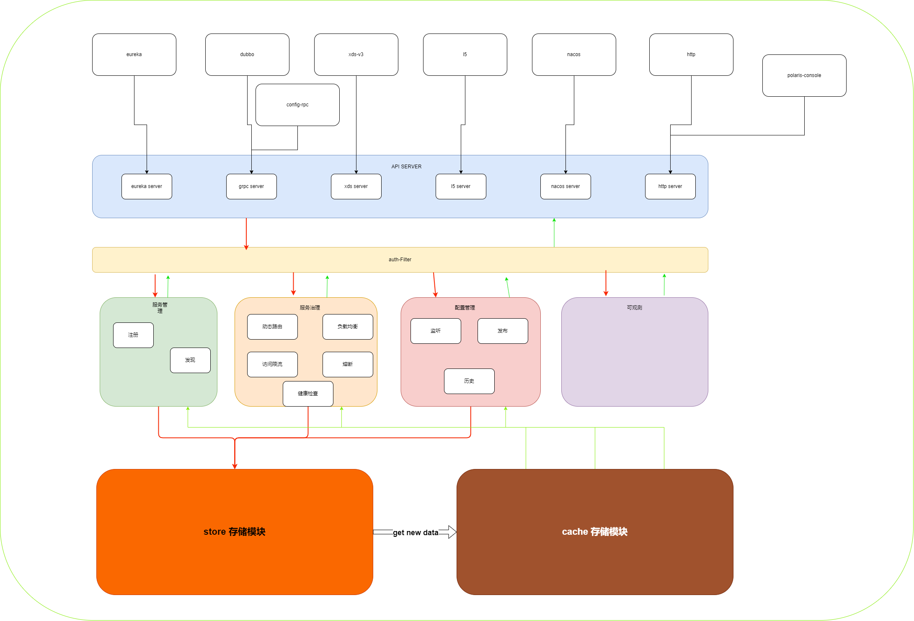
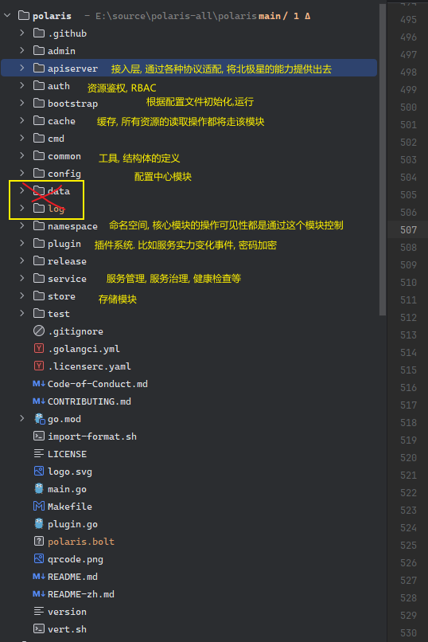
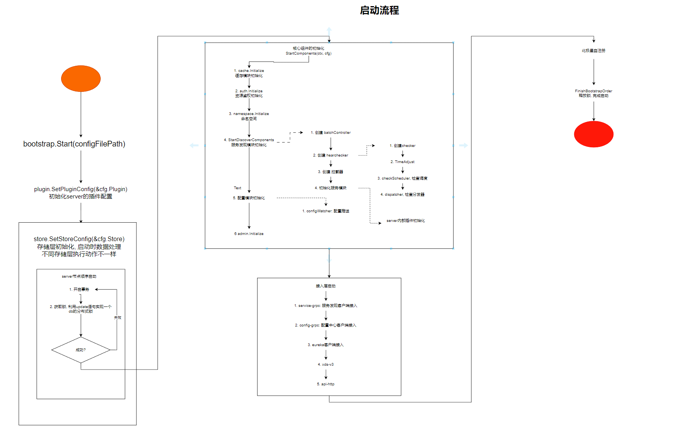
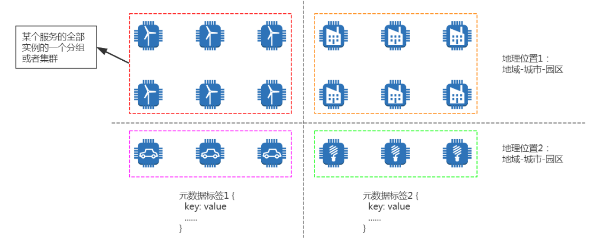
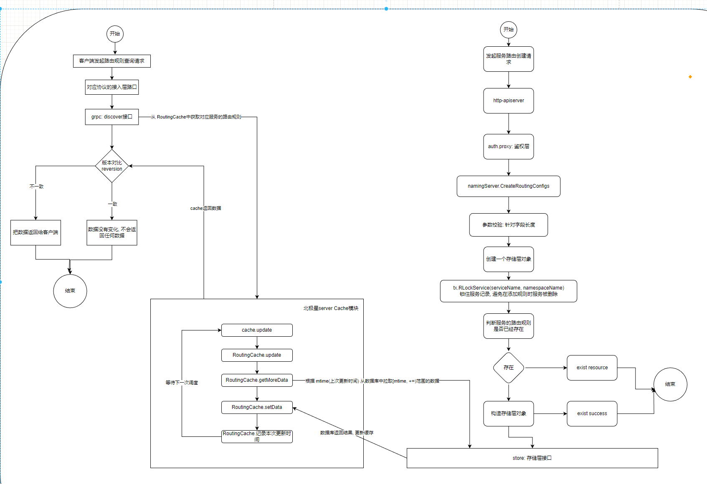

北极星学习:

# 1. 北极星组成:



## 1. 控制台: 

polaris-console: 北极星相关功能的一个管控台

## 2. 控制面:

polaris-server: 

- 服务管理: 服务发现, 服务注册, 元数据管理
- 服务治理: 健康检查, 动态路由, 负载均衡, 访问限流, 服务熔断, 节点熔断, 主动探测
- 配置管理: 配置变更, 配置校验, 版本管理, 灰度发布
- 可观测: 业务流量, 系统事件, 操作记录
- 权限管理: 访问鉴权
- api-sever: 对接不同的注册中心协议, 将数据统一转换成polairs的数据格式

polaris-controller: 支持 K8s 服务同步和网格代理注入。

## 3. 数据面:

sdk: `polaris-java`, `polaris-go`, `polaris-cpp`

开发框架: `dubbo-java-polaris`, `spring-cloud-tecent`, `grpc-go-polaris`

agent: `java-agent`

sidecar: `polaris-sidecar`, `envoy-proxy`.


# 2. 代码层次:



# 3. 启动流程:

## 1. 配置文件认识:

北极星是一个插件化设计的服务端系统, 根据配置文件选择性的加载对应的功能模块.

```yaml
# Tencent is pleased to support the open source community by making Polaris available.
#
# Copyright (C) 2019 THL A29 Limited, a Tencent company. All rights reserved.
#
# Licensed under the BSD 3-Clause License (the "License");
# you may not use this file except in compliance with the License.
# You may obtain a copy of the License at
#
# https://opensource.org/licenses/BSD-3-Clause
#
# Unless required by applicable law or agreed to in writing, software distributed
# under the License is distributed on an "AS IS" BASIS, WITHOUT WARRANTIES OR
# CONDITIONS OF ANY KIND, either express or implied. See the License for the
# specific language governing permissions and limitations under the License.

# server Start guidance configuration
bootstrap:
  # Global log
  logger:
    # Log scope name
    # Configuration center related logs
    config:
      # Log file location
      rotateOutputPath: log/runtime/polaris-config.log
      # Special records of error log files at ERROR level
      errorRotateOutputPath: log/runtime/polaris-config-error.log
      # The maximum size of a single log file, 100 default, the unit is MB
      rotationMaxSize: 100
      # How many log files are saved, default 30
      rotationMaxBackups: 30
      # The maximum preservation days of a single log file, default 7
      rotationMaxAge: 7
      # Log output level，debug/info/warn/error
      outputLevel: info
      # Open the log file compression
      compress: true
      # onlyContent just print log content, not print log timestamp
      # onlyContent: false
    # Resource Auth, User Management Log
    auth:
      rotateOutputPath: log/runtime/polaris-auth.log
      errorRotateOutputPath: log/runtime/polaris-auth-error.log
      rotationMaxSize: 100
      rotationMaxBackups: 30
      rotationMaxAge: 7
      outputLevel: info
      compress: true
    # Storage layer log
    store:
      rotateOutputPath: log/runtime/polaris-store.log
      errorRotateOutputPath: log/runtime/polaris-store-error.log
      rotationMaxSize: 100
      rotationMaxBackups: 30
      rotationMaxAge: 7
      outputLevel: info
      compress: true
    # Server cache log log
    cache:
      rotateOutputPath: log/runtime/polaris-cache.log
      errorRotateOutputPath: log/runtime/polaris-cache-error.log
      rotationMaxSize: 100
      rotationMaxBackups: 30
      rotationMaxAge: 7
      outputLevel: info
      compress: true
    # Service discovery and governance rules related logs
    naming:
      rotateOutputPath: log/runtime/polaris-naming.log
      errorRotateOutputPath: log/runtime/polaris-naming-error.log
      rotationMaxSize: 100
      rotationMaxBackups: 30
      rotationMaxAge: 7
      outputLevel: info
      compress: true
    # Service discovery institutional health check log
    healthcheck:
      rotateOutputPath: log/runtime/polaris-healthcheck.log
      errorRotateOutputPath: log/runtime/polaris-healthcheck-error.log
      rotationMaxSize: 100
      rotationMaxBackups: 30
      rotationMaxAge: 7
      outputLevel: info
      compress: true
    # XDS protocol layer plug -in log
    xdsv3:
      rotateOutputPath: log/runtime/polaris-xdsv3.log
      errorRotateOutputPath: log/runtime/polaris-xdsv3-error.log
      rotationMaxSize: 100
      rotationMaxBackups: 30
      rotationMaxAge: 7
      outputLevel: info
      compress: true
    # Eureka protocol layer plug -in log
    eureka:
      rotateOutputPath: log/runtime/polaris-eureka.log
      errorRotateOutputPath: log/runtime/polaris-eureka-error.log
      rotationMaxSize: 100
      rotationMaxBackups: 30
      rotationMaxAge: 7
      outputLevel: info
      compress: true
    # APISERVER common log, record inbound request and outbound response 
    apiserver:
      rotateOutputPath: log/runtime/polaris-apiserver.log
      errorRotateOutputPath: log/runtime/polaris-apiserver-error.log
      rotationMaxSize: 100
      rotationMaxBackups: 30
      rotationMaxAge: 7
      outputLevel: info
      compress: true
    default:
      rotateOutputPath: log/runtime/polaris-default.log
      errorRotateOutputPath: log/runtime/polaris-default-error.log
      rotationMaxSize: 100
      rotationMaxBackups: 30
      rotationMaxAge: 7
      outputLevel: info
      compress: true
    # server plugin logs
    token-bucket:
      rotateOutputPath: log/runtime/polaris-ratelimit.log
      errorRotateOutputPath: log/runtime/polaris-ratelimit-error.log
      rotationMaxSize: 100
      rotationMaxBackups: 30
      rotationMaxAge: 7
      outputLevel: info
      compress: true
    discoverstat:
      rotateOutputPath: log/statis/polaris-discoverstat.log
      errorRotateOutputPath: log/statis/polaris-discoverstat-error.log
      rotationMaxSize: 100
      rotationMaxBackups: 30
      rotationMaxAge: 7
      outputLevel: info
      compress: true
      onlyContent: true
    local:
      rotateOutputPath: log/statis/polaris-statis.log
      errorRotateOutputPath: log/statis/polaris-statis-error.log
      rotationMaxSize: 100
      rotationMaxBackups: 30
      rotationMaxAge: 7
      outputLevel: info
      compress: true
    HistoryLogger:
      rotateOutputPath: log/operation/polaris-history.log
      errorRotateOutputPath: log/operation/polaris-history-error.log
      rotationMaxSize: 100
      rotationMaxBackups: 10
      rotationMaxAge: 7
      rotationMaxDurationForHour: 24
      outputLevel: info
      onlyContent: true
    discoverEventLocal:
      rotateOutputPath: log/event/polaris-discoverevent.log
      errorRotateOutputPath: log/event/polaris-discoverevent-error.log
      rotationMaxSize: 100
      rotationMaxBackups: 30
      rotationMaxAge: 7
      outputLevel: info
      onlyContent: true
    cmdb:
      rotateOutputPath: log/runtime/polaris-cmdb.log
      errorRotateOutputPath: log/runtime/polaris-cmdb-error.log
      rotationMaxSize: 100
      rotationMaxBackups: 30
      rotationMaxAge: 7
      outputLevel: info
      compress: true
    nacos-apiserver:
      rotateOutputPath: log/runtime/nacos-apiserver.log
      errorRotateOutputPath: log/runtime/nacos-apiserver-error.log
      rotationMaxSize: 100
      rotationMaxBackups: 30
      rotationMaxAge: 7
      outputLevel: info
      compress: true
  # Start the server in order
  startInOrder:
    # Start the Polaris-Server in order, mainly to avoid data synchronization logic when the server starts the DB to pull the DB out of high load
    open: true
    # The name of the start lock
    key: sz
  # Register as Arctic Star Service
  polaris_service:
    ## level: self_address > network_inter > probe_address
    ## Obtain the IP of the VM or POD where Polaris is located by making a TCP connection with the probe_adreess address
    # probe_address: ##DB_ADDR##
    ## Set the name of the gateway to get your own IP
    # network_inter: eth0
    ## Show the setting node itself IP information
    # self_address: 127.0.0.1
    # disable_heartbeat disable polaris_server node run heartbeat action to keep lease polaris_service
    # disable_heartbeat: true
    # Whether to open the server to register
    enable_register: true
    # Registered North Star Server Examples isolation status
    isolated: false
    # Service information that needs to be registered
    services:
        # service name
      - name: polaris.checker
        # Set the port protocol information that requires registration
        protocols:
          - service-grpc
# apiserver Configuration
apiservers:
    # apiserver plugin name
  - name: service-eureka
    # apiserver additional configuration
    option:
      # tcp server listen ip
      listenIP: "0.0.0.0"
      # tcp server listen port
      listenPort: 8761
      # set the polaris namingspace of the EUREKA service default
      namespace: default
      # pull data from the cache of the polaris, refresh the data cache in the Eureka protocol
      refreshInterval: 10
      # eureka incremental instance changes time cache expiration cycle
      deltaExpireInterval: 60
      # unhealthy instance expiration cycle
      unhealthyExpireInterval: 180
      # whether to enable an instance ID of polaris to generate logic
      generateUniqueInstId: false
      # TCP connection number limit
      connLimit:
        # Whether to turn on the TCP connection limit function, default FALSE
        openConnLimit: false
        # The number of connections with the most IP
        maxConnPerHost: 1024
        # Current Listener's maximum number of connections
        maxConnLimit: 10240
        # Whitening list ip list, English comma separation
        whiteList: 127.0.0.1
        # Cleaning the cycle of link behavior
        purgeCounterInterval: 10s
        # How long does the unpretentious link clean up
        purgeCounterExpired: 5s
  - name: api-http
    option:
      listenIP: "0.0.0.0"
      listenPort: 8090
      # debug pprof switch
      enablePprof: true
      # swagger docs switch
      enableSwagger: true
      connLimit:
        openConnLimit: false
        maxConnPerHost: 128
        maxConnLimit: 5120
        whiteList: 127.0.0.1
        purgeCounterInterval: 10s
        purgeCounterExpired: 5s
      # Referenced from: [Pull Requests 387], in order to improve the processing of service discovery QPS when using api-http server
      enableCacheProto: false
      # Cache default size
      sizeCacheProto: 128
    # Set the type of open API interface
    api:
      # admin OpenAPI interface
      admin:
        enable: true
      # Console OpenAPI interface
      console:
        enable: true
        # OpenAPI group that needs to be exposed
        include: [default, service, config]
      # client OpenAPI interface
      client:
        enable: true
        include: [discover, register, healthcheck, config]
    # Polaris is a client protocol layer based on the gRPC protocol, which is used for registration discovery and service governance rule delivery
  - name: service-grpc
    option:
      listenIP: "0.0.0.0"
      listenPort: 8091
      connLimit:
        openConnLimit: false
        maxConnPerHost: 128
        maxConnLimit: 5120
      # Open the protobuf parsing cache, cache the protobuf serialization results of the same content, and improve the processing of service discovery QPS
      enableCacheProto: true
      # Cache default size
      sizeCacheProto: 128
      # tls setting
      tls:
        # set cert file path
        certFile: ""
        # set key file path
        keyFile: ""
        # set trusted ca file path
        trustedCAFile: ""
    api:
      client:
        enable: true
        include: [discover, register, healthcheck]
  - name: config-grpc
    option:
      listenIP: "0.0.0.0"
      listenPort: 8093
      connLimit:
        openConnLimit: false
        maxConnPerHost: 128
        maxConnLimit: 5120
    api:
      client:
        enable: true
  - name: xds-v3
    option:
      listenIP: "0.0.0.0"
      listenPort: 15010
      connLimit:
        openConnLimit: false
        maxConnPerHost: 128
        maxConnLimit: 10240
  - name: service-nacos
    option:
      listenIP: "0.0.0.0"
      listenPort: 8848
      # 设置 nacos 默认命名空间对应 Polaris 命名空间信息
      defaultNamespace: default
      connLimit:
        openConnLimit: false
        maxConnPerHost: 128
        maxConnLimit: 10240
  # - name: service-l5
  #   option:
  #     listenIP: 0.0.0.0
  #     listenPort: 7779
  #     clusterName: cl5.discover
# Core logic configuration
auth:
  # auth's option has migrated to auth.user and auth.strategy
  # it's still available when filling auth.option, but you will receive warning log that auth.option has deprecated.
  user:
    name: defaultUser
    option:
      # Token encrypted SALT, you need to rely on this SALT to decrypt the information of the Token when analyzing the Token
      # The length of SALT needs to satisfy the following one：len(salt) in [16, 24, 32]
      salt: polarismesh@2021
  strategy:
    name: defaultStrategy
    option:
      # 控制台鉴权开关, 默认开启
      consoleOpen: true
      # Console Strict Model, default true
      consoleStrict: true
      # 客户端鉴权开关, 默认关闭
      clientOpen: false
      # Customer Strict Model, default close
      clientStrict: false
# ------------------     命名空间相关配置 --------------------------------------
namespace:
  # 自动创建命名空间开关
  autoCreate: true

# ------------------     服务相关配置  ------------------
naming:
  # 服务批量管理
  batch:
    register:
      open: true
      # 任务队列长度
      queueSize: 10240
      # 等待任务填充的时间间隔, 如果时间到了任务数量还没有到达单次批量处理任务数量, 直接启动批量操作
      waitTime: 32ms
      # 单次批量处理任务数
      maxBatchCount: 128
      # 处于批任务的 worker 协程数量
      concurrency: 128
      # 是否开启丢弃过期任务，仅用于 register 类型的批量控制器
      dropExpireTask: true
      # 任务最大有效期，超过有效期则任务不执行，仅用于 register 类型的批量控制器
      taskLife: 30s
    deregister:
      open: true
      queueSize: 10240
      waitTime: 32ms
      maxBatchCount: 128
      concurrency: 128
  # 自动创建服务开关, 默认为true
  autoCreate: true

# -------------------  健康检查相关配置  -------------------------
healthcheck:
  # 是否开启健康检查功能模块
  open: true
  # 参与健康检查任务的实例所在的服务
  service: polaris.checker
  # 时间轮参数
  slotNum: 30
  # 用于调整实例健康检查任务在时间轮内的下一次执行时间，限制最小检查周期
  minCheckInterval: 1s
  # 用于调整实例健康检查任务在时间轮内的下一次执行时间，限制最大检查周期
  maxCheckInterval: 30s
  # 用于调整SDK上报实例健康检查任务在时间轮内的下一次执行时间
  clientReportInterval: 120s
  # 健康检查数据的批量写控制器
  batch:
    heartbeat:
      open: true
      queueSize: 10240
      waitTime: 32ms
      maxBatchCount: 32
      concurrency: 64
  # 健康检查启用插件列表，当前支持 heartbeatMemory/heartbeatRedis/heartbeatLeader，由于3者属于同一类型健康检查插件，因此只能启用一个
  checkers:
    - name: heartbeatMemory # 基于本机内存实现的健康检查插件，仅适用于单机版本
#    - name: heartbeatLeader  # Heartbeat examination plugin based on the Leader-Follower mechanism
#      option:
#        # Heartbeat Record MAP number of shards
#        soltNum: 128
#        # The number of GRPC connections used to process heartbeat forward request processing between leader and follower,
#        # default value is runtime.GOMAXPROCS(0)
#        streamNum: 128
#    - name: heartbeatRedis # 基于 redis 实现的健康检查插件，适用于单机版本以及集群版本
#      option:
#        kvAddr: ##REDIS_ADDR##   # redis 地址，IP:PORT 格式
#        # ACL user from redis v6.0, remove it if ACL is not available
#        kvUser: ##REDIS_USER#    # 如果redis版本低于6.0，请直接移除该配置项
#        kvPasswd: ##REDIS_PWD##  # redis 密码
#        poolSize: 200            # redis 链接池大小
#        minIdleConns: 30         # 最小空闲链接数量
#        idleTimeout: 120s        # 认为空闲链接的时间
#        connectTimeout: 200ms    # 链接超时时间
#        msgTimeout: 200ms        # redis的读写操作超时时间
#        concurrency: 200         # 操作redis的worker协程数量
#        withTLS: false
# ------------------ 配置中心模块启动配置 --------------------------
config:
  # 模块开关
  open: true
  # 配置文件最大长度
  contentMaxLength: 20000
# ------------------ 缓存配置 --------------------------
cache:
  # When the incremental synchronization data is cached, the actual incremental data time range is as follows: 
  # How many seconds need to be backtracked from the current time, that is, 
  # the incremental synchronization at time T [T - abs(DiffTime), ∞)
  # 缓存增量同步时间范围, 即同步 T时刻往前 diffTime时间的数据
  diffTime: 5s
  # todo resources配置现在还有没?
#  resources:
#    - name: service # 加载服务数据
#      option:
#        disableBusiness: false # 不加载业务服务
#        needMeta: true # 加载服务元数据
#    - name: instance # 加载实例数据
#      option:
#        disableBusiness: false # 不加载业务服务实例
#        needMeta: true # 加载实例元数据
#    - name: routingConfig # 加载路由数据
#    - name: rateLimitConfig # 加载限流数据
#    - name: circuitBreakerConfig # 加载熔断数据
#    - name: users # 加载用户、用户组数据
#    - name: strategyRule # 加载鉴权规则数据
#    - name: namespace # 加载命名空间数据
#    - name: client # 加载 SDK 数据
# Maintain configuration
maintain:
  jobs:
    # Clean up long term unhealthy instance
    - name: DeleteUnHealthyInstance
      enable: false
      option:
        # Valid time units are "ns", "us" (or "µs"), "ms", "s", "m", "h".
        instanceDeleteTimeout: 60m
    # Delete auto-created service without an instance
    - name: DeleteEmptyAutoCreatedService
      enable: false
      option:
        # Valid time units are "ns", "us" (or "µs"), "ms", "s", "m", "h".
        serviceDeleteTimeout: 30m
    # Clean soft deleted instances
    - name: CleanDeletedInstances
      enable: true
      option:
        # Valid time units are "ns", "us" (or "µs"), "ms", "s", "m", "h".
        # instanceCleanTimeout: 10m
    # Clean soft deleted clients
    - name: CleanDeletedClients
      enable: true
      option:
        # Valid time units are "ns", "us" (or "µs"), "ms", "s", "m", "h".
        # clientCleanTimeout: 10m
# Storage configuration
store:
  # 本地存储
#  name: boltdbStore
#  option:
#    path: ./polaris.bolt
  ## 数据库插件
   name: defaultStore
   option:
     master:
       dbType: mysql
       dbName: polaris_server
       dbUser: root
       dbPwd: root
       dbAddr: 192.168.200.130:33066
       maxOpenConns: 300
       maxIdleConns: 50
       connMaxLifetime: 300 # Unit second
       txIsolationLevel: 2 #LevelReadCommitted
# polaris-server plugin settings
plugin:
  crypto:
    entries:
      - name: AES
  # whitelist:
  #   name: whitelist
  #   option:
  #     ip: [127.0.0.1]
  cmdb:
    name: memory
    option:
      url: ""
      interval: 60s
  history:
    entries:
      - name: HistoryLogger
  discoverEvent:
    entries:
      - name: discoverEventLocal
  statis:
    entries:
      - name: local
        option:
          interval: 60
      - name: prometheus
  ratelimit:
    name: token-bucket
    option:
      # Whether to use remote configuration
      remote-conf: false
      # IP -level current, global
      ip-limit:
        # Whether the system opens IP -level current limit
        open: false 
        global:
          open: false
          # Maximum peak
          bucket: 300
          # The average number of requests per second of IP
          rate: 200
        # Number of IP of the maximum cache
        resource-cache-amount: 1024 
        white-list: [127.0.0.1]
      instance-limit:
        open: false
        global:
          bucket: 200
          rate: 100
        resource-cache-amount: 1024
      # Interface-level ratelimit limit
      api-limit:
        # Whether to turn on the interface restriction and global switch, only for TRUE can it represent the flow restriction on the system.By default
        open: false
        rules:
          - name: store-read
            limit:
              # The global configuration of the interface, if in the API sub -item, is not configured, the interface will be limited according to Global
              open: false
              # The maximum value of token barrels
              bucket: 2000
              # The number of token generated per second
              rate: 1000
          - name: store-write
            limit:
              open: false
              bucket: 1000
              rate: 500
        apis:
          - name: "POST:/v1/naming/services"
            rule: store-write
          - name: "PUT:/v1/naming/services"
            rule: store-write
          - name: "POST:/v1/naming/services/delete"
            rule: store-write
          - name: "GET:/v1/naming/services"
            rule: store-read
          - name: "GET:/v1/naming/services/count"
            rule: store-read
```

## 2. 流程图:



# 4. 服务注册流程:

# 5. 流量管理:

## 1. 动态路由:

`定义:`

通常一个服务包含多个实例。在简单场景下，每个实例是对等的，通过负载均衡组件访问任意一个即可。

但是，在绝大部分场景下，每个实例具有逻辑属性和物理属性：

- 逻辑属性：版本、协议、业务Set、特性环境等。北极星允许用户为每个实例设置自定义标签
- 物理属性：地理位置。比如实例所属的地域-城市-园区的位置信息。

对于某个服务的全部实例，可以根据逻辑和物理属性将其划分成为多个分组或者集群，如下图所示：



`服务消费者发送请求，客户端根据请求和主调方节点属性，将不同节点的不同请求路由到不同实例分组或者集群。`

`逻辑导图`:

路由处理插件的加载流程:


服务端路由处理链路梳理:



客户端路由处理流程:

入口getOnInstance:

获取的时候, 构建一个GetResourcesInvoker对象. 在构建GetResourcesInvoker对象的时候, 会根据配置的事件分别创建不同的定时任务去持续的通过grpc发送请求给服务端的descovery接口, 根据传参获取对应类型的数据.

客户端每次启动之后, 第一次缓存中获取资源时, 都会默认认为没有被初始化过, 需要走创建定时任务的流程.

new GetResourcesInvoker().

```java
public GetResourcesInvoker(ServiceEventKeysProvider paramProvider,
        Extensions extensions, boolean internalRequest, boolean useCache) throws PolarisException {
    this.extensions = extensions;
    this.internalRequest = internalRequest;
    this.totalCallback = init(paramProvider);
    this.useCache = useCache;
}
```

getResourceInvoker.init()

```java
private int init(ServiceEventKeysProvider paramProvider) throws PolarisException {
    LocalRegistry localRegistry = extensions.getLocalRegistry();
    int callbacks = 0;
    if (!CollectionUtils.isEmpty(paramProvider.getSvcEventKeys())) {
        // 会把所有需要的事件都去创建定时任务, 定时拉取.
        for (ServiceEventKey svcEventKey : paramProvider.getSvcEventKeys()) {
            listeningServices.add(svcEventKey);
            callbacks = processSvcEventKey(localRegistry, callbacks, svcEventKey);
        }
    }
    if (null != paramProvider.getSvcEventKey()) {
        listeningServices.add(paramProvider.getSvcEventKey());
        callbacks = processSvcEventKey(localRegistry, callbacks, paramProvider.getSvcEventKey());
    }
    return callbacks;
}
```

```java
private int processSvcEventKey(LocalRegistry localRegistry, int callbacks, ServiceEventKey svcEventKey) {
    ResourceFilter filter = new ResourceFilter(svcEventKey, internalRequest, useCache);
    switch (svcEventKey.getEventType()) {
        case INSTANCE:
            ServiceInstances instances = localRegistry.getInstances(filter);
            if (instances.isInitialized()) {
                resourcesResponse.addServiceInstances(svcEventKey, instances);
            } else {
                localRegistry.loadInstances(svcEventKey, this);
                callbacks++;
            }
            break;
        case SERVICE:
            Services services = localRegistry.getServices(filter);
            if (services.isInitialized()) {
                resourcesResponse.addServices(svcEventKey, services);
            } else {
                localRegistry.loadServices(svcEventKey, this);
                callbacks++;
            }
            break;
        default:
            ServiceRule serviceRule = localRegistry.getServiceRule(filter);
            // 客户端刚启动的时候, 一定是没有初始化的, 一定会else
            if (serviceRule.isInitialized()) {
                resourcesResponse.addServiceRule(svcEventKey, serviceRule);
            } else {
                localRegistry.loadServiceRule(svcEventKey, this);
                callbacks++;
            }
            break;
    }
    return callbacks;
}
```

localRegistry.loadRemoteValue(svcEventKey, notifier)

```java
private void loadRemoteValue(ServiceEventKey svcEventKey, EventCompleteNotifier notifier) throws PolarisException {
    checkDestroyed();
    CacheHandler handler = cacheHandlers.get(svcEventKey.getEventType());
    if (null == handler) {
        throw new PolarisException(ErrorCode.INTERNAL_ERROR,
                String.format("[LocalRegistry] unRegistered resource type %s", svcEventKey.getEventType()));
    }
    CacheObject cacheObject = resourceMap
            .computeIfAbsent(svcEventKey,
                    serviceEventKey -> new CacheObject(handler, svcEventKey, InMemoryRegistry.this)
            );
    //添加监听器
    cacheObject.addNotifier(notifier);
    //触发往serverConnector注册
    if (cacheObject.startRegister()) {
        LOG.info("[LocalRegistry]start to register service handler for {}", svcEventKey);
        try {
            connector.registerServiceHandler(
                    enhanceServiceEventHandler(new ServiceEventHandler(svcEventKey, cacheObject)));
        } catch (Throwable e) {
            PolarisException polarisException;
            if (e instanceof PolarisException) {
                polarisException = (PolarisException) e;
            } else {
                polarisException = new PolarisException(ErrorCode.INTERNAL_ERROR,
                        String.format("exception occurs while registering service handler for %s", svcEventKey));
            }
            cacheObject.resumeUnRegistered(polarisException);
            throw polarisException;
        }
        if (svcEventKey.getEventType() == EventType.INSTANCE) {
            //注册了监听后，认为是被用户需要的服务，加入serviceSet
            services.put(svcEventKey.getServiceKey(), true);
        }
    }
}
```

connector.registerServiceHandler(
                        enhanceServiceEventHandler(new ServiceEventHandler(svcEventKey, cacheObject)));

```java
public void registerServiceHandler(ServiceEventHandler handler) throws PolarisException {
    checkDestroyed();
    ServiceUpdateTask serviceUpdateTask = new CompositeServiceUpdateTask(handler, this);
    submitServiceHandler(serviceUpdateTask, 0);
}
```

```java
protected void submitServiceHandler(ServiceUpdateTask updateTask, long delayMs) {
    LOG.debug("[ServerConnector]task for service {} has been scheduled discover", updateTask);
    sendDiscoverExecutor.schedule(updateTask, delayMs, TimeUnit.MILLISECONDS);
}
```

```java
protected void execute() {
    CompositeConnector connector = (CompositeConnector) serverConnector;
    for (DestroyableServerConnector sc : connector.getServerConnectors()) {
        if (SERVER_CONNECTOR_GRPC.equals(sc.getName()) && sc.isDiscoveryEnable()) {
            GrpcServiceUpdateTask grpcServiceUpdateTask = new GrpcServiceUpdateTask(serviceEventHandler, sc);
            grpcServiceUpdateTask.execute(this);
            return;
        }
    }
    boolean svcDeleted = this.notifyServerEvent(
            new ServerEvent(serviceEventKey, DiscoverResponse.newBuilder().build(), null));
    if (!svcDeleted) {
        this.addUpdateTaskSet();
    }
}
```

> CompositeServiceUpdateTask就是一个runable, 主要作用是通过grpc先服务端请求对应serviceEvent的数据.

接收到响应后:

SpecStreamClient.onNext()方法中, 回调事件处理器, 实际上就是缓存中对应时间的cacheObject.

```java
public void onNext(ResponseProto.DiscoverResponse response) {
    lastRecvTimeMs.set(System.currentTimeMillis());
    ValidResult validResult = validMessage(response);
    if (validResult.errorCode != ErrorCode.Success) {
        exceptionCallback(validResult);
        return;
    }
    ServiceProto.Service service = response.getService();
    ServiceKey serviceKey = new ServiceKey(service.getNamespace().getValue(), service.getName().getValue());
    EventType eventType = GrpcUtil.buildEventType(response.getType());
    ServiceEventKey serviceEventKey = new ServiceEventKey(serviceKey, eventType);
    ServiceUpdateTask updateTask;
    synchronized (clientLock) {
        updateTask = removePendingTask(serviceEventKey);
    }
    if (null == updateTask) {
        LOG.warn("[ServerConnector]callback not found for:{}", TextFormat.shortDebugString(service));
        return;
    }
    if (updateTask.getTaskType() == Type.FIRST) {
        LOG.info("[ServerConnector]request(id={}) receive response for {}", getReqId(), serviceEventKey);
    } else {
        LOG.debug("[ServerConnector]request(id={}) receive response for {}", getReqId(), serviceEventKey);
    }
    boolean svcDeleted = updateTask.notifyServerEvent(new ServerEvent(serviceEventKey, response, null));
    if (!svcDeleted) {
        updateTask.addUpdateTaskSet();
    }
}
```

回到CompositeServiceUpdateTask.notifyServerEvent, 调用各自的cacheObject

cacheObject.onEventUpdate():

1. 请求响应出错了: 熔断信息获取事件会做一些相关的操作, 其他事件什么也不做. `如果错误信息是没有服务信息, 会直接删除掉缓存.`
2. 正常请求
   1. 缓存中没有, 或者reversion不同, 进行缓存持久化, 缓存更新, 监听器通知数据更新, 进行后续操作, (路由信息获取没有后续操作).
   2. 缓存中没有, 但是服务端也没有数据, 记录一下error日志
   3. 缓存中没有, 或者是从持久化文件中加载出来的数据, 且事件是实例数据更新事件, 设置服务端服务可用.
   4. 异常通知逻辑.


**后续获取**: 从缓存中获取数据


